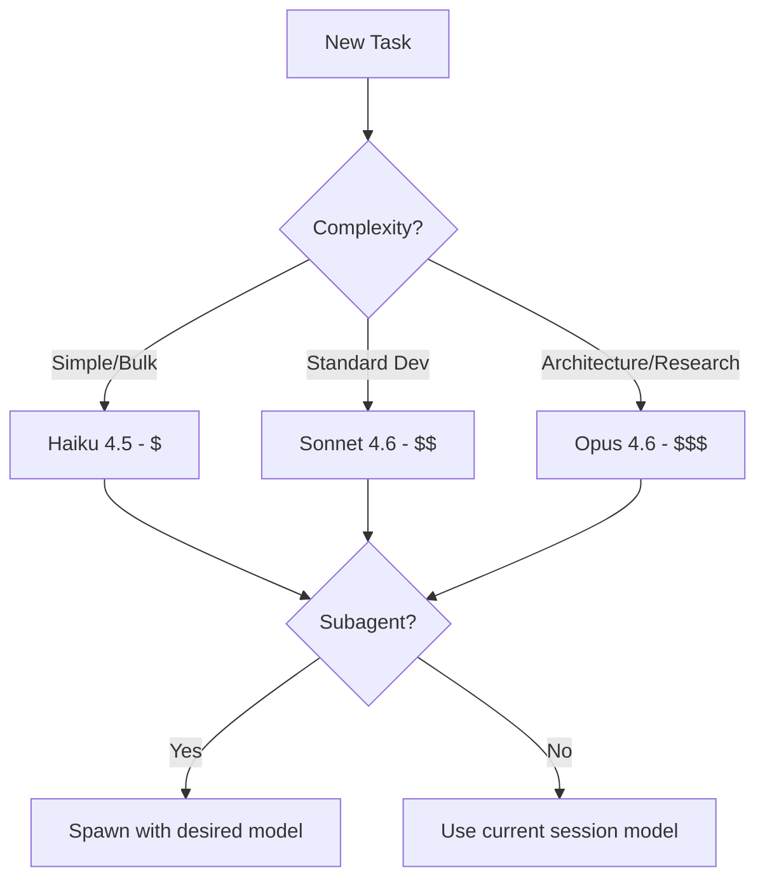

# CC Commander — by Kevin Zicherman
> Updated: 2026-04-17 | Version: see package.json | Non-coder friendly. Practical examples throughout.
> Sources: 200+ best practices distilled from: ykdojo 45 tips · hooeem Claude Certified Architect Guide · aiedge_ Skills 2.0 Guide · dr_cintas Cowork Complete Guide · MichLieben Vibe Marketing ($7M B2B) · coreyganim Cowork Plugins Guide · GriffinHilly Weekly Loop/COMP System · bekacru Agent Auth Protocol · SuperClaude Framework · chddaniel Mobile Dev · Trail of Bits · Anthropic Official Docs

> **Which document?** **BIBLE.md = learning guide (you are here).** CHEATSHEET.md = daily reference (quick lookup). SKILLS-INDEX.md = skill discovery (search by keyword/category).

---

## Table of Contents

### The Commandments
- [Golden Rules](#golden-rules) — The 7 non-negotiable principles
- [The Kevin Z Method](#the-kevin-z-method) — Build types, CCC domains, checklists

### The Chapters
- [Chapter 1: Genesis](#stage-1-starting-a-new-project) — Starting a New Project
- [Chapter 2: Foundations](#stage-2-daily-development-loop) — Daily Development Loop
- [Chapter 3: Construction](#stage-3-building-features) — Building Features
- [Chapter 4: Debugging](#stage-4-debugging--fixing) — Fixing & Debugging
- [Chapter 5: Deployment](#stage-5-shipping--production) — Shipping & Production
- [Chapter 6: Autonomy](#stage-6-long-running--autonomous-work) — Long-Running & Autonomous Work

### The Appendices
- [CC Commander](#cc-commander) *(v4.0.0-beta.7 — Desktop plugin + CLI, plugin-first)*
- [Intelligence Layer Deep Dive](#intelligence-layer-deep-dive) *(v2.3.0 — 4 modules that make CCC smart)*
- [CLAUDE.md Templates](#claudemd-templates)
- [Skills Catalog](#skills-catalog)
- [Commands Reference](#commands-reference)
- [Tools Reference](#tools-reference)
- [Prompt Templates](#prompt-templates)
- [The 45 Tips — Quick Reference](#the-45-tips--quick-reference)
- [Power Combos](#power-combos) *(advanced only — full table in CHEATSHEET)*
- [Workflow Modes](#workflow-modes) *(10 modes)*
- [Prompt Library](#prompt-library-1) *(36+ templates)*
- [Integrations](#integrations) *(Agency Orchestrator + OpenClaw)*
- [Proactive Automation Suite](#proactive-automation-suite-v11) *(28 kit-native hooks)*
- [Settings Reference](#settings-reference)
- [Appendix A: Model Selection](#model-selection)
- [Appendix B: Contributor Credits](#contributor-credits)
- [Claude Certified Architect — Domain Summary](#claude-certified-architect--domain-summary)

---

## Golden Rules

> For commands, CLI flags, and model tables see **CHEATSHEET.md**.

1. **Plan before coding** — `/plan` every multi-step task
2. **Context is milk** — fresh + condensed = best output
3. **Verify, don't trust** — always `/verify` before done
4. **Subagents = fresh context** — parallel work, no bloat
5. **CLAUDE.md = investment** — your rules compound over time
6. **Boring solutions win** — AI has a bias for complexity; push back
7. **Operationalize fixes** — every bug → test → rule update

---

## The Kevin Z Method

> Run `/init` to get this automatically configured. The decision tree asks these questions and sets up your project.

### Build Type Selection

Before touching ANY code, answer one question: **What kind of build is this?**

| Build Type | Time | Approach | Model | CCC Domains |
|------------|------|----------|-------|----------------|
| **QUICK** | <4 hours | Direct execute, ship fast | Sonnet | Stack-specific only |
| **DEEP** | 1-5 days | Spec-first, TDD, subagents | Opus | mega-{domain} + ccc-testing |
| **SAAS** | 1-4 weeks | Full lifecycle: scaffold→auth→billing→ship | Opus | ccc-saas + ccc-seo + ccc-testing + ccc-devops |
| **OVERNIGHT** | 6-12h autonomous | Checkpoints, error recovery | Opus | overnight-runner + domain skills |

### CCC Domains (Load ONE, Get Everything)

| CCC Domain | Skills Inside | What It Covers |
|------------|--------------|----------------|
| `ccc-seo` | 19 | Technical SEO, AI search, content strategy, analytics, programmatic SEO |
| `ccc-design` | 35+ | Animations, visual effects, design systems, landing pages, Impeccable polish suite |
| `ccc-testing` | 15 | TDD, E2E, verification, QA, regression, visual testing, load testing |
| `ccc-marketing` | 46 | Content, CRO, channels, growth, intelligence, sales |
| `ccc-saas` | 20 | Auth, billing, database, API, frontend stack, metrics, CRO |
| `ccc-devops` | 20 | CI/CD, containers, AWS, monitoring, zero-downtime deploy, Terraform |
| `ccc-research` | 8 | Deep research, literature review, competitive analysis, data synthesis |
| `ccc-mobile` | 7 | iOS, Android, React Native, Flutter, app store optimization |
| `ccc-security` | 9 | Pen testing, OWASP, supply chain, secrets management, threat modeling |
| `ccc-data` | 8 | ETL pipelines, data warehousing, analytics, visualization, ML ops |

### Automatic Checklists

#### Quick Build
- [ ] Build the thing
- [ ] `/verify` — works end-to-end
- [ ] `git commit` — conventional commit
- [ ] Ship

#### Deep Build
- [ ] `/init` — deep build, skills loaded
- [ ] `/plan` — spec interview complete
- [ ] New session with spec
- [ ] TDD: write failing tests first
- [ ] Implement until tests pass
- [ ] `/code-review`
- [ ] `/verify` — full verification
- [ ] `operationalize-fixes` if bugs found
- [ ] `/pr` — create draft PR

#### SaaS Build
- [ ] `/init` — SaaS build, template selected
- [ ] Scaffold from starter template
- [ ] Auth (better-auth)
- [ ] Database schema (drizzle-neon)
- [ ] Core features via spec-driven sessions
- [ ] Billing (stripe-subscriptions)
- [ ] Dashboard + analytics
- [ ] SEO (ccc-seo)
- [ ] E2E tests (ccc-testing)
- [ ] Deploy (ccc-devops)

#### Overnight Build
- [ ] `/init` — overnight build configured
- [ ] Define batch tasks + error strategy
- [ ] Set checkpoint frequency
- [ ] Launch with `overnight-runner`
- [ ] Review checkpoints in morning

---

## Stage 1: Starting a New Project

### Mindset
You're briefing a brilliant contractor who knows nothing about your project yet. The more complete your brief, the less time you waste in corrections. Invest 20 minutes upfront to save 10 hours later.

Stock Claude Code starts every session with amnesia. CC Commander doesn't. Before you type a single prompt, the Intelligence Layer has already read your `package.json`, scored the complexity of what you're about to build, and pre-ranked the skills most likely to help. See [Intelligence Layer Deep Dive](#intelligence-layer-deep-dive) in the appendices.

### Quick Start (3 paths)

| Path | You Use | Command |
|------|---------|---------|
| **CLI** | `claude` in terminal | `npm install -g cc-commander` → `ccc` |
| **Slash commands only** | Claude Code sessions | `curl ... \| bash` → `/ccc` in any session |
| **Desktop plugin** | Claude Desktop | `/plugin marketplace add KevinZai/commander` |

Arrow keys to navigate. No commands to memorize. The Intelligence Layer handles model selection, budget, and skill routing automatically.

### Key Commands

```bash
# Step 1: Initialize project context
/init                    # Creates CLAUDE.md with project overview
/plan                    # Spec interview — Claude asks 5–7 questions

# Step 2: Set up the COMP system (4 files every project needs)
```

### The COMP System (from @GriffinHilly)
Every project gets exactly 4 files:

| File | What goes here | Who reads it |
|------|---------------|--------------|
| `CLAUDE.md` | How the AI should behave | Claude every session |
| `ORIENT.md` | What a human needs to know to work here | New team members |
| `MEMORY.md` | Accumulated decisions, gotchas, context | Claude + humans |
| `PLAN.md` | Roadmap, progress, next steps | Claude + humans |

Separate behavioral instructions from orientation from accumulated knowledge from direction. Each has different audience and update frequency.

### CLAUDE.md Quick-Start Template

```markdown
# CLAUDE.md — [Project Name]

## Stack
- Framework: [Next.js 15 / Laravel 11 / Vue 3]
- Language: [TypeScript / PHP]
- Database: [PostgreSQL]
- Testing: [Vitest / PHPUnit]

## Build & Test
- Dev: `npm run dev` | Build: `npm run build` | Test: `npm test`

## Rules
- Never change unrelated code
- Always write tests before implementing
- Commit after each milestone

## Active Tasks
See `tasks/todo.md`
```

### Kickoff Workflow

```
1. /init → generates baseline CLAUDE.md
2. /plan → spec interview → spec saved to tasks/spec-YYYYMMDD.md
3. New session with spec as context
4. Execute against spec
5. /verify after each milestone
```

### CLAUDE.md Gotchas

- **Don't edit mid-session** — invalidates the cache (costs more tokens)
- **Start lean** — add instructions only when you catch yourself repeating them
- **Static content first** — improves cache hit rate
- **Use `#` shortcut** — type `# always use TypeScript strict mode` → adds to CLAUDE.md automatically
- **Progressive Disclosure** — keep CLAUDE.md lean; trigger rules like "when X, read guide Y" (guides load on demand)

### Path-Specific Rules (Power Move)

Instead of one bloated CLAUDE.md, use `.claude/rules/` with YAML frontmatter:

```yaml
# .claude/rules/testing.md
---
paths: ["**/*.test.tsx", "**/*.spec.ts"]
---
# Testing Rules
- Always use describe/it blocks
- Mock external dependencies
- Test edge cases first
```

This loads **only** when editing matching files. Saves tokens. Works across the entire codebase regardless of directory depth.

---

## Stage 2: Daily Development Loop

### Mindset
Structure your day. AI works best in short focused sessions with clear handoffs. Don't let context bloat. Write HANDOFF.md before stopping. Start each session by reading it.

### The Weekly Loop (from @GriffinHilly)

**Weekly cadence:**
1. Download your saved bookmarks/articles
2. Have Claude read and categorize them
3. Identify anything new to add to your workflow
4. Run your Claude through the new patterns
5. Update CLAUDE.md with anything that stuck

```bash
# The bookmark pipeline (from github.com/griffinhilly/claude-code-synthesis)
# Every week: export bookmarks as HAR files → pipeline categorizes/embeds → search semantically
python search.py "agent orchestration pattern" --top-k 5
```

Your bookmarks are a curated signal. The pipeline turns them into a searchable knowledge base that improves your workflow automatically.

### Daily Session Structure

```
Morning:
1. Read tasks/todo.md and tasks/HANDOFF.md (if exists)
2. Load relevant CLAUDE.md context
3. /compact if picking up a long-running session
4. Execute on the top 1–3 tasks

Before stopping:
1. Write tasks/HANDOFF.md (see prompt template in §12)
2. Git commit all progress
3. Update tasks/todo.md
```

### Cowork: Daily Automation Mode

If you have Claude Cowork (desktop app), set up scheduled tasks for daily automation:

```
Setup: Claude Desktop App → Cowork mode → Settings > Cowork > Edit Global Instructions

Write your global instructions once (who you are, your projects, your format preferences).
Every task starts with this context loaded automatically.
```

**Example Global Instructions:**
```
I run a B2B SaaS company. My team uses Google Workspace and Slack.
Reports in Word format unless specified. Default landscape for slides.
My main projects: [list]. Preferred tone: direct, no jargon.
```

**Daily scheduled tasks (type `/schedule`):**

```
Monday 8am: Pull calendar, draft weekly priorities doc, save to Desktop.
Friday 4pm: Scan Downloads folder, sort new files into project folders.
Daily 12pm: Check Gmail for urgent messages, draft responses, save as text file.
```

**Cowork quota management:**
- Cowork tasks use significantly more quota than regular chat (agentic = more compute)
- One file-organization session ≈ dozens of regular messages
- Start with 1–2 scheduled tasks; monitor usage with `/usage`
- Complex multi-step pipelines: batch in one session rather than many small ones
- If quota is tight: use Chat mode for Q&A, Cowork only for execution

### Context Management Daily Rules

1. **Start a new session for each new topic** — don't chain unrelated work
2. **Compact at 40–50 turns** — not after context fills
3. **Static content first in CLAUDE.md** — improves cache hits
4. **Don't edit CLAUDE.md mid-session** — breaks the cache
5. **`/aside` for side questions** — preserves main context budget
6. **Subagents = fresh windows** — use them for parallel work

### Tool & Context Awareness

These failure modes come from reverse-engineering Claude Code's internal behavior (sources: iamfakeguru/claude-md, code.claude.com/docs/en/best-practices):

1. **Tool Result Blindness** — Tool results may be truncated to ~2,000 bytes. Always re-read files after modification. Never assume a tool call succeeded based on the result preview alone.
2. **Context Decay** — Re-read files if >10 messages have passed since last read. Your memory of file contents degrades as the conversation grows. Treat file state as volatile.
3. **File Read Budget** — The Read tool has a 2,000-line cap per call. For large files, use `offset` and `limit` parameters. Never assume you've read the entire file.
4. **One Source of Truth** — Never duplicate state across multiple files. Pick one canonical location and reference it. Duplicated state drifts and causes silent bugs.

### Power Commands

| Command | What It Does |
|---------|-------------|
| `/btw` | Ask a side question without polluting main context |
| `Ctrl+G` | Open the current plan in your editor |
| `/compact` | Compress context. Add "When compacting, always preserve: [items]" to your CLAUDE.md |
| `@path/to/file` | Import file content into CLAUDE.md at load time (compose from multiple sources) |
| `/aside` | Similar to `/btw` — preserves main context budget |

### CLAUDE.md Include/Exclude Table

| DO include | Do NOT include |
|-----------|---------------|
| Project architecture overview | Line-by-line implementation instructions |
| Tech stack and dependencies | Entire API specs (link instead) |
| Coding standards and conventions | Content that changes every session |
| Common commands and workflows | Secrets or credentials |
| Error handling patterns | Verbose examples (keep them short) |
| Known gotchas and anti-patterns | Duplicated content from other files |

### Rate Limit Management (Cowork)

- Track usage: `/usage` or check Settings → Usage
- If hitting limits: switch to Haiku for bulk tasks, Sonnet for general work, Opus only for judgment calls
- Rate limits reset: check `/usage` for exact timing
- Max plan ($200/month) has higher Cowork limits than Pro ($20/month)

---

## Stage 3: Building Features

### Mindset
Never start coding without a spec. Claude's first attempt is usually directionally right but has rough edges. Plan, implement in small steps, verify each step, then move forward. For client deliverables, vibe coding is acceptable — but add tests for anything going to production.

### Key Commands

```bash
/plan          # Always first — spec interview before building
/tdd           # Test-driven development mode
/review        # After implementing
/verify        # Before marking done
/pr            # Create PR when ready
```

### Feature Build Workflow

```
1. /plan → spec document saved to tasks/
2. New session: load spec + execute
3. Write tests FIRST (TDD)
4. Implement until tests pass
5. /review → address feedback
6. /verify → confirm it's actually done
7. /checkpoint → git save
8. /pr → create draft PR
```

### For Non-Coders: Breaking Down Problems

**The decomposition rule:** If Claude can't one-shot it, break it smaller.

```
Big task → Sub-task 1 → Sub-task 1a
                      → Sub-task 1b
         → Sub-task 2
```

**Real example:** Building a voice transcription app
1. First: just download a model (nothing else)
2. Then: just record voice (nothing else)
3. Then: just transcribe pre-recorded audio
4. Finally: combine them

### Vibe Marketing / B2B Client Work (from @MichLieben)

For GTM and lead gen work, Claude Code + APIs is a force multiplier:

**The Vibe Marketing Stack:**
- **Conductor** — UI layer for running Claude Code + Codex side-by-side; branches, easy toggles
- **Claude Code** — primary engine for API calls, MCP connections, lead gen workflows
- **Codex** — backup when Claude Code gets stuck on a build

**8 APIs for B2B prospecting (connect via Claude Code):**
| API | Purpose |
|-----|---------|
| Wiza | Email + phone data |
| Apify | Web scraping + automation |
| Prospeo | Email finding + verification |
| Lemlist | Multi-channel outreach at scale |
| Instantly | Automated email sequences |
| OpenMart | Local business leads |
| FullEnrich | Phone numbers + verified emails |
| PredictLeads | Company signals + technographic data |

**Example workflow:**
```
"Use Exa API and Prospeo to build a lead list of [ICP].
For each company, pull their tech stack from PredictLeads.
Build a table with company, contact, email, phone, and top 3 outreach angles."
```

**Mini-tools for lead gen autopilot:**
- Build free tools (email finder, phone finder, signal finder) that live on your site
- Users input info → tool outputs leads → feeds your CRM
- Claude Code builds these in one session with the right API connections

**Conductor UI:** Solves the terminal-feels-clunky problem with Claude Code. Visual interface, branch management, easy Claude/Codex toggle. `conductor.dev`

**Progression:** Lovable (easiest, great for first projects) → Cursor (visual, good UI) → Claude Code (unlimited $200/mo, concurrent agents, best for GTM scale)

### Mobile Development with Claude Code (from @chddaniel)

**Shipper platform** — Claude Opus 4.6 builds complete iOS/Android apps:
- Complete mobile apps from one prompt
- iOS + Android compatibility handled automatically
- App store listing autofill (icon, screenshots, descriptions, keywords, privacy policy)
- Cost: ~$0.17/app
- Publishable from first prompt; built in 5 min, not months

Ask Claude: `"create a mobile app for my business"` or `"create an iOS app for [idea]"` via Shipper.

### Skills for Building Features

| Skill | When to use |
|-------|------------|
| `spec-interviewer` | Starting any feature > 1 day |
| `tdd-workflow` | Write tests first |
| `frontend-design` | Anti-slop design |
| `landing-page-builder` | High-converting pages |
| `laravel-patterns` | Laravel routing, Eloquent |
| `vue-nuxt` | Vue 3, Nuxt 4, Pinia |

### Multi-Agent Feature Building

```
"Spawn two subagents:
 - Agent 1: Build the API endpoint (use Sonnet)
 - Agent 2: Write the test suite (use Haiku)
 Have both report back when done."
```

Each subagent gets a fresh full context window — perfect for parallel work.

---

## Stage 4: Debugging & Fixing

### Mindset
Never fix a bug without finding the root cause first. The investigate-first rule prevents you from solving symptoms while the real problem festers. Every bug is a learning opportunity — operationalize the fix.

### Key Commands

```bash
# Bug workflow
investigate skill → root cause → write test → fix → operationalize
/verify              # Confirm fix works
```

### Bug Fix Workflow

```
1. DO NOT touch code yet
2. Use `investigate` skill — find root cause
3. Write a test that REPRODUCES the bug (watch it fail)
4. Commit the failing test
5. Fix the root cause (not the symptom)
6. Test passes → commit the fix
7. `operationalize-fixes` skill → check for similar bugs, update CLAUDE.md
8. /verify → confirm clean
```

### The Operationalize Rule (from @GriffinHilly)

> Don't just fix the bug. Write tests that catch the whole CLASS of similar bugs. Check for other instances. If it reveals a gap in your instructions, update CLAUDE.md. Every bug is a learning opportunity.

After every fix:
- Write tests that cover the whole pattern, not just this instance
- `grep -r "similar_pattern" ./src` — scan for other occurrences
- Add a rule to CLAUDE.md: "Never do X because it causes Y"

### Test-First Bug Fix (Anti-Sycophancy Rule)

```
"Write a failing test that reproduces this bug BEFORE attempting any fix.
Show me the test running and failing.
Then fix the root cause.
Then show the test passing."
```

This ensures Claude doesn't just patch the symptom and tell you it's fixed.

### Systematic Debugging Skill

```
"Use systematic-debugging skill on this error:
[paste error]

Steps to reproduce:
- [step]
- [step]
Expected: [behavior]
Actual: [behavior]"
```

### CI/CD Failure Investigation

```
"Investigate this CI failure: [paste URL or error]

Use gh CLI:
1. Find the failing step
2. Is it new or flaky? Check last 10 runs.
3. Find the commit that introduced it
4. Root cause (one sentence)
5. Draft fix as a PR"
```

---

## Stage 5: Shipping & Production

### Mindset
Shipping is a systems problem, not a code problem. Every deploy should be repeatable, verifiable, and reversible. Use draft PRs, tests, and staged deploys. Never merge without a review pass.

### Key Commands

```bash
/review          # Final code review
/verify          # Confirm working
/pr              # Create draft PR
/deploy          # Deploy command
/docs            # Generate/update docs
```

### Ship Workflow

```
1. Feature complete → /review
2. Address feedback → /verify
3. /pr → create DRAFT PR (safe — not merged yet)
4. Review diff in GitHub Desktop (visual)
5. CI passes → mark PR ready
6. /deploy
7. Verify in production (smoke test)
```

### Cloudflare Dynamic Workers — AI Agent Sandboxing (from Cloudflare blog)

**Why this matters:** Traditional containers take 100s of milliseconds to boot and 100s of MB of memory. When every user has an agent writing code, containers don't scale.

**Dynamic Workers = V8 isolate-based sandbox:**
- ⚡ **100x faster startup** than containers (few milliseconds vs hundreds)
- 💾 **10–100x less memory** per sandbox
- 🌍 Runs in every Cloudflare PoP worldwide (zero latency)
- 🔐 Battle-hardened security (8+ years of Workers security)
- 📈 Unlimited concurrency (same tech that handles millions of req/sec)
- 💰 Pricing: $0.002/unique Worker/day (waived during beta)

**Use cases:**
- Run AI-generated code safely without containers
- Let agents write and execute JavaScript against your APIs
- Build platforms where users' agents run code (Zite example: millions of executions/day)
- Code Mode: agent writes a single TypeScript function that chains API calls → runs in Worker → returns result (cuts token usage by 81%)

**Quick start:**
```javascript
// Have your LLM generate this code
let agentCode = `
  export default {
    async myAgent(param, env, ctx) {
      // agent does work here
    }
  }
`;

// Load it in a secure sandbox
let worker = env.LOADER.load({
  compatibilityDate: "2026-03-01",
  mainModule: "agent.js",
  modules: { "agent.js": agentCode },
  globalOutbound: null,  // block internet access
});

await worker.getEntrypoint().myAgent(param);
```

**TypeScript APIs > HTTP APIs for agents:**
- TypeScript interface: few tokens to describe, easy for agents to call
- OpenAPI spec: verbose, hard to narrow to exact capabilities
- Use TypeScript RPC for agent-facing APIs (see @cloudflare/codemode npm package)

**Available packages:**
- `@cloudflare/codemode` — DynamicWorkerExecutor, Code Mode SDK
- `@cloudflare/worker-bundler` — bundle npm packages for Dynamic Workers
- `@cloudflare/shell` — virtual filesystem for agents (read/write/search/diff, backed by SQLite + R2)

**Credential injection pattern:**
```javascript
// globalOutbound callback intercepts every HTTP request from the agent
// Inject auth keys → agent never sees the secret → can't leak it
globalOutbound: async (request) => {
  request.headers.set('Authorization', `Bearer ${env.SECRET_KEY}`);
  return fetch(request);
}
```

**Get started:** Workers Paid plan → [developers.cloudflare.com/dynamic-workers](https://developers.cloudflare.com/dynamic-workers)

### Verification Before Shipping

Multiple verification strategies:
1. **Tests** — let Claude write them; verify they don't just return `true`
2. **GitHub Desktop** — visual diff of all changed files
3. **Draft PRs** — review everything before marking ready
4. **Self-check prompt:** `"Double check every claim in your output. Make a table of what you could verify."`
5. **TDD pattern** — write tests first → fail → commit → implement → pass

### The Boring Solution Rule

> AI has a bias for complexity. Constantly push back.

After any implementation:
```
"Is this the simplest possible way to accomplish the goal?
Can this be fewer lines?
Are these abstractions earning their complexity?
What would you remove?"
```

---

## Stage 6: Long-Running & Autonomous Work

### Mindset
Autonomous agents need structure, checkpoints, and security boundaries. Never give an agent more access than it needs for the specific task. Plan for failure — every long-running job should be resumable.

### Overnight / Batch Work

```
"Use overnight-runner skill.

Task: [describe the batch job]
Hours available: 8
Checkpoint every: 30 min (write to tasks/checkpoint-HHMMSS.md)
On completion: notify via [method]
On error: write error details to tasks/errors.md and stop"
```

### Agent Auth Protocol — Production Security (from @bekacru)

**The problem:** Traditional OAuth gives coarse scopes (`mail.write`). Agents are non-deterministic — you don't know what they'll need, so you over-provision. Result: agent has access to everything, can do anything, at any time.

**Agent Auth Protocol** — makes each agent a first-class principal with its own identity:

**Core concepts:**

| Concept | What it means |
|---------|--------------|
| **Host** | The runtime (Claude Desktop, VS Code extension, CI pipeline) — stable identity |
| **Agent** | A specific session/chat — ephemeral, registered under a host |
| **Capability** | What the agent can do, with exact constraints |
| **Discovery** | Agents find services via `/.well-known/agent-configuration` or intent-based directory |

**Granular capabilities vs coarse scopes:**
```
# Bad: OAuth scope
Scope: mail.write   # What does "write" mean? Anything.

# Good: Agent Auth capability
Capability: "send email"
  - to: jane@company.com
  - subject: "Meeting invite: Q3 planning"
  - max_uses: 1
  - expires: 3600s
```

**Approval methods:**
- **Device Authorization** — familiar "visit URL + enter code" flow; universal fallback
- **CIBA** — server pushes notification to user (phone/email/app); approve without navigating anywhere

**Key rules for production:**
1. Every agent action must trace to a specific agent identity
2. Two different chats = two different agents = separate capabilities
3. Revoking one agent doesn't touch others
4. Agents can request new capabilities mid-session (`request_capability` escalation)
5. Works on top of existing OAuth infrastructure — no major app changes

**Quick start:**
```bash
npx auth ai   # Interactive wizard for client + server setup
```

**Public directory:** [agent-auth.directory](https://agent-auth.directory) — searchable index of Agent Auth services

**For production agents:** Never use bare credentials in agent prompts. Use credential injection (Cloudflare Dynamic Workers pattern) or Agent Auth Protocol capability constraints.

### Containers for Risky Tasks

Use containers when:
- Long-running autonomous tasks (`--dangerously-skip-permissions`)
- Experimental work (isolated from your main system)
- Multi-model orchestration

**SafeClaw** — [github.com/ykdojo/safeclaw](https://github.com/ykdojo/safeclaw) — isolated Claude sessions with web terminal dashboard.

### Git Worktrees for Parallel Work

Work on multiple branches simultaneously without conflicts:

```bash
# Claude can do this for you:
git worktree add ../feature-auth feature/auth-system
cd ../feature-auth
claude  # Full clean context window for this branch
```

**Combine with terminal tabs:**
```
Tab 1: Main (always left)
Tab 2: Feature branch A (worktree)
Tab 3: Feature branch B (worktree)
Tab 4: Current focus
```

### GitAgent — Git-Native Agent Standard (from github.com/open-gitagent/gitagent)

**The problem:** Every AI framework has its own agent structure. No portable standard.

**GitAgent:** A framework-agnostic, git-native standard. Clone a repo, get an agent.

**Required files (just 2):**
```
agent.yaml    # Manifest — name, version, model, compliance
SOUL.md       # Identity, personality, values
```

**Full structure:**
```
my-agent/
├── agent.yaml          # Manifest (required)
├── SOUL.md             # Identity (required)
├── RULES.md            # Hard constraints
├── DUTIES.md           # Segregation of duties
├── skills/             # Reusable capability modules
├── tools/              # MCP-compatible tool definitions
├── workflows/          # Multi-step YAML procedures
├── knowledge/          # Reference documents
├── memory/             # Persistent cross-session memory
│   └── runtime/        # Live state (dailylog.md, context.md)
├── hooks/              # Lifecycle handlers (bootstrap.md, teardown.md)
└── agents/             # Sub-agent definitions (recursive)
```

**Key patterns GitAgent supports:**
- **Human-in-the-loop** — agent opens PR for any skill/memory change
- **Segregation of duties** — maker/checker/executor/auditor roles; conflict matrix
- **Agent versioning** — every change is a git commit; rollback bad prompts
- **Branch deployment** — dev → staging → main just like shipping software
- **Knowledge tree** — entity relationships with embeddings for runtime reasoning

**Framework adapters (export to any runtime):**
```bash
gitagent export --format claude-code    # → CLAUDE.md
gitagent export --format openai         # → OpenAI Agents SDK
gitagent export --format crewai         # → CrewAI YAML
gitagent export --format openclaw       # → OpenClaw format
gitagent export --format gemini         # → GEMINI.md + settings.json
gitagent export --format cursor         # → .cursor/rules/*.mdc
```

**Get started:**
```bash
npm install -g gitagent
gitagent init --template standard
gitagent validate
```

### Context Crash Recovery

Each agent writes structured state to a known file:
```
tasks/checkpoint-HHMMSS.md:
- What was done
- What's in progress
- Files modified
- Next steps
- Any errors encountered
```

On resume:
```
"Load tasks/checkpoint-[latest].md and continue from where we left off."
```

### Split Mode (Tabbed tmux)

Long-running or multi-task work benefits from visual separation. CCC's split mode runs the interactive menu in tab 0 and opens a new tmux window for each dispatched task — so you can watch Claude work, switch between jobs, and return to the menu without disrupting anything.

```bash
ccc --split
```

Each dispatched task gets its own named window. Claude output streams in full. No logs to tail — it's all visible.

**Navigation:**

| Key | Action |
|-----|--------|
| `Ctrl+A n` | Next tab |
| `Ctrl+A p` | Previous tab |
| `Ctrl+A 0` | Back to CCC menu |
| `Ctrl+A q` | Quit session |
| Mouse click | Switch tabs |

**Combine with git worktrees:** run one worktree per tab for fully isolated parallel feature work with zero branch conflicts.

### Agent-Friendly API

CCC is designed to be driven by AI agents, not just humans. Any orchestrator — OpenClaw, Claude Code, n8n, a shell script — can dispatch tasks headlessly and read structured JSON results.

**Core flags:**

| Command | Output | Purpose |
|---------|--------|---------|
| `ccc --dispatch "task" --json` | JSON | Run task, return result |
| `ccc --list-skills --json` | JSON | Full skill catalog |
| `ccc --list-sessions --json` | JSON | Session history |
| `ccc --status` | JSON | Health + config check |

**Override flags:** `--model <alias>` · `--max-turns <n>` · `--budget <$>` · `--cwd <path>`

**OpenClaw agent dispatching a build:**
```bash
result=$(ccc --dispatch "Build JWT auth module" --json --model opusplan --budget 5)
echo $result | jq '.session_id, .cost, .result'
```

**Claude Code agent finding relevant skills:**
```bash
ccc --list-skills --json | jq '.[] | select(.name | contains("auth"))'
```

JSON responses include: `session_id`, `cost`, `model`, `turns`, `result`, `status`. Use `--status` for a health check before dispatching from CI pipelines or scheduled runners.

---

## CLAUDE.md Templates

### Global CLAUDE.md (~/.claude/CLAUDE.md)

```markdown
# Global CLAUDE.md

## Operating Model
- You do the thinking. I do the doing. I ideate, decide, steer.
  You research, implement, execute.
- When uncertain: surface options with tradeoffs. Don't decide silently.

## Plan-First Protocol
Every task starts with: objective? success criteria? sub-tasks?
Research agents plan. Implementation agents execute. Never both.

## Scope Discipline
Push back on ambitious plans: "This is a 3-session project. Start with X?"
A working smaller thing beats a half-finished grand vision.

## Orchestrator-First
Before any task: handle directly, delegate to subagent, or route to MCP?
This is the single biggest lever for productivity.

## Anti-Sycophancy
If an approach has clear problems, say so. Propose an alternative. Accept override.
Sycophancy is a failure mode.

## Test-First Bug Fixing
When a bug is reported: write a test that reproduces it BEFORE attempting fix.
Watch it fail. Then fix the root cause. Then watch it pass.

## Operationalize Every Fix
Don't just fix the bug. Write tests for the whole class.
Check for similar instances. Update CLAUDE.md if it reveals a gap.

## Evals Before Specs
Define how success will be evaluated BEFORE writing the spec.
Order: evals → spec → plan → implement → verify.

## Prefer the Boring Solution
Can this be fewer lines? Are abstractions earning their complexity?
Don't build 1,000 lines when 100 suffice.

## Structured > Prose
For rules I MUST follow: use XML tags and JSON, not markdown paragraphs.
Tagged content is processed differently.

## Corrective Framing (Anti-Drift)
Instead of "remember to do X", present: "You should be doing X — still doing it?"
Mismatches trigger natural correction.

## Context Rules
- Static content goes first in CLAUDE.md (cache efficiency)
- Don't edit CLAUDE.md mid-session (breaks cache)
- Compact at 40–50 turns, not when context is full
- Use /aside for side questions (preserve main budget)

## Workflow Evolution
When a session reveals a new pattern, encode it here.
Use your tools to improve your tools. It's a flywheel.
```

### Project CLAUDE.md Template

```markdown
# CLAUDE.md — [Project Name]

## Stack
- Framework: [Next.js 15 / Laravel 11 / Vue 3]
- Language: [TypeScript / PHP / Python]
- Database: [PostgreSQL / MySQL]
- Testing: [Vitest / PHPUnit / Pytest]

## Build & Test
- Dev: `npm run dev`
- Build: `npm run build`
- Test: `npm test`
- Lint: `npm run lint`

## Architecture
[Key decisions, patterns, folder structure]

## Rules
- Never change unrelated code
- Always write tests before implementing
- Commit after each milestone
- Use context7 for library docs (not training data)

## Active Tasks
See `tasks/todo.md`

## Gotchas
[Known pitfalls, things that tripped us up]
```

### ORIENT.md Template (for human readers)

```markdown
# ORIENT.md — [Project Name]

## What this project does
[One paragraph]

## How to run it locally
[Steps]

## Key files and where things live
[Map of important files]

## Who to ask about what
[Contacts or notes]

## Known issues / quirks
[Things that will confuse a new developer]
```

---

## Skills Catalog

### CCC Domains

Instead of loading 5-15 individual skills per session, load ONE CCC domain to get the entire domain:

```
"Use the ccc-seo skill"       → All 19 SEO skills loaded via router
"Use the ccc-design skill"    → All 35+ design/animation skills loaded
"Use the ccc-testing skill"   → All 15 testing skills loaded
"Use the ccc-marketing skill" → All 46 marketing skills loaded
"Use the ccc-saas skill"      → All 20 SaaS building skills loaded
"Use the ccc-devops skill"    → All 20 DevOps skills loaded
"Use the ccc-research skill"  → All 8 research skills loaded
"Use the ccc-mobile skill"    → All 7 mobile dev skills loaded
"Use the ccc-security skill"  → All 9 security skills loaded
"Use the ccc-data skill"      → All 8 data/analytics skills loaded
```

Each CCC domain has a **router** that matches your intent to the right specialist sub-skill. See the Absorbed Skills Manifest in each CCC domain's SKILL.md for exactly which skills it contains.

### How Skills Work

Skills are reusable instruction sets that load only when needed (token-efficient). Three types:

| Type | Where stored | Scope |
|------|-------------|-------|
| Skills | `~/.claude/skills/` or project `.claude/skills/` | On-demand |
| CLAUDE.md | `~/.claude/CLAUDE.md` or `./CLAUDE.md` | Always loaded |
| Plugins | Installed via Cowork sidebar | Bundle of skills + connectors + commands |

**Invoke any skill:**
```
"Use the spec-interviewer skill"
"Follow the tdd-workflow skill"
"Use my brand-voice skill for this LinkedIn post"
```

### Skills 2.0 — New Features (March 2026, from @aiedge_)

**1. Built-in Evals & Testing**
- Before saving a skill: write realistic test prompts → Claude runs them with AND without the skill → outputs scored + displayed
- You review actual outputs and leave feedback
- Know your skill works before shipping it

**2. A/B Testing**
- Compare two versions of the same skill against identical prompts
- Made a change? Run A/B test to confirm improvement
- Use it: `"A/B test these two versions of my brand-voice skill"`

**3. Trigger Optimization**
- Automatically rewrites and tests your skill's description until it triggers reliably
- Fixes: skill doesn't trigger, skill triggers at wrong times
- Use it: `"Optimize my trigger description for this skill"`

### Building Great Skills (from @aiedge_)

1. **Reverse prompting:** `"I want to build [X] skill — ask me 10–50 questions first"`
2. **Reverse building:** `"Based on everything you know about me, what Skills would help?"`
3. **Context dump:** Paste PDFs, attach docs — more context = better skill
4. **Use existing chats:** `"Use everything from this chat as context for building a [X] skill"` — Claude knows your preferences from the conversation history
5. **Iterate:** First output = rough draft. Read it, list changes, refine. 3 iterations to get it right.
6. **Include a real example:** One strong example inside the Skill file is worth ten bullet points of instruction
7. **QC checklist:** End every skill with 3–5 self-check questions Claude runs before responding
8. **Manual review:** Always read the skill file yourself — painful once, saves time forever

**Build a skill from scratch:**
```
You are building a Claude Skill — a reusable instruction set in markdown format.

My Skill is for: [describe the task]

Context Claude needs:
- My name / brand: [name]
- My audience: [who]
- My tone and voice: [how]
- My standards: [what good looks like]
- What to avoid: [don'ts]

Write a complete SKILL.md that:
1. Opens with one-line description
2. Defines Claude's role when Skill is active
3. Lists exact rules Claude must follow
4. Includes at least one example of great output
5. Ends with a quality checklist Claude runs before responding
```

**Skill resources:**
- SkillsMSP marketplace: [skillsmp.com](https://skillsmp.com) — 500,000+ skills ready to download
- Awesome Claude Skills: [github.com/ComposioHQ/awesome-claude-skills](https://github.com/ComposioHQ/awesome-claude-skills)
- Anthropic Complete Guide: [resources.anthropic.com/hubfs/The-Complete-Guide-to-Building-Skill-for-Claude.pdf](https://resources.anthropic.com/hubfs/The-Complete-Guide-to-Building-Skill-for-Claude.pdf)

### Tiered Skill Loading

Skills are installed in tiers — smaller tiers load faster and save ~10k tokens per session:

| Tier | Flag | Count | Best for |
|------|------|-------|---------|
| Essential | `--skills=essential` (default) | ~30 | Most developers — core workflows |
| Recommended | `--skills=recommended` | ~100 | Active builders who use many domains |
| Domain | `--skills=domain` | 11 routers | Load one ccc-domain per domain as needed |
| Full | `--skills=full` | 459 | Legacy behavior — everything installed |

```bash
./install.sh --skills=essential   # Default — saves ~10k tokens per session
./install.sh --skills=recommended # Good balance for full-time users
./install.sh --skills=full        # All 459 skills (original behavior)
```

Tiers are defined in `skills/_tiers.json`. You can always load an on-demand skill mid-session with: `"use the skill-name skill"`.

### 🎯 Essential Skills by Category

#### Planning & Execution

| Skill | Invoke | Use when |
|-------|--------|---------|
| `spec-interviewer` | "use spec-interviewer skill" | Starting any feature > 1 day |
| `evals-before-specs` | "use evals-before-specs" | Define "done" BEFORE writing specs |
| `writing-plans` | "use writing-plans skill" | Need structured plan |
| `executing-plans` | "use executing-plans skill" | Have a plan, need execution with checkpoints |
| `delegation-templates` | "use delegation-templates" | Dispatching to subagents |
| `dialectic-review` | "use dialectic-review" | Important decision — FOR/AGAINST/Referee |

#### Code Quality & Review

| Skill | Invoke | Use when |
|-------|--------|---------|
| `review` | "use review skill" | Code review |
| `tdd-workflow` | "use tdd-workflow" | Write tests first |
| `systematic-debugging` | "use systematic-debugging" | Broken, need root cause |
| `investigate` | "use investigate skill" | Never fix without root cause |
| `operationalize-fixes` | "use operationalize-fixes" | After fixing: test → sweep → update rules |
| `verification-before-completion` | "use verification-before-completion" | Proof before marking done |

#### DevOps & Infra

| Skill | Invoke | Use when |
|-------|--------|---------|
| `github` | "use github skill" | gh CLI: issues, PRs, CI |
| `gh-issues` | "use gh-issues" | Fetch issues → spawn subagents to fix |
| `docker-development` | "use docker-development" | Docker/container work |
| `senior-devops` | "use senior-devops" | CI/CD, cloud, infrastructure |
| `overnight-runner` | "use overnight-runner" | Unattended batch jobs |

#### Design & Frontend

| Skill | Invoke | Use when |
|-------|--------|---------|
| `frontend-design` | "use frontend-design" | Anti-slop design |
| `landing-page-builder` | "use landing-page-builder" | High-converting landing page |
| `polish` | "use polish skill" | Final quality pass |
| `critique` | "use critique skill" | Evaluate design effectiveness |
| `bolder` | "use bolder skill" | Design is boring, needs amplification |

#### Business & SEO

| Skill | Invoke | Use when |
|-------|--------|---------|
| `saas-metrics-coach` | "use saas-metrics-coach" | ARR, MRR, churn, LTV, CAC |
| `seo-optimizer` | "use seo-optimizer" | Technical SEO audit |
| `ai-seo` | "use ai-seo" | Optimize for AI search |
| `aaio` | "use aaio" | Agentic AI Optimization |
| `cold-email` | "use cold-email skill" | B2B cold outreach |
| `churn-prevention` | "use churn-prevention" | Cancellation flows |

#### Context & Memory

| Skill | Invoke | Use when |
|-------|--------|---------|
| `strategic-compact` | "use strategic-compact" | Manual context compaction |
| `session-startup` | "use session-startup" | Consistent session start |
| `overnight-runner` | "use overnight-runner" | Long autonomous batch jobs |

### Cowork Plugins (from @coreyganim)

Plugins bundle: skills + connectors + slash commands + sub-agents.

**11 Official Anthropic Plugins (shipped Jan 30, 2026 — all free, open source):**

| Plugin | Slash Commands | Purpose |
|--------|---------------|---------|
| Sales | `/sales:call-prep`, `/sales:account-plan`, `/sales:objection-handling` | Prospect research, call briefs |
| Marketing | `/marketing:seo-audit`, `/marketing:email-sequence`, `/marketing:competitive-brief` | Content + SEO |
| Legal | `/legal:contract-review`, `/legal:compliance-check` | Risk analysis |
| Finance | Budget analysis, forecasting | Financial modeling |
| Customer Support | Ticket response, escalation | Support workflows |
| Product Management | `/pm:prd`, `/pm:roadmap` | PRDs, roadmaps |
| Data Analysis | `/data:clean-dataset`, `/data:visualize` | Dashboards, cleaning |
| Enterprise Search | Cross-platform search | Company-wide search |
| Biology Research | Literature review | Experiment design |
| Productivity | Task management, meeting prep | Scheduling |
| Plugin Create | Build custom plugins | Meta-plugin |

**Browse:** `github.com/anthropics/knowledge-work-plugins`

**Install:** Cowork → Customize (sidebar) → Browse Plugins → Add plugin

**Custom plugin structure:**
```
my-plugin/
├── plugin.json           # Manifest
├── commands/
│   └── my-command.md     # Slash command definition
├── skills/
│   └── my-skill/
│       └── SKILL.md
└── .mcp.json             # Connector config
```

**Build a plugin:**
```
"I want to build a plugin for [workflow].
Walk me through creating the structure, skills, and commands.
My workflow: [describe steps].
My tools: [list tools/APIs]."
```

---

## Commands Reference

### 🔥 Daily Slash Commands

| Command | What it does | When to use |
|---------|-------------|-------------|
| `/init` | Create `CLAUDE.md` for the project | First time in new repo |
| `/help` | Show all commands + keyboard shortcuts | When lost |
| `/clear` | Clear conversation, fresh start | New topic, stuck agent, bloated context |
| `/compact` | Smart compress context | Every 40–50 turns |
| `/new` | Start fresh same session | New sub-topic without full reset |
| `/model` | Switch model for session | Need more power mid-task |
| `/think` | Enable extended reasoning | Hard architecture decisions |
| `/plan` | Spec-first planning | Before ANY multi-step task |
| `/review` | Code review pass | After implementing |
| `/verify` | Full verification | Before saying "it's done" |
| `/cost` | Show token usage + cost | Checking spend |
| `/context` | Show what's in current context | When confused |
| `/context-budget` | How much context used vs remaining | Before long tasks |
| `/memory` | View/edit CLAUDE.md files | Updating project rules |
| `/doctor` | Diagnose Claude Code setup | Something broken? |
| `/add` | Add files/dirs to active context | Claude doesn't know about a file |
| `/aside` | Quick side question, keeps main context | Quick question mid-task |
| `/checkpoint` | Git checkpoint | Mid-work safety save |
| `/complete` | Mark task done with verification | Finishing a task |
| `/resume` | Resume a previous session | Continuing yesterday's work |
| `/pr` | Create pull request | Ready to merge |
| `/deploy` | Deploy to production | Shipping |
| `/docs` | Generate/update docs | After building something |
| `/usage` | Check rate limits | Worried about hitting limits |
| `/stats` | Usage stats + activity graph | Curious about usage |
| `/chrome` | Toggle native browser integration | Need logged-in browser state |
| `/mcp` | Manage MCP servers | Adding/checking integrations |
| `/release-notes` | What's new in current version | Staying current |
| `/fork` | Fork current session | Try different approach |
| `/permissions` | Manage approved commands | Security audit |
| `/schedule` | Schedule a Cowork task | Cowork mode autopilot |

### 🛠️ Plugin Workflows (v4.0.0-beta.7)

CC Commander is now a Claude Code plugin. The primary UX is plain `/ccc-*` slash commands with a native AskUserQuestion chip picker. 12 specialist workflows ship in the plugin — no menu traversal required:

| Workflow | What it does |
|----------|-------------|
| `/ccc-build` | Spec-first feature build with clarification questions |
| `/ccc-review` | Pre-landing code review with severity ratings |
| `/ccc-ship` | Tests → changelog → commit → PR pipeline |
| `/ccc-verify` | Four-question verification before marking done |
| `/ccc-plan` | Multi-step plan with risk + rollback |
| `/ccc-debug` | Root-cause investigation (Iron Law workflow) |
| `/ccc-learn` | Extract reusable patterns from the session |
| `/ccc-spike` | Timeboxed exploration with AskUserQuestion confirm |
| `/ccc-spike-confirm` | Close-the-loop on a spike result |
| `/ccc-research` | Structured competitive / market research |
| `/ccc-design` | Route into the 39-skill design domain |
| `/ccc-deploy` | Pre-deploy GO/CAUTION/NO-GO gate |

Pick one and the plugin handles it — no service ports, no persistent process. For CLI-only power-user commands (fleet dispatch, AO worker pool, cost dashboard), see the [CLI-Only Commands appendix](#cli-only-commands-cli-power-user) below.

### 💻 CLI Entry Points

```bash
claude                               # Start interactive session
claude "fix the TypeScript errors"   # One-shot task
claude -p "explain this" < file.ts   # Print mode (pipe-friendly)
claude -c                            # Continue last conversation
claude --resume abc123               # Resume specific session by ID
claude update                        # Update Claude Code to latest
claude mcp list                      # List MCP servers
claude config list                   # List all config values
```

### 🚀 Key CLI Flags

| Flag | What it does |
|------|-------------|
| `--model <model>` | Set model (overrides config) |
| `--headless` | No interactive UI (CI/CD use) |
| `-p` | Non-interactive print mode (required for CI!) |
| `--output-format json` | JSON output for scripting |
| `--json-schema <schema>` | Structured JSON output with schema |
| `--add-dir <path>` | Add directory to initial context |
| `--max-turns <n>` | Limit agentic loop iterations |
| `--dangerously-skip-permissions` | Skip all permission prompts (containers only) |
| `--verbose` | Show detailed tool call output |
| `--debug` | Enable debug logging |
| `--fork-session` | Fork session on continue |

**CRITICAL for CI:** Always use `-p` flag in CI scripts or the job hangs waiting for interactive input.

### ⌨️ Keyboard Shortcuts

| Shortcut | Action |
|----------|--------|
| `Ctrl+C` | Cancel current generation |
| `Ctrl+D` | Exit Claude Code |
| `Ctrl+R` | Reverse search history |
| `Shift+Enter` | Insert newline |
| `Tab` | Autocomplete slash commands |
| `Ctrl+B` | Move running bash command to background |
| `Ctrl+V` | Paste image from clipboard |
| `Ctrl+G` | Open prompt in external editor |
| `Cmd+A` / `Ctrl+A` | Select all (paste pages into Claude) |
| `Ctrl+W` | Delete previous word |
| `Ctrl+U` | Delete to start of line |
| `Ctrl+K` | Delete to end of line |
| `↑` / `↓` | Browse input history |

### 🔧 Quick Terminal Aliases

```bash
alias c='claude'
alias ch='claude --chrome'
alias cs='claude --dangerously-skip-permissions'  # containers only

# Fork shortcut
claude() {
  local args=()
  for arg in "$@"; do
    [[ "$arg" == "--fs" ]] && args+=("--fork-session") || args+=("$arg")
  done
  command claude "${args[@]}"
}
# Usage: c -c --fs  (fork the last session)
```

---

## Tools Reference

### Cloudflare Dynamic Workers (NEW — 2026)

**Purpose:** Isolate AI-generated code execution. 100x faster than containers.

**When to use:**
- Running AI-generated code safely
- Code Mode (agent writes TypeScript, runs in sandbox, returns result)
- Building platforms where users' agents execute code
- Any "give the agent compute" scenario

**Get started:** Workers Paid plan required. [developers.cloudflare.com/dynamic-workers](https://developers.cloudflare.com/dynamic-workers)

**Key packages:** `@cloudflare/codemode`, `@cloudflare/worker-bundler`, `@cloudflare/shell`

### v0 by Vercel (UI Mockup Tool)

**Purpose:** Generate React/Tailwind UI components from descriptions or screenshots.

**When to use:**
- Rapid UI prototyping
- "Make it look like [site]"
- Starting point for frontend components

**Access:** [v0.dev](https://v0.dev) | Pricing: [v0.dev/pricing](https://v0.dev/pricing)

**Workflow:** Describe UI → v0 generates component → paste into Claude Code for customization

### developer-icons (Tech Stack Icons & Logos)

**Purpose:** 500+ optimized SVG icons for tech stacks, frameworks, tools, and languages. React-ready, tree-shakeable.

**When to use:** Any time you need tech icons, framework logos, language badges, or stack visualization. Never build custom SVG icons when this library covers it.

**Install:** `npm install developer-icons`

**Browse:** [xandemon.github.io/developer-icons/icons/All](https://xandemon.github.io/developer-icons/icons/All)

### agentplace.io (No-Code Agents)

**Purpose:** No-code agent creation and deployment platform.

**When to use:**
- Non-technical users who need an agent without coding
- Rapid agent prototyping
- Business process automation without engineering resources

**Access:** [agentplace.io](https://agentplace.io)

### companies.sh (Company Directory)

**Purpose:** Company directory and data lookup.

**When to use:**
- B2B prospecting research
- Company intelligence gathering
- ICP discovery

**Access:** [companies.sh](https://companies.sh)

### gitagent (Git-Native Agent Framework)

**Purpose:** Framework-agnostic, git-native standard for defining AI agents.

**When to use:**
- You want portable agent definitions that work across Claude Code, OpenAI, LangChain
- You want version control for your agent's prompts and rules
- Building compliant agents (FINRA, SEC, SOD requirements)
- Team needs shared agent definitions

**Get started:**
```bash
npm install -g gitagent
gitagent init --template standard
gitagent validate
gitagent export --format claude-code  # generates CLAUDE.md
```

**Access:** [github.com/open-gitagent/gitagent](https://github.com/open-gitagent/gitagent)

### Anthropic Official Courses

**When to use:** Structured learning path, official best practices.

| Course | URL |
|--------|-----|
| Building with Claude API | anthropic.skilljar.com/claude-with-the-anthropic-api |
| Intro to MCP | anthropic.skilljar.com/introduction-to-model-context-protocol |
| Claude Code in Action | anthropic.skilljar.com/claude-code-in-action |
| Claude 101 | anthropic.skilljar.com/claude-101 |

All at: [anthropic.skilljar.com](https://anthropic.skilljar.com)

### Conductor (UI for Claude Code)

**Purpose:** Visual interface for running Claude Code (and Codex) side-by-side.

**When to use:**
- Claude Code's terminal feels clunky
- Want to run agents concurrently with branch management
- Toggle between Claude and Codex easily

**Access:** `conductor.dev` (requires Claude + OpenAI accounts)

### SocratiCode (Codebase Intelligence)

```
"Use SocratiCode to find all places we handle payment errors"
"Index this codebase and tell me the architecture"
```

### Playwright MCP (Browser Automation)

```
"Screenshot the homepage"
"Run the signup flow and verify it works"
"Use playwright to test the checkout"
```

### Available MCP Servers (Always On)

| MCP | Say this... | For... |
|-----|------------|--------|
| `context7` | "use context7" | Latest library docs |
| `playwright` | "screenshot this" | Browser automation, E2E testing |
| `github` | "check the repo" | Personal GitHub |
| `github-gn` (example) | "check Guest Networks repo" | Secondary org GitHub |
| `n8n-mcp` | "run the workflow" | n8n automation |
| `granola` | "check my meeting notes" | Meeting transcripts |
| `claude-peers` | "message the agent" | Agent-to-agent comms |

---

## Prompt Templates

### Handoff Prompt (Between Sessions)

```
Before I start a new session, write a HANDOFF.md to tasks/HANDOFF.md.

Include:
- What we were building (one sentence)
- Current state — what's done, what's in progress
- What we tried that didn't work (important!)
- The next 3 specific steps
- Any file paths or context the next agent needs
- Any gotchas or warnings

Be comprehensive. The next agent gets ONLY this file.
```

### Bug Fix Prompt

```
There's a bug: [DESCRIBE THE BUG]

Steps to reproduce:
- [step 1]
- [step 2]
Expected: [what should happen]
Actual: [what happens instead]

Error output: [paste error]

Rules:
- Find root cause BEFORE writing any code (use investigate skill)
- Do not change unrelated code
- Write a test that reproduces the bug FIRST
- Watch it fail. Then fix. Then watch it pass.
- After fixing: run /verify and confirm the test passes
- Then use operationalize-fixes: check for similar bugs, update CLAUDE.md
```

### Code Review Prompt

```
Review the recent changes in this repo (or file: [FILENAME]).

Focus on:
1. Correctness — does it do what was intended?
2. Security — any vulnerabilities or exposure?
3. Performance — any obvious inefficiencies?
4. Maintainability — hard to change in 6 months?
5. Edge cases — what inputs could break this?

Format: severity (critical/major/minor), file+line, issue, suggested fix.
Skip nitpicks. Prioritize critical issues first.
```

### Architecture Review Prompt

```
Review the architecture of [COMPONENT/SYSTEM].

Context: [what it does, who uses it, scale]
Current state: [describe current architecture]

Evaluate:
1. Scalability — will it hold at 10x current load?
2. Reliability — single points of failure?
3. Security — attack surface?
4. Operational complexity — hard to debug?
5. Cost efficiency — unnecessary spend?

Output: verdict (keep/change/rebuild), specific recommendations, priority order.
```

### Research Prompt

```
Research: [TOPIC]

I need to know:
- [specific question 1]
- [specific question 2]
- [specific question 3]

Sources to check: [GitHub repo / Reddit / URLs]

Output:
- Summary (3–5 bullets)
- Key findings table
- Sources cited
- Confidence level per claim (high/medium/low)

Double-check every factual claim.
```

### PR Description Prompt

```
Create a PR description for these changes.

Format:
## Summary
[1–2 sentences: what changed and why]

## Changes
[bullet list]

## Testing
[what was tested, how to test]

## Breaking changes
[yes/no — if yes: what and migration path]

Keep it under 200 words. No filler.
```

### CI Failure Investigation

```
Investigate this CI failure: [URL or paste error]

Steps:
1. Identify the failing test/step
2. Check if new failure or flaky (check last 10 runs via gh CLI)
3. Find the commit that introduced it
4. Identify root cause — be specific
5. Propose a fix

Output: root cause (1 sentence), evidence, proposed fix.
```

### Subagent Dispatch Prompt (from delegation-templates skill)

```
Spawn a [Implementer/Researcher/Reviewer/Batch/Explorer] subagent.

Task: [specific, scoped task]
Context they need: [paste all relevant context — subagents don't share memory]
Model: [Sonnet for execution / Haiku for bulk / Opus for judgment]
Report format:
- What was done
- What files were changed
- Any issues encountered
- Recommended next steps

Return all results to me when complete.
```

### Evals-First Prompt

```
Before we write the spec for [feature], define success.

Write an evals document that describes:
1. What the happy path looks like (with example inputs/outputs)
2. Edge cases that must be handled correctly
3. What failure looks like (should NOT happen)
4. How we'll verify it's working (test strategy)

Save to tasks/evals-[feature].md
Then we'll write the spec.
```

---

> **Troubleshooting?** See CHEATSHEET.md for common issues, fixes, and mistakes.

---

## The 45 Tips — Quick Reference (ykdojo)

| # | Tip | Key Action |
|---|-----|-----------|
| 0 | Customize status line | `scripts/context-bar.sh` — shows model, branch, token usage |
| 1 | Learn essential slash commands | `/usage`, `/chrome`, `/mcp`, `/stats`, `/clear` |
| 2 | Use voice input | SuperWhisper / MacWhisper / built-in voice mode |
| 3 | Break down large problems | Decompose until each piece is solvable |
| 4 | Git and GitHub CLI | Let Claude commit, branch, push, create draft PRs |
| 5 | Context is like milk | Fresh + condensed = best performance |
| 6 | Get output out of terminal | `/copy`, `pbcopy`, write to file → open in VS Code |
| 7 | Terminal aliases | `c='claude'`, `ch='claude --chrome'` |
| 8 | Proactively compact | Write HANDOFF.md, then `/clear` + new session |
| 9 | Write-test cycle | Write code → run → check → repeat |
| 10 | Cmd+A and Ctrl+A | Select-all pages, Reddit posts → paste into Claude |
| 11 | Gemini CLI fallback | For sites Claude can't fetch |
| 12 | Invest in your workflow | CLAUDE.md, aliases, tools are your edge |
| 13 | Search conversation history | `~/.claude/projects/` — JSONL files |
| 14 | Multitask with terminal tabs | Cascade left-to-right, max 3–4 tasks |
| 15 | Slim the system prompt | Patch CLI to save ~10k tokens per session |
| 16 | Git worktrees | Parallel branches in separate directories |
| 17 | Manual exponential backoff | Check CI/Docker with `1min → 2min → 4min` |
| 18 | Writing assistant | Draft → go line by line → refine iteratively |
| 19 | Markdown is the format | Write everything in markdown |
| 20 | Notion preserves links | Slack/web text → Notion → Claude (links survive) |
| 21 | Containers for risky tasks | `--dangerously-skip-permissions` only in containers |
| 22 | Best way to learn: use it | The "billion token rule" |
| 23 | Clone/fork conversations | `/fork`, `--fork-session`, or `/dx:clone` |
| 24 | Use `realpath` | Get absolute paths for files in other folders |
| 25 | CLAUDE.md vs Skills vs Plugins | CLAUDE.md = always; Skills = on-demand; Plugins = bundles |
| 26 | Interactive PR reviews | `gh` to fetch PR → go file by file |
| 27 | Research tool | Google/deep research + GitHub + Reddit + Slack MCP |
| 28 | Verify output | Tests, GitHub Desktop, draft PRs, self-check |
| 29 | DevOps engineer | CI failures → `gh` CLI → root cause → draft PR fix |
| 30 | Keep CLAUDE.md simple | Start empty, add only repeated instructions |
| 31 | Universal interface | Video edit, audio transcription, data analysis |
| 32 | Right level of abstraction | Vibe coding OK sometimes; dig deeper when it matters |
| 33 | Audit approved commands | `npx cc-safe .` — check for risky permissions |
| 34 | Write lots of tests | TDD: tests first → fail → commit → implement → pass |
| 35 | Be brave in the unknown | Iterative problem solving works even in unfamiliar territory |
| 36 | Background commands | `Ctrl+B` moves to background; subagents run in parallel |
| 37 | Era of personalized software | Build custom tools for yourself |
| 38 | Navigate input box | readline shortcuts: `Ctrl+A`, `Ctrl+E`, `Ctrl+W`, `Ctrl+K` |
| 39 | Plan but prototype quickly | Plan early decisions; prototype to validate |
| 40 | Simplify overcomplicated code | Ask "why did you add this?" — AI has bias for more |
| 41 | Automation of automation | Any repeated task → automate it |
| 42 | Share knowledge | Teaching → learning |
| 43 | Keep learning | `/release-notes`, r/ClaudeAI, follow @adocomplete |
| 44 | Install dx plugin | `/dx:gha`, `/dx:handoff`, `/dx:clone`, `/dx:reddit-fetch` |
| 45 | Quick setup script | `bash <(curl -s .../setup.sh)` — sets up all tips |

### CCC-Specific Tips (v2.3.0)

| # | Tip | Key Action |
|---|-----|-----------|
| A | Caveman mode | `"use caveman skill"` — strips markdown/emojis/prose, ~75% token savings for iteration |
| B | Update checker | Runs silently on session start (4h cache) — notifies when a new CCC version is available |
| C | Tiered skill install | `./install.sh --skills=essential` (default) — installs 30 core skills, saves ~10k tokens |
| D | ClaudeSwap rate meters | Footer shows rate + budget as `%` numbers — ClaudeSwap failover keeps sessions alive |

---

## Power Combos

> Full table in CHEATSHEET.md. These are the advanced/unique combos:

| Goal | Workflow |
|------|---------|
| **AI agent sandbox** | CF Dynamic Workers → generate code → run in isolate → result (100x faster than containers) |
| **Secure agent deploy** | Agent Auth Protocol → register agent → granular capabilities → CIBA approval |
| **Portable agent def** | gitagent init → SOUL.md + agent.yaml → export to any framework |
| **B2B lead gen** | Connect APIs (Wiza/Prospeo/PredictLeads) → describe ICP → Claude builds list |
| **Weekly workflow** | Download bookmarks → Claude reads + categorizes → update CLAUDE.md with new patterns |

---

## Workflow Modes

> Switch your entire workflow persona with one command.

Modes adjust Claude's behavior, verbosity, risk tolerance, and auto-loaded skills. Think of them as presets for different types of work.

| Mode | Behavior | When to use |
|------|----------|------------|
| `normal` | Balanced — plan-first, verify-before-done | Default for most work |
| `design` | Visual-first — loads design/animation skills, critique loop | Building UIs, landing pages |
| `saas` | Full SaaS lifecycle — auth, billing, DB, deploy pipeline | Building a SaaS product |
| `marketing` | Content + CRO — SEO, copy, conversion optimization | Marketing campaigns, content |
| `research` | Deep research — citations, confidence levels, source verification | Competitive analysis, learning |
| `writing` | Long-form content — structured drafts, editing | Blog posts, docs, reports |
| `night` | Autonomous overnight — checkpoints, error recovery, notifications | Batch jobs, migrations |
| `yolo` | Max speed — skip confirmations, auto-approve, ship fast | Quick prototypes, demos |
| `unhinged` | No guardrails — experimental, creative, push boundaries | Hackathons, experiments |
| `caveman` | Ultra-compressed output — strips markdown/emojis/prose (~75% token savings) | Iteration, high-frequency loops |

**How to switch:**
```
/cc mode design        # Via command center
"Switch to research mode"  # Natural language
```

Each mode auto-loads the relevant CCC domains and adjusts the session behavior. You can switch modes mid-session, though starting a fresh session with the new mode is recommended for best results.

---

## Prompt Library

> 36+ battle-tested prompt templates across 6 categories.

Instead of crafting prompts from scratch every time, use the pre-built templates in `prompts/`:

| Category | Count | Key templates |
|----------|-------|--------------|
| **Coding** | 8 | Bug fix, code review, architecture review, TDD setup, refactor brief, performance audit |
| **Planning** | 6 | Spec interview, evals-first, decomposition, handoff, sprint planning, project kickoff |
| **Design** | 5 | Design critique, accessibility audit, animation brief, design system setup |
| **Marketing** | 6 | SEO content brief, cold email sequence, landing page copy, ad creative |
| **DevOps** | 5 | CI failure investigation, deploy checklist, incident response, monitoring setup |
| **Meta** | 5+ | Subagent dispatch, research, PR description, skill creation, CLAUDE.md generation |

**Access:** `/cc prompts` or browse the `prompts/` directory directly.

Templates are designed to be copy-pasted with minimal modification. Each includes placeholders in `[BRACKETS]` for your specific context.

---

## Integrations

> Patterns for multi-agent orchestration.

### Agency Orchestrator

For coordinating multiple Claude instances or AI agents working in parallel:

- Coordinator/worker topology with structured dispatch
- Progress tracking and aggregation
- Error recovery and retry patterns
- Report validation before accepting subagent output

### OpenClaw Patterns

Integration patterns for OpenClaw multi-agent platform:

- Agent configuration templates
- Channel routing patterns
- Session management and handoff
- Tool binding and capability mapping
- Inter-agent communication protocols

---

## Proactive Automation Suite

28 kit-native hooks that run automatically throughout every session. No prompting required — they guard, track, checkpoint, and coach in the background.

### The 9 New Hooks

The original 4 hooks (careful-guard, auto-notify, preuse-logger, status-checkin) are joined by 11 new proactive hooks:

| Hook | Lifecycle | What it does |
|------|-----------|-------------|
| `context-guard` | PostToolUse | Tracks context usage — warns at ~70% and auto-saves session before overflow |
| `pre-commit-verify` | PreToolUse | Runs TypeScript check before any git commit — blocks on tsc errors |
| `auto-checkpoint` | PostToolUse | Creates a git-stash checkpoint every 10 file edits — automatic safety net |
| `confidence-gate` | PreToolUse | Warns on risky multi-file bash operations (sed -i on globs, find -exec) |
| `session-end-verify` | Stop | Verifies modified files and checks for leftover console.log statements |
| `cost-alert` | PostToolUse | Cost proxy alerts at ~$0.50 (30 tool calls) and ~$2.00 (60 calls) |
| `auto-lessons` | PostToolUse | Automatically captures errors and corrections to tasks/lessons.md |
| `rate-predictor` | PostToolUse | Predicts remaining session duration based on tool call rate |
| `session-coach` | Stop | Periodic coaching nudges — skill suggestions, workflow tips, checkpoint reminders |
| `pre-compact` | PreCompact | Saves session state and critical context before context compaction |
| `self-verify` | PostToolUse | Auto-verifies file changes against stated intent, catches drift |

### Session Coach

The session-coach hook fires every N responses (default: 10) with contextual suggestions: unused skills for the current task, workflow reminders, checkpoint nudges.

| Env Var | Default | What it does |
|---------|---------|-------------|
| `CC_COACH_INTERVAL` | `10` | Responses between coaching nudges |
| `CC_COACH_DISABLE` | `0` | Set to `1` to disable session coach entirely |

### Hook Totals

| Configuration | Hooks | File |
|---------------|-------|------|
| Kit standalone | 28 | `hooks-standalone.json` |
| Kit + ECC | 28 | `hooks.json` |

Every kit-native hook can be individually disabled via its `KZ_DISABLE_*` env var. See CHEATSHEET.md for the full list.

---

## Settings Reference

### `.claude/settings.json`

```json
{
  "model": "claude-sonnet-4-6",
  "permissions": {
    "allow": [
      "Bash(npm run *)",
      "Bash(git *)",
      "Bash(gh *)",
      "Read(**)",
      "Write(src/**)"
    ],
    "deny": [
      "Bash(rm -rf *)",
      "Bash(sudo *)"
    ]
  },
  "env": {
    "NODE_ENV": "development",
    "DISABLE_AUTOUPDATER": "1",
    "ENABLE_TOOL_SEARCH": "true"
  },
  "attribution": {
    "commit": "",
    "pr": ""
  }
}
```

### `.mcp.json` (Project MCP Config)

```json
{
  "mcpServers": {
    "github": {
      "command": "npx",
      "args": ["-y", "@modelcontextprotocol/server-github"],
      "env": {
        "GITHUB_TOKEN": "${GITHUB_TOKEN}"
      }
    }
  }
}
```

Note: `${GITHUB_TOKEN}` expands from environment variables — keeps credentials out of version control. Each developer sets their own tokens locally.

### System Prompt Slimming

Claude's default system prompt + tool definitions = ~19k tokens. Patch saves ~10k tokens:

```json
// ~/.claude/settings.json
{
  "env": {
    "DISABLE_AUTOUPDATER": "1",
    "ENABLE_TOOL_SEARCH": "true"
  }
}
```

---

## Claude Certified Architect — Domain Summary

> From @hooeem's teardown of the Anthropic partner exam. Learn these patterns = production-grade Claude applications.

### Domain 1: Agentic Architecture & Orchestration (27%)

**The #1 mistake:** Assuming subagents share context with the coordinator. **They don't.** Every piece of information must be passed explicitly in the prompt.

**Anti-patterns to reject:**
- Parsing natural language to determine loop termination (use `stop_reason` instead)
- Arbitrary iteration caps as primary stopping mechanism
- Checking for assistant text as completion indicator

**Key rules:**
- When stakes are financial or security-critical: enforce programmatically with hooks (not just prompts)
- Hub-and-spoke: coordinator handles task decomp + routing + error handling; subagents never talk to each other
- All communication flows through the coordinator
- Parallel spawning: emit multiple Task tool calls in one coordinator response

**Session management:**
- Resume: prior context still valid
- Fork: explore divergent approaches from shared baseline
- Fresh + injected summary: when context degraded or files changed

### Domain 2: Tool Design & MCP Integration (18%)

**Tool descriptions are the primary mechanism for tool selection** — not few-shot examples, not classifiers. Vague descriptions → misrouting.

**Good tool description includes:**
- What the tool does (primary purpose)
- What inputs it expects (formats, constraints)
- Example queries it handles well
- Explicit boundaries: when to use THIS tool vs similar tools

**Optimal:** 4–5 tools per agent, scoped to its role. 18 tools degrades selection reliability.

**`tool_choice` options:**
- `"auto"` — model may return text or call a tool
- `"any"` — must call a tool, picks which
- `{"type": "tool", "name": "X"}` — must call specific tool (use for mandatory first steps)

**MCP scoping:**
- Project-level (`.mcp.json`): version-controlled, shared
- User-level (`~/.claude.json`): personal, NOT shared

### Domain 3: Claude Code Config & Workflows (20%)

**CLAUDE.md hierarchy:**
- User-level (`~/.claude/CLAUDE.md`): only YOU get this — NOT version-controlled, NOT shared
- Project-level (`.claude/CLAUDE.md`): everyone gets this — version-controlled, shared
- Directory-level: applies to files in that specific directory only

**Path-specific rules (`.claude/rules/`):**
- Use YAML frontmatter glob patterns
- Load only when editing matching files
- Better than directory CLAUDE.md for cross-codebase patterns (e.g., all test files)

**Plan mode vs direct execution:**
- Plan mode: complex multi-file changes, architectural decisions, multiple valid approaches
- Direct execution: single-file bug fix, clear scope, approach already known

**CI/CD:** Always use `-p` flag for non-interactive mode. Without it: job hangs.

**Independent review:** Same session that generated code is less effective at reviewing it. Use separate review instance.

### Domain 4: Prompt Engineering & Structured Output (20%)

**"Be conservative" doesn't work. Be explicit:**
```
Wrong: "Only report high-confidence findings"
Right: "Flag comments only when claimed behaviour contradicts actual code behaviour.
        Report bugs and security vulnerabilities. Skip style preferences."
```

**Few-shot examples = most effective technique** for consistency. 2–4 targeted examples with reasoning for ambiguous cases.

**`tool_use` with JSON schemas** eliminates syntax errors. Does NOT prevent semantic errors.

**Schema design for extractions:**
- Optional/nullable fields when source may not contain info → prevents hallucination
- `"unclear"` enum value for ambiguous cases
- `"other"` + freeform string for extensible categorization

**Batch API (Message Batches):**
- 50% cost savings, up to 24-hour processing
- Use for: overnight reports, weekly audits, latency-tolerant work
- DON'T use for: blocking workflows (pre-merge checks, anything developers wait for)
- Does NOT support multi-turn tool calling within one request

### Domain 5: Context Management & Reliability (15%)

**Progressive summarization trap:** Condensing loses transactional data. Fix: persistent "case facts" block (order numbers, amounts, dates) — never summarize, include in every prompt.

**"Lost in the middle" effect:** Put key summaries at the beginning, not buried in the middle.

**Three valid escalation triggers:**
1. Customer explicitly requests a human (honor immediately, no investigation first)
2. Policy gaps or exceptions
3. Agent cannot make meaningful progress

**Two unreliable triggers (exam will try to trick you):**
- Sentiment analysis (frustration ≠ complexity)
- Self-reported confidence scores (model is often wrong about its own confidence)

**Error propagation:**
- Include: failure type, what was attempted, partial results, alternatives
- Never: silently suppress errors or kill entire pipeline on single failure
- Valid empty result ≠ access failure (don't retry if the answer is "no results")

---

## Appendix: For Non-Coders

### How to Give Instructions That Actually Work

```
Context: [what this is, what it does]
Task: [exactly what you want done]
Constraints: [what NOT to do, tech to use]
Verification: [how you'll know it's done]
```

**Good vs bad:**
- ❌ "Fix the bug" → no context
- ✅ "The login form throws `Error: undefined is not a function` when clicking Submit. Fix it. Don't change the UI. Test with `/verify` when done."

### Voice Input

- Claude Code has built-in voice mode
- SuperWhisper (polished Mac app) — better local accuracy
- Speak as if to a smart colleague on a phone call
- Claude understands mistranscribed words from context
- Works whispered through earphones in public

### Writing with Claude Code

1. Give full context: "I'm writing a LinkedIn post about X for audience Y, tone: Z"
2. Let it draft
3. Go line by line: "I like this, change that, move this paragraph"
4. Save as Markdown → paste into Notion to convert formats

**Markdown tip:** Paste markdown into Notion first, then copy from Notion into Google Docs / LinkedIn. Notion handles conversion cleanly.

---

---

## Model Selection

> Appendix A: Choose the right model for the task.

| Model | Best For | Cost | When to Use |
|-------|---------|------|-------------|
| **Haiku 4.5** | Fast iteration, bulk ops, simple tasks | $ | Lightweight subagents, pair programming, worker agents |
| **Sonnet 4.6** | General development, most coding tasks | $$ | Main development, orchestrating multi-agent workflows |
| **Opus 4.6** | Complex architecture, deep reasoning | $$$ | Architectural decisions, research, maximum reasoning |

**Cost optimization tips:**
- Use Haiku for 90% of subagent work (3x savings, 90% of Sonnet capability)
- Set `MAX_THINKING_TOKENS=10000` for routine work (saves ~60% thinking budget)
- Compact within 5 min of last message (cache still warm = cheaper re-read)
- Add `.claudeignore` to exclude node_modules, .git, build artifacts (30-40% context savings)
- Context at 70% = precision loss begins → plan handoff to fresh session



**Rule:** Never change models mid-session. Spawn a subagent with the desired model instead.

---

## Contributor Credits

> Appendix B: Every source that contributed to this Bible.

### Primary Sources
| Source | Contribution |
|--------|-------------|
| **ykdojo** | 45 Claude Code tips — the original viral thread |
| **hooeem** | Claude Certified Architect Guide — domain-driven architecture |
| **aiedge_** | Skills 2.0 Guide — skill creation, CCC domain patterns |
| **dr_cintas** | Cowork Complete Guide — session management, context optimization |
| **MichLieben** | Vibe Marketing ($7M B2B) — marketing skill suite foundation |
| **coreyganim** | Cowork Plugins Guide — plugin architecture, hook lifecycle |
| **GriffinHilly** | Weekly Loop/COMP System — CLAUDE/ORIENT/MEMORY/PLAN convention |
| **bekacru** | Agent Auth Protocol — Better Auth integration patterns |
| **chddaniel** | Mobile Dev — cross-platform Claude Code usage |

### Framework Integrations
| Framework | Stars | What We Integrated |
|-----------|-------|-------------------|
| **[gstack](https://github.com/garrytan/gstack)** (Garry Tan) | 40K | `/office-hours` product validation, `/retro` productivity stats, `/qa` diff-aware QA |
| **[Compound Engineering](https://github.com/EveryInc/compound-engineering-plugin)** (Every.to) | 10K | `/compound` post-task learning capture, compounding productivity methodology |
| **SuperClaude Framework** | 22K | Confidence checking, Four-question validation, Parallel execution |
| **Everything Claude Code (ECC)** | 100K | Lifecycle hooks, developer profiles, agent definitions |
| **anthropics/claude-plugins-official** | 15K | Plugin manifest format |

### Further Reading
| Source | Topics |
|--------|--------|
| **michielhdoteth/claude-bible** | Ethics, security philosophy, prompt engineering |
| **4riel/cc-bible** | Community best practices |
| **Trail of Bits** | Security configuration patterns |
| **Boris Cherny** (Claude Code creator) | Context window management, cost optimization |
| **David Ondrej** | Comprehensive methodology, session management |
| **Anthropic Official Docs** | CLAUDE.md conventions, hooks API, settings schema |

200+ articles from X/Twitter, Reddit, Medium, YouTube, and GitHub were reviewed.

---
## CC Commander

> *v4.0.0-beta.7* — A Claude Code plugin. 28 plugin skills, 15 specialist agents, 8 MCPs, 6 lifecycle hooks. Click-first via AskUserQuestion. A CLI also exists for power users.

### What It Is

CC Commander is a Claude Code plugin installed via the marketplace. It ships as plugin skills (plain `/ccc-*` slash commands) driven by the native AskUserQuestion chip picker — click, don't type. No persistent Node process. No separate UI layer. It lives inside your Claude Code session.

```
Claude Code session
  |
  +-- /plugin install commander       (one-time, from marketplace)
  |
  +-- /ccc-build, /ccc-review, ...    (28 plugin skills)
  +-- 15 specialist agents            (architect, reviewer, debugger, ...)
  +-- 8 MCP servers                   (pre-wired: GitHub, Linear, docs, ...)
  +-- 6 lifecycle hooks               (SessionStart, Stop, PreToolUse, ...)
  +-- AskUserQuestion chip picker     (click-first — no menu traversal)
```

A `ccc` CLI binary also ships for power users who prefer a terminal dispatcher outside the Claude Code session — but the plugin is the primary product.

### Quick Start

```bash
# From the kit repo
ccc

# Or via npm
npx kit-commander

# Quick stats without TUI
ccc --stats

# Self-test
ccc --test

# Fix corrupt state
ccc --repair
```

### Key Features

| Feature | Description |
|---------|------------|
| **Arrow-key menus** | Navigate with arrows or letter shortcuts |
| **10 themes** | Cyberpunk, Fire, Graffiti, Futuristic (switch anytime) |
| **Spec-driven build** | 3 clarification questions before dispatch |
| **Plan-mode-first** | Every dispatch starts in plan mode for safety |
| **Auto-compact** | 70% context threshold for compaction |
| **Level-based defaults** | Guided=$2/sonnet, Assisted=$3/opusplan, Power=$5/opusplan |
| **Project import** | Reads local CLAUDE.md without modifying .claude/ |
| **Session tracking** | Persistent history across days/weeks |
| **Skill browser** | Browse all 500+ skills from within Commander |
| **Stats dashboard** | Sparklines, activity heatmap, streak tracking |
| **Progressive disclosure** | Guided → Assisted (5 sessions) → Power (20 sessions) |
| **Rich footer bar** | 12-segment status line with color-coded limits |
| **Plugin-first** | 28 plugin skills, 15 agents, 8 MCPs, 6 lifecycle hooks — installed via `/plugin install commander` |
| **AskUserQuestion chips** | Click-first UX — no menu traversal, no typing commands |
| **Proactive intelligence** | After every action, suggests 3-4 contextual next steps |

### Adventure Flows

| Flow | What It Does |
|------|-------------|
| **Build something** | Code: web apps, APIs, CLI tools |
| **Create content** | Blog posts, social media, email campaigns, marketing copy, docs |
| **Research & analyze** | Competitive analysis, market research, code audits, SEO |
| **Review work** | Session history, resume, details |
| **Learn a skill** | Browse skills, CCC domains, cheatsheet, recommendations |
| **Check stats** | Dashboard with sparklines, achievements, cost tracking |
| **Settings** | Name, level, cost ceiling, theme, animations, reset |

### Rich Footer Bar

The rich footer bar displays 12 live segments at the bottom of every session:

```
━━ CCC2.3.1│🔥Opus1M│🔑gAA│🧠▐██45%░░▌│⏱️▐██░░▌6%│📅▐██░░▌34%│💰$2.34│↑640K↓694K│⏰8h0m│🎯456│📋CC-150│📂~/project
```

| Segment | What It Shows |
|---------|--------------|
| `CCC2.3.1` | Version |
| `🔥Opus1M` | Active model |
| `🔑gAA` | Auth status |
| `🧠▐██45%░░▌` | Context usage — green <60%, yellow <80%, red ≥80% |
| `⏱️▐██░░▌6%` | Rate limit usage % (sourced from ClaudeSwap failover data) |
| `📅▐██░░▌34%` | Daily budget usage % |
| `💰$2.34` | Session cost |
| `↑640K↓694K` | Token counts (in/out) |
| `⏰8h0m` | Session duration |
| `🎯456` | Total CLI-visible skills installed |
| `📋CC-150` | Active Linear ticket |
| `📂~/project` | Current working directory |

<a id="cli-only-commands-cli-power-user"></a>
### CLI-Only Commands (CLI power user)

The `ccc` binary ships a handful of commands that only make sense outside a Claude Code session — local-service dispatch, parallel agent pools, and cost dashboards. These are optional power-user tools and are NOT required for the plugin experience.

| CLI command | Action |
|-------------|--------|
| `ccc fleet` | Fleet Commander — parallel agent dispatch (CLI-only) |
| `ccc cost` | Real-time cost dashboard (CLI-only) |
| `ccc ao` | Composio AO parallel agents (CLI-only) |
| `ccc detect` | Probe local services + CLIs available on this machine |

If you only use the plugin, you never need any of the above.

### Proactive Intelligence Protocol

After every action, CCC suggests 3-4 contextual next steps via `AskUserQuestion`. The recommendations are context-aware — based on what was just completed.

**Override modes:**
- Say `"skip"` — skip all proactive suggestions this session
- Say `"just do it"` — execute the top suggestion without confirming
- Say `"auto"` — auto-execute top suggestion for all subsequent actions

### Backwards Compatibility

CC Commander is an OVERLAY. It never modifies your `.claude/` directory:

- **Reads** CLAUDE.md and `.claude/` for context (skills, settings, agents)
- **Passes** that context to dispatched sessions via `--append-system-prompt`
- **Stores** its own state in `~/.claude/commander/` (separate from `.claude/`)
- **Your existing Claude Code setup works unchanged** — Commander is additive

If you stop using Commander, nothing breaks. Your `.claude/`, `CLAUDE.md`, skills, hooks — all untouched.

### Dispatcher Flags

Every dispatch from Commander uses the full Claude Code CLI:

```
claude -p "task" \
  --bare \                    # Clean scripted execution
  --output-format json \      # Structured output
  --permission-mode plan \    # Plan first, always
  --effort medium \           # Auto-set per user level
  --max-budget-usd 2 \       # Cost ceiling per level
  --model sonnet \            # Model per level
  --fallback-model sonnet \   # Resilience
  --name ccc-session-name \    # Named for easy resume
  --max-turns 30              # Safety limit
```

Environment: `CLAUDE_AUTOCOMPACT_PCT_OVERRIDE=70` for auto-compaction.

### State Files

```
~/.claude/commander/
├── state.json          # User prefs, active session, theme
├── sessions/           # One JSON per session
│   └── ccc-*.json      # { id, task, cost, duration, outcome }
└── history.json        # Append-only completed session log
```

### Without Commander

Everything in CC Commander works without the CLI. The skills, hooks, commands, and prompt templates are all standalone. Commander is one way to access them — not the only way. You can always:

- Use skills directly: `/@skill-name` in Claude Code
- Use commands: `/command-name` in Claude Code
- Use hooks: they run automatically via `.claude/settings.json`
- Use the CHEATSHEET.md as a daily reference

Commander adds session management, guided menus, and visual flair on top.

### CCC Domain Breakdown

Each CCC domain is a domain router. One command, and it dispatches to the right specialist.

#### ccc-design (39 sub-skills)
UI/UX, responsive design, accessibility, animations, motion design, canvas, SVG animation, generative backgrounds, particle systems, WebGL shaders, interactive visuals, retro pixel art, design systems, Tailwind v4 patterns, shadcn/ui components, theme factory, colorize, typeset, frontend slides, brand guidelines, design consultation, design review, plan-design-review.

#### ccc-marketing (45 sub-skills)
Content strategy, content creation, CRO (form, signup, paywall), email sequences (SendGrid), ad creative, analytics (conversion, product, business), landing page builder, bulk page generation, cold email, guest blogging, backlink audit, competitor alternatives, free tool strategy, social integration, video gallery, referral programs, churn prevention, monetization strategy, SEO content briefs, SERP analysis, marketing pack, c-level pack.

#### ccc-saas (20 sub-skills)
Better Auth, Stripe subscriptions, API design, database designer, database migrations, PostgreSQL patterns, Redis patterns, Drizzle+Neon, backend patterns, FastAPI, JPA patterns, billing automation, metrics dashboard, SaaS metrics coach, experiment designer.

#### ccc-testing (15 sub-skills)
TDD workflow, E2E testing (Playwright), webapp testing, Python testing, AI regression testing, verification loop, test coverage, eval harness, benchmark, quality gate.

#### ccc-devops (20 sub-skills)
Docker development, GitHub Actions (reusable workflows, security), AWS (Lambda, S3, IAM, CloudFront, solution architect), container security, Prometheus configuration, Grafana dashboards, PromQL alerting, infrastructure runbook, deploy, senior DevOps, setup-deploy.

#### ccc-seo (19 sub-skills)
SEO optimizer, AI SEO, AEO audit, SERP analyzer, search console, backlink audit, site architecture, bulk page generator, free tool strategy, SEO content brief, competitor alternatives.

#### ccc-security (8 sub-skills)
Pentest checklist, container security, GitHub Actions security, PCI compliance, GDPR data handling, AWS IAM security, harden, guard.

#### ccc-research (8 sub-skills)
Mega-research router, investigate, brainstorming, competitive intelligence, business analytics, trading analysis, iterative retrieval, dialectic review.

#### ccc-mobile (8 sub-skills)
Vue/Nuxt, React patterns, multi-frontend, multi-backend, multi-plan, multi-execute, multi-workflow.

#### ccc-data (8 sub-skills)
Data analysis, data visualization, SQL queries, statistical analysis, explore data, validate data, build dashboard, data context extractor.

**Total: 190 verified sub-skills across 11 CCC domains.**


---

## Intelligence Layer Deep Dive

> *Appendix: v2.3.0 — How CCC thinks before it acts.*

CC Commander's Intelligence Layer is four modules that run silently on every dispatch. Together they answer the question: **"What's the right way to handle this task right now?"**

---

### Module 1: Weighted Complexity Scoring

**File:** `commander/dispatcher.js`

Before dispatching any task, CCC scores it 0–100 using three inputs:

1. **47 keyword signals** — words like "fix", "typo", "rename" pull the score down; "build", "architect", "integrate", "SaaS", "platform" push it up
2. **Word count** — longer task descriptions imply more scope
3. **Fuzzy regex matching** — partial matches catch related concepts ("refact" matches "refactor")

File scope estimation adds 0–20 bonus points based on how many project files are likely to be touched.

The final score maps to model + turns + budget:

| Score | Label | Model | Turns | Budget |
|-------|-------|-------|-------|--------|
| 0–20 | Trivial | Haiku | 10 | $1 |
| 21–40 | Simple | Sonnet | 20 | $3 |
| 41–60 | Moderate | Sonnet | 35 | $6 |
| 61–80 | Complex | Opus | 45 | $8 |
| 81–100 | Epic | Opus | 50 | $10 |

You can override with `--model`, `--max-turns`, `--budget` flags. But you usually won't need to.

---

### Module 2: Stack Detection

**File:** `commander/project-importer.js`

Runs once per project on first dispatch (cached after that). Scans:

- `package.json` → detects nextjs, react, vue, testing frameworks, billing (Stripe), ORM (Prisma, Drizzle)
- `Dockerfile`, `docker-compose.yml` → docker flag
- `go.mod`, `requirements.txt`, `Cargo.toml` → language detection
- `.github/workflows/` → github-actions flag
- `package.json` workspaces, `lerna.json`, `turbo.json`, `nx.json` → monorepo detection

Also reads:
- Current git branch name
- Last 5 commit messages → extracts recurring themes (what work is currently in flight)

This context is passed to the skill recommender and the dispatcher, so relevant skills surface first and model selection accounts for project complexity.

---

### Module 3: Skill Recommendations

**File:** `commander/skill-browser.js`

`recommendSkills(task, techStack)` ranks all 500+ skills using three signals:

```
Stack match:    +10 pts per matching technology
                (e.g., next.js project + "pages" task → nextjs-app-router +10)

Keyword match:  +2 pts per keyword hit between task description and skill metadata
                (e.g., "auth" task → auth, jwt, better-auth all get hits)

Usage boost:    Skills you've used successfully in past sessions rank higher
                (stored in ~/.claude/commander/state.json)
```

**Trending skills** (`getTrendingSkills(7)`) surface skills with increasing usage over the last 7 days — useful for discovering what's working in your current workflow.

Usage tracking is automatic. Every time you run a skill, the outcome is recorded. Skills that led to successful sessions compound their ranking advantage over time.

---

### Module 4: Knowledge Compounding

**File:** `commander/knowledge.js`

Every completed session extracts a lesson and stores it in `~/.claude/commander/`. Before the next dispatch, relevant lessons are searched and surfaced.

**What a lesson contains:**
- Keywords from the task
- Category (frontend, backend, testing, etc.)
- Tech stack at the time
- Error patterns encountered
- Success patterns that worked

**Relevance scoring with time decay:**

```
< 7 days old:   2.0x multiplier  (recent = highly relevant)
< 30 days old:  1.5x multiplier
older:          1.0x multiplier  (still useful, lower priority)
```

**Fuzzy matching:** Partial keyword matches score 0.5 (vs 1.0 for exact). This catches related concepts — "auth" catches "authentication", "authorize", "oauth".

**Cross-domain boosts** — related categories get a relevance bump even without keyword overlap:

| Category A | Category B | Boost |
|-----------|-----------|-------|
| web | react | +0.5 |
| api | backend | +0.5 |
| testing | bugfix | +0.3 |

**Smart retry** handles the three most common dispatch failures:
- Rate limit hit → wait 60s, retry with same parameters
- Context overflow → reduce `max-turns` to 60%, retry
- Budget exceeded → surface clear error with suggested next steps (don't silently fail)

---

### Putting It Together

A typical dispatch goes through all four modules in sequence:

```
1. project-importer.js  reads package.json, git branch, recent commits
2. dispatcher.js        scores task complexity (0–100) → selects model + budget
3. knowledge.js         searches past lessons for relevant context
4. skill-browser.js     ranks skills for this task + stack combination
5. dispatcher.js        fires: claude -p "task" --model X --max-turns N --budget Y
                        with top-ranked skill pre-loaded
```

Total overhead: ~50ms. Completely invisible. Just better results.

## Community Insights (v2.3.0 Research Pass)

Insights distilled from 40+ community repos and articles, April 2026.

### Skill Design Patterns

- **`disable-model-invocation: true`** — Add this to SKILL.md frontmatter for any skill with side effects (file writes, git commits, API calls). Prevents Claude from auto-invoking it — the user must explicitly trigger it. Audit all workflow skills for this flag.

- **Path-based rule filtering** — Use `paths:` in SKILL.md frontmatter (e.g., `paths: ["src/app/api/**/*"]`) to load rules only when Claude is editing matching files. Prevents context bloat from irrelevant domain rules. Use for stack-specific skills like database patterns or API design.

- **Progressive disclosure memory** — Don't load all memory at once. Retrieve in layers: (1) one-line summaries of relevant lessons, (2) expand to full detail only on demand, (3) show token cost at each layer. This is the correct model for session memory at scale.

### Workflow Patterns

- **`/btw` for overlay questions** — `/btw` questions never enter conversation history. Use for quick lookups, version checks, or side questions during deep implementation. The most underused context preservation technique.

- **Writer/Reviewer parallel sessions** — Session A implements. Session B reviews code it didn't write. Self-review in a single session carries context bias — the model remembers its own reasoning and is less likely to catch its own mistakes. Use two separate Claude Code sessions for critical code review.

- **RARV cycle for autonomous loops** — Reason → Act → Reflect → Verify. Named loop from loki-mode. Each iteration has an explicit reflection step before the next action. Better than ad-hoc "keep trying" loops. Apply to: YOLO mode, overnight runner, daemon tick loops.

- **`cat error.log | claude` piping** — Pipe any text directly into Claude Code for analysis. Under-documented CI integration primitive. Combine with `--output-format stream-json` for real-time processing in pipelines.

### Mental Models

- **Agent Workspace Model** — A repository is a self-contained environment for ANY domain, not just coding. System admin, health tracking, competitive research, content creation — each gets its own workspace repo with CLAUDE.md, skills, and commands. CCC's `/init` wizard should offer non-coding workspace templates.

- **Unix philosophy for LLM tools** — Simple composable commands outperform rich interfaces. Prefer piped single-purpose outputs over multi-modal dashboards. When building CCC tools, ask: "Can this be a pipe?" before "Can this be a menu?"

- **The Compound phase** — After each feature, produce a structured agent-readable artifact documenting what failed, what worked, and why. Not prose — queryable JSON. Feeds back into future agent prompts automatically. This is what makes knowledge compounding real, not just aspirational.

## Claude Code v2.191 — What CCC Leverages

CC Commander is designed to take advantage of the latest Claude Code features automatically.

| Feature (v2.189-2.191) | How CCC Uses It |
|------------------------|----------------|
| **500K character output** | Knowledge pipeline ingests full session transcripts in one pass — no chunking needed. |
| **Pause mid-agent** | Confidence-gate hook emits PAUSE (not ABORT) when confidence drops. User can redirect, then resume. Works in YOLO and overnight modes. |
| **Auto-mode boundaries** | Dispatcher defaults to `--permission-mode auto` for unattended runs. The background safety classifier blocks scope escalation without needing `--dangerously-skip-permissions`. |
| **Plugin lifecycle hooks** | 6 lifecycle hooks (SessionStart, UserPromptSubmit, PreToolUse, PostToolUse, Stop, Notification) — loaded automatically when the plugin is installed. |

> These features require Claude Code v2.189+. Run `claude --version` to check.

## Token Optimization — Save 30-60%

### The Hidden Multiplier
A single Claude Code command = 8-12 internal API calls. Each carries full conversation context.
One hour of active use can exhaust a Pro daily allocation.

### The Optimization Stack (cumulative)

| Optimization | Token Savings | How |
|-------------|--------------|-----|
| `ENABLE_TOOL_SEARCH` | 14K/turn | Deferred tool loading. Add to settings.json env. |
| CLAUDE.md caching | 5-20K/turn | Keep static, stable content first. Cache hits don't count toward limits. |
| `--include` scoping | 50-80% input | Restrict file context to relevant dirs. CCC auto-infers patterns. |
| Session resets | Prevents bloat | Start fresh after completing logical tasks. Context grows exponentially. |
| Subagent delegation | Fresh context | Each subagent starts clean. No accumulated history. |
| Batch dispatch | 50% cost | Use `--stream false` for non-urgent tasks (future: Batch API). |
| Model routing | 3-10x savings | Haiku for simple tasks, Sonnet for standard, Opus for complex. CCC auto-selects. |

### Cache-Friendly CLAUDE.md Structure
1. Static rules and standards (top) — cached across sessions
2. Project-specific context (middle) — cached within session
3. Dynamic/changing instructions (bottom) — not cached

### Rate Limit Recovery
- Smart retry: CCC waits 60s on 429, reduces turns on context overflow
- Pro plan resets: UTC midnight daily
- Max plan resets: rolling weekly window
- Kill orphan processes: `ps aux | grep claude | grep -v grep`

---

## Chapter: The Wider Claude Skill Ecosystem

CCC is the curated, guided layer over a 67-skill (and growing) Claude Code landscape.

The polydao "Top 67 Claude Skills" thread mapped the public skill ecosystem as of early 2026. It surfaced four key repositories every power user should know. CCC knows about all of them — and deliberately positions above them.

### The Four Repositories

| Repo | Stars | What It Is |
|------|-------|-----------|
| `anthropics/skills` | Official | Anthropic-maintained skills. Theme Factory, Frontend Design, Spec Writer. Production-grade. |
| `mattpocock/skills` | 15K | Matt Pocock's collection. TypeScript-first, developer-focused. Grill Me and Ubiquitous Language are breakout hits. |
| `skillsmp.com` | 66K+ community | The community marketplace. Breadth over depth. Great for discovering niche workflows. |
| `ComposioHQ/awesome-claude-skills` | — | Curated awesome-list of skills across all repos. |

### Alternate Install Format

The skills CLI (`npx skills@latest`) is a popular alternative install path:

```bash
npx skills@latest add anthropics/skills/skills/frontend-design
npx skills@latest add mattpocock/skills/skills/grill-me
npx skills@latest add KevinZai/commander/skills/ccc-design
```

CCC skills are fully compatible with this format. Cherry-pick individual skills or install the full set.

### Notable Skills Worth Knowing (Outside CCC)

| Skill | Repo | What It Does |
|-------|------|-------------|
| **Grill Me** | mattpocock/skills | Relentless clarifying questions before any task. Forces spec clarity. |
| **Ubiquitous Language** | mattpocock/skills | DDD glossary extractor — pulls domain terms and definitions from your codebase. |
| **GitHub Triage** | community | Issue backlog processing — categorize, prioritize, close stale, create epics. |
| **PRD to Plan to Issues** | community | 3-step pipeline: Product Requirements Doc → implementation plan → Linear/GitHub issues. |
| **Theme Factory** | anthropics/skills | Design system token generator — produces cohesive color/type/spacing themes. |
| **Frontend Design** | anthropics/skills | Opinionated UI scaffolding with accessibility and responsive patterns baked in. |

### Why CCC on Top of This Ecosystem

CCC does not replace these skills. It organizes and orchestrates them.

- **Curation:** 500+ skills are pre-screened. Low-signal skills are excluded. High-signal ones are cross-wired.
- **Guidance:** The intent classifier reads your message and routes to the right skill automatically. You don't need to know which skill does what.
- **Pre-wired MCPs:** 8 MCP servers are configured out of the box. Skills that need web search, GitHub, Linear, or docs get them without manual setup.
- **Domain coherence:** 11 `ccc-*` domains group related skills into coherent workflows. `ccc-design` (39 skills) behaves like a single expert, not 39 separate prompts.
- **Session memory:** The knowledge-capture hook learns from every session. Community skills are stateless. CCC accumulates.

The community ecosystem provides the raw material. CCC provides the operating system.

---

## About the Author

**Kevin Zicherman** is the CEO of [MyWiFi Networks](https://mywifi.io), a WiFi marketing platform used by thousands of venues worldwide. He built this kit by scanning 200+ Claude Code articles, plugins, and community resources — testing everything and keeping what worked. Not a researcher. Not a pundit. An operator who ships.

- **Web:** [kevinz.ai](https://kevinz.ai)
- **X:** [@kzic](https://x.com/kzic)
- **GitHub:** [KevinZai](https://github.com/KevinZai)

---

*Last updated: 2026-03-29*
*CC Commander — by Kevin Zicherman*
*Update this file when you learn something new. That's the point.*
