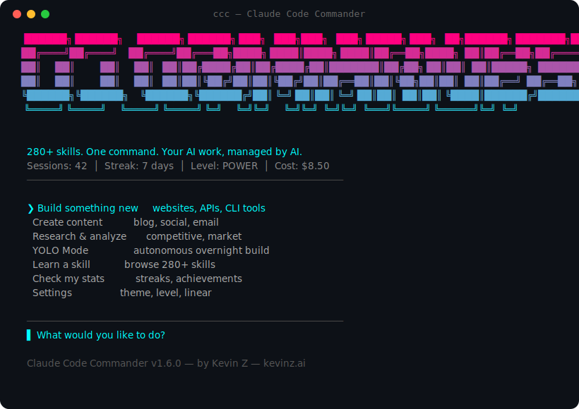
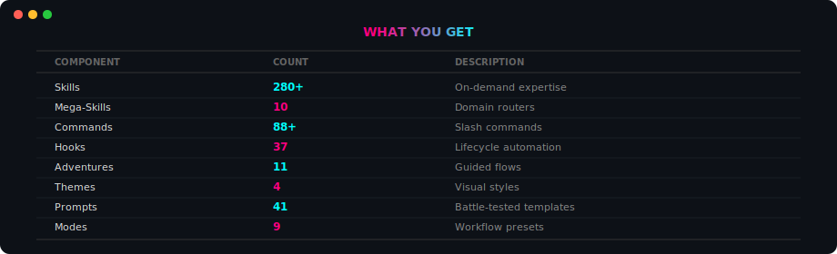
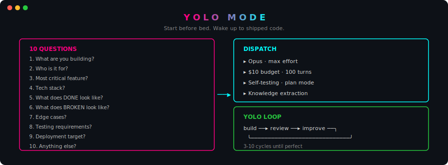
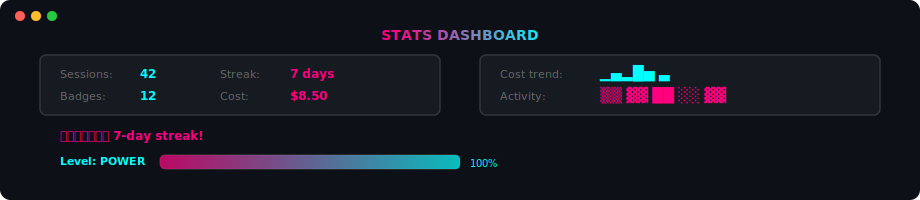
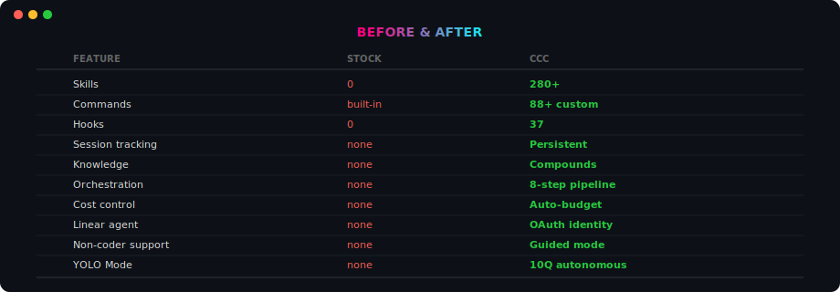

> **280+ skills · one command · your AI work, managed by AI**

**Not a skill pack. An AI project manager.** The most comprehensive Claude Code setup ever built.

[](https://opensource.org/licenses/MIT) [](./SKILLS-INDEX.md) [](./commander/tests/) [](./CHANGELOG.md)

**[Kevin Z](https://kevinz.ai)** · **[@kzic](https://x.com/kzic)** · Built from 200+ community sources

**[⬇ Install](#install)** · **[📖 Read the BIBLE](BIBLE.md)** · **[🔍 Browse Skills](SKILLS-INDEX.md)**

---

## Why This Exists

Every Claude Code tool is a skill pack that runs **inside** sessions.

CCC runs **above** them — it dispatches, tracks, learns, and orchestrates.


---

## Install

```bash
# One-line install
curl -fsSL https://raw.githubusercontent.com/KevinZai/cc-commander/main/install-remote.sh | bash

# Or via npm (gives you the `ccc` command globally)
npm install -g cc-commander

# Or clone
git clone https://github.com/KevinZai/cc-commander.git && cd cc-commander && ./install.sh
```

After install, just type **`ccc`** anywhere.

**Claude Desktop:** `/plugin marketplace add KevinZai/cc-commander`

---

## How to Use (Start Here)

**You don't need to know how to code.** CCC guides you with menus.

### Step 1: Install (one command)

```bash
curl -fsSL https://raw.githubusercontent.com/KevinZai/cc-commander/main/install-remote.sh | bash
```

### Step 2: Launch

```bash
ccc
```

That's it. Three letters.

### Step 3: Pick what you want to do

```
  What would you like to do?

  ❯ Build something new        ← websites, apps, tools
    Create content              ← blogs, social, emails
    Research & analyze          ← competitors, markets
    YOLO Mode                   ← overnight autonomous build
    Learn a new skill           ← browse 280+ skills
    Check my stats              ← streaks, achievements
```

Use **arrow keys** to move up/down. Press **Enter** to select.

### Step 4: Answer a few questions

CCC asks what you need (multiple choice — just pick one):

```
  What's the most important outcome?

  ❯ Something that works end-to-end
    A solid foundation to build on
    A quick prototype to test the idea
```

### Step 5: CCC does the rest

It dispatches to Claude Code with the right settings, tracks the session,
and learns from the results so next time is faster.

### That's it.

No commands to memorize. No flags to type. No config files to edit.
Just answer questions and CCC handles everything.

| Method             | Command                                             | For                   |
|--------------------|-----------------------------------------------------|-----------------------|
| **Quick stats**    | `ccc --stats`                                | Sessions, streaks     |
| **Self-test**      | `ccc --test`                             | Verify install        |
| **Fix issues**     | `ccc --repair`                           | Reset corrupt state   |
| **Claude Desktop** | `/plugin marketplace add KevinZai/cc-commander`     | Use in the Claude app |

---

## The Interactive CLI

```bash
ccc
```

```
╔══════════════════════════════════════════╗
║                                          ║
║   CCC v1.6.0                             ║
║   Welcome back, Kevin!                   ║
║   main · 3 files modified · 42 sessions  ║
║                                          ║
║   ❯ Build something new                  ║
║     Create content                       ║
║     Research & analyze                   ║
║     YOLO Mode (autonomous build)         ║
║     Learn a skill (280+)                 ║
║     Check my stats                       ║
║     Settings · Theme · Linear            ║
║                                          ║
╚══════════════════════════════════════════╝
```

Arrow keys or letter shortcuts. 4 themes. 11 flows.

---

## What You Get



<!--```
╔═════════════════╦════════╦════════════════════════╗
║  COMPONENT      ║ COUNT  ║  WHAT IT DOES          ║
╠═════════════════╬════════╬════════════════════════╣
║  Skills         ║  280+  ║  On-demand expertise   ║
║  Mega-Skills    ║   10   ║  Domain routers        ║
║  Commands       ║   88+  ║  Slash commands        ║
║  Hooks          ║   37   ║  Lifecycle automation  ║
║  Adventures     ║   11   ║  Guided flows          ║
║  Themes         ║    4   ║  Visual styles         ║
║  Prompts        ║   41   ║  Battle-tested         ║
║  Modes          ║    9   ║  Workflow presets       ║
╚═════════════════╩════════╩════════════════════════╝
```-->

---

## Spec-Driven Builds

```
╔══════════════════════════════════════════╗
║                                          ║
║  1. Most important outcome?              ║
║     ❯ Working end-to-end                 ║
║       Solid foundation                   ║
║       Quick prototype                    ║
║                                          ║
║  2. Tech preferences?                    ║
║     ❯ Pick the best for me               ║
║       Popular tools                      ║
║       Keep it simple                     ║
║                                          ║
║  3. How thorough?                        ║
║     ❯ Just the basics                    ║
║       With tests                         ║
║       Production-ready                   ║
║                                          ║
╚══════════════════════════════════════════╝
```

---

## Intelligence Layer

### CCC Detects Your Packages

```
╔══════════════════════════════╦═══════╦═══════════════╗
║  PACKAGE                     ║ STARS ║  STRENGTH     ║
╠══════════════════════════════╬═══════╬═══════════════╣
║  gstack (Garry Tan)          ║ 54.6K ║  Decisions+QA ║
║  Compound Engineering        ║ 11.5K ║  Knowledge    ║
║  Superpowers (obra)          ║  121K ║  Workflow     ║
║  Everything Claude Code      ║  100K ║  Hooks        ║
╚══════════════════════════════╩═══════╩═══════════════╝
```

### CCC Orchestrates Them

```
  PHASE          BEST TOOL              FALLBACK
  ──────────────────────────────────────────────
  ▸ Clarify      /office-hours          Spec flow
  ▸ Decide       /plan-ceo-review       Plan mode
  ▸ Plan         /ce:plan               Claude plan
  ▸ Execute      /ce:work               Dispatch
  ▸ Review       /ce:review (6+ agents) /simplify
  ▸ Test         /qa (real browser)     /verify
  ▸ Learn        Knowledge engine       Always on
  ▸ Ship         /ship                  git commit
```

### CCC Learns From Every Session

```
  Session 1 ───▸ Fix auth bug ───▸ 3 hours
                  │
                  ▾ auto-extracted to knowledge
                  
  Session 47 ──▸ Similar issue ──▸ "We hit this"
                                    ──▸ 10 minutes
```

---

## YOLO Mode

**Start before bed. Wake up to shipped code.**



<!--```
╔══════════════════════════════════════════╗
║                                          ║
║   Y O L O   M O D E                     ║
║                                          ║
║   10 questions:                          ║
║     What? Who? Critical feature?         ║
║     Stack? Done? Broken? Edges?          ║
║     Tests? Deploy? Extras?               ║
║                                          ║
║   Then:                                  ║
║     ▸ Opus · max effort · $10 budget     ║
║     ▸ 100 turns · self-testing           ║
║     ▸ Knowledge extraction               ║
║                                          ║
║   YOLO Loop:                             ║
║     build ──▸ review ──▸ improve ──╮     ║
║       ╰────────────────────────────╯     ║
║       3-10 cycles until perfect          ║
║                                          ║
╚══════════════════════════════════════════╝
```-->

---

## Linear Agent

CCC is its own **agent** in Linear.

```
╔══════════════════════════════════════════╗
║                                          ║
║  CCC Agent · OAuth App Identity          ║
║                                          ║
║  29 issues · 27 done · 82%              ║
║  ▓▓▓▓▓▓▓▓▓▓▓▓▓▓▓▓▓▓▓▓░░░░░             ║
║                                          ║
║  Sessions auto-create issues.            ║
║  Costs tracked. Progress on phone.       ║
║                                          ║
╚══════════════════════════════════════════╝
```

---

## 280+ Skills · 10 Mega-Skills

```
╔══════════════════╦══════╦══════════════════════╗
║  MEGA-SKILL      ║ SUBS ║  DOMAIN              ║
╠══════════════════╬══════╬══════════════════════╣
║  mega-design     ║  39  ║  UI/UX, animation    ║
║  mega-marketing  ║  45  ║  CRO, email, ads     ║
║  mega-saas       ║  20  ║  Auth, billing, API  ║
║  mega-testing    ║  15  ║  Unit, E2E, TDD      ║
║  mega-devops     ║  20  ║  CI/CD, Docker, AWS  ║
║  mega-seo        ║  19  ║  Schema, SERP        ║
║  mega-security   ║   8  ║  OWASP, pentest      ║
║  mega-research   ║   8  ║  Competitive, market ║
║  mega-mobile     ║   8  ║  React Native        ║
║  mega-data       ║   8  ║  SQL, ETL            ║
╠══════════════════╬══════╬══════════════════════╣
║  TOTAL           ║ 190  ║  10 domain routers   ║
╚══════════════════╩══════╩══════════════════════╝
```

---

## 4 Themes

```
  CYBERPUNK     ░▒▓█████████▓▒░   neon pink → cyan
  FIRE          ░▒▓█████████▓▒░   amber → deep orange
  GRAFFITI      ░▒▓█████████▓▒░   yellow → pink → blue
  FUTURISTIC    ░▒▓█████████▓▒░   soft blue → purple
```

---

## Stats Dashboard



<!--```
╔══════════════════════════════════════════╗
║  Sessions: 42        Streak: 7 days     ║
║  Badges:   12        Cost:   $8.50      ║
╠══════════════════════════════════════════╣
║  Cost:     ▁▄▂█▅ ▃                      ║
║  Activity: ▒▒ ▓▓ ██ ░░ ▓▓              ║
║  Level:    POWER █████████████████      ║
╚══════════════════════════════════════════╝
```-->

---

## The Kevin Z Method

> 7 rules from 200+ articles. 14 months of production.

```
╔══════════════════════════════════════════╗
║                                          ║
║  1. Plan before coding                   ║
║  2. Context is milk — keep it fresh      ║
║  3. Verify, don't trust                  ║
║  4. Subagents = fresh context            ║
║  5. CLAUDE.md is an investment           ║
║  6. Boring solutions win                 ║
║  7. Operationalize every fix             ║
║                                          ║
║  Full methodology: BIBLE.md              ║
║  2000+ lines · 7 chapters · appendices   ║
║                                          ║
╚══════════════════════════════════════════╝
```

---

## Before & After



<!--```
╔══════════════════════╦════════╦══════════════╗
║  FEATURE             ║ STOCK  ║  CCC         ║
╠══════════════════════╬════════╬══════════════╣
║  Skills              ║   0    ║  280+        ║
║  Commands            ║ built  ║  88+ custom  ║
║  Hooks               ║   0    ║  37          ║
║  Session tracking    ║ none   ║  Persistent  ║
║  Knowledge           ║ none   ║  Compounds   ║
║  Orchestration       ║ none   ║  8-step      ║
║  Cost control        ║ none   ║  Auto-budget ║
║  Linear agent        ║ none   ║  OAuth       ║
║  Non-coder support   ║ none   ║  Guided      ║
║  YOLO Mode           ║ none   ║  10Q auto    ║
║  Themes              ║ none   ║  4 gradient  ║
╚══════════════════════╩════════╩══════════════╝
```-->

---

## Contributing

```bash
skills/your-skill/SKILL.md        # Add a skill
commands/your-command.md           # Add a command
hooks/your-hook.js                 # Add a hook
commander/adventures/X.json        # Add a flow
```

MIT License.

---

<div align="center">

```
╔══════════════════════════════════════╗
║                                      ║
║   Not a researcher.                  ║
║   Not a pundit.                      ║
║   An operator who ships.             ║
║                                      ║
╚══════════════════════════════════════╝
```

**Claude Code Commander v1.6.0** · **[Kevin Z](https://kevinz.ai)** · **[@kzic](https://x.com/kzic)**

**[Install Now](#install)** · **[Read the BIBLE](BIBLE.md)** · **[Browse Skills](SKILLS-INDEX.md)**

</div>
