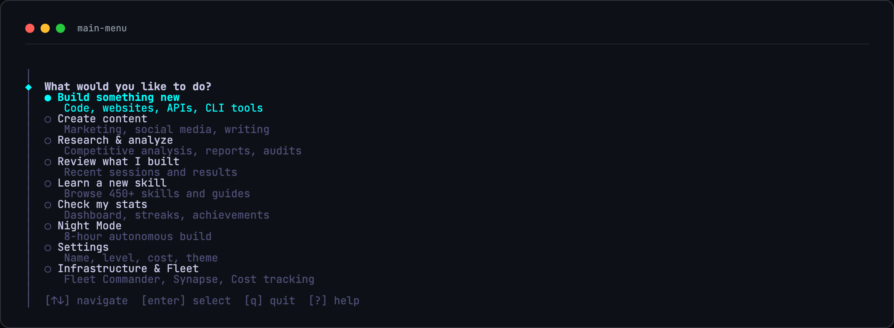
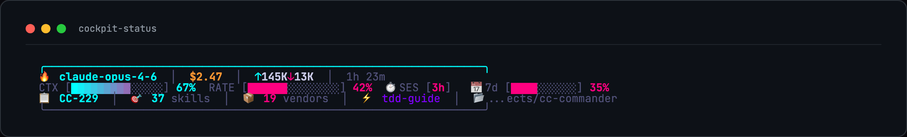
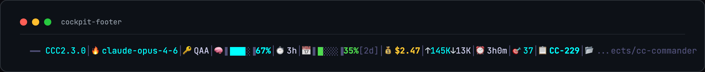
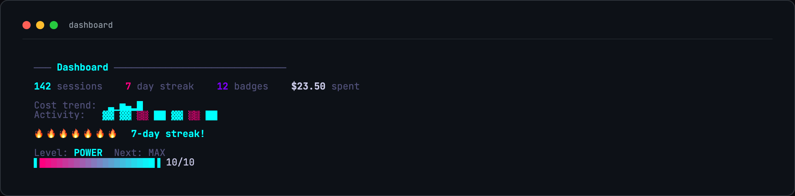
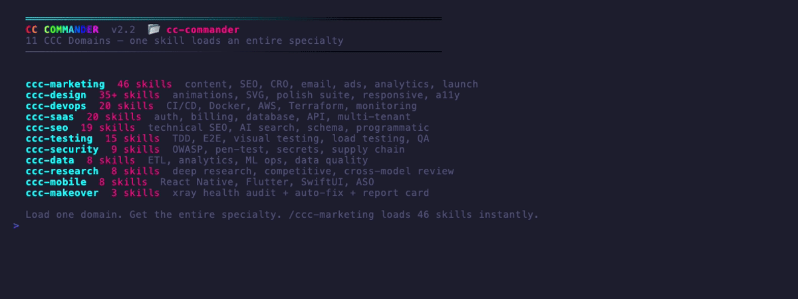

<picture>
  <source media="(prefers-color-scheme: dark)" srcset="docs/assets/ccc-hero.svg">
  
</picture>

> **Every Claude Code tool. One install. An AI brain that learns.**

**Not a skill pack. An AI project manager that thinks before it acts.** 450+ skills, 98% context savings, 19 vendor packages, and an Intelligence Layer that scores complexity, reads your stack, and gets smarter every session.


[](https://opensource.org/licenses/MIT) [](./SKILLS-INDEX.md) [](./docs/ACKNOWLEDGMENTS.md) [](./commander/tests/) [](./CHANGELOG.md)

**[Kevin Z](https://kevinz.ai)** · **[@kzic](https://x.com/kzic)** · Built from 200+ community sources · Aggregates 19 vendor packages

**[Install](#quick-start--pick-your-path)** · **[Browse Skills](SKILLS-INDEX.md)** · **[Agent Bible](docs/BIBLE-AGENT.md)** · **[Ecosystem](docs/ECOSYSTEM.md)** · **[BIBLE](BIBLE.md)** · **[Changelog](CHANGELOG.md)** · **[Why CCC?](docs/WHY-CCC.md)** · **[Evaluation](docs/EVALUATION.md)**

---


## Why CC Commander

Stock Claude Code is a blank terminal with amnesia. No skills. No guidance. No memory. Every session starts from zero. And it wastes 98% of your context window on tool output you'll never re-read.

**CC Commander remembers everything, learns from every session, and gets smarter the more you use it.** It wraps every major Claude Code tool into one install — with a smart orchestrator, guided menus, and an Intelligence Layer that auto-adjusts every dispatch based on your project.

```
You type: ccc
You get:  A guided AI project manager with 450+ skills,
          19 vendor packages, real learning, and zero setup.
```


---

## See It In Action

### Main Menu — Arrow Keys, No Commands to Memorize



### Cockpit Dashboard — Live Session Status

Context, rate limits, and budget meters in your terminal. Color-codes green → yellow → red as limits approach.





### Stats Dashboard



Sessions, streaks, badges, cost tracking, activity heatmap, level progression.

### 11 CCC Domains — One Skill Loads an Entire Specialty



### 450+ Skills — Install Only What You Need


> All recordings are real terminal output captured with [vhs](https://github.com/charmbracelet/vhs). No mockups.

---

## Intelligence Layer

> Stock Claude Code is a blank terminal with amnesia. CC Commander remembers everything, learns from every session, and gets smarter the more you use it.

**An AI project manager that thinks before it acts.** Before dispatching a single token, CCC scores your task, reads your stack, pulls relevant lessons from past sessions, and selects the right model and budget automatically. No configuration. No flags. It just works.

### How It Works

**Four modules. Always running.**

#### 1. Weighted Complexity Scoring (`dispatcher.js`)

Every task scored 0–100 using 47 keyword signals, word count, and fuzzy regex matching:

```
"fix typo"             → score  0  → 10 turns, $1 budget, Haiku
"add dark mode"        → score 25  → 20 turns, $3 budget, Sonnet
"refactor auth module" → score 60  → 35 turns, $6 budget, Sonnet
"build SaaS platform"  → score 100 → 50 turns, $10 budget, Opus
```

File scope estimation adds 0–20 bonus points by scanning how many project files the task is likely to touch. Budget and turns auto-adjust — no manual flags needed.

#### 2. Stack Detection (`project-importer.js`)

CCC reads your project before every dispatch: `package.json`, `Dockerfile`, `go.mod`, `requirements.txt`. Detects nextjs, react, vue, docker, python, rust, go, github-actions, orm, billing, testing. Reads current git branch + last 5 commit themes. Adds monorepo detection (workspaces, lerna, turbo, nx).

#### 3. Skill Recommendations (`skill-browser.js`)

`recommendSkills(task, techStack)` combines three signals:

| Signal | Weight | What It Does |
|--------|--------|-------------|
| Stack match | 10 pts | Next.js project → nextjs-app-router ranks first |
| Keyword match | 2 pts/hit | "auth" task → auth, jwt, better-auth bubble up |
| Usage history | boost | Skills that worked for you rank higher over time |

Trending skills (7-day window) surface automatically. Skills that led to successful sessions compound their ranking advantage.

#### 4. Knowledge Compounding (`knowledge.js`)

Every completed session extracts a lesson (keywords, category, stack, error patterns, success patterns) stored in `~/.claude/commander/`. Searched before the next dispatch with time-decay relevance: < 7 days = 2x, < 30 days = 1.5x, older = 1x. Fuzzy keyword matching and cross-domain boosts (web↔react, api↔backend, testing↔bugfix) catch related concepts.

**Smart retry** handles failures automatically: rate limit → wait 60s + retry; context overflow → reduce turns to 60% + retry; budget exceeded → clear error with next steps.

### Intelligence Analysis — Smart Dispatch in Action

Before dispatching a single token, CCC scores your task, reads your stack, and auto-configures the session.

```
  Task: "Add authentication with JWT and OAuth"

  Intelligence Analysis:
  ├─ Complexity Score: 72/100 (complex)
  ├─ Keyword signals:  +15 (auth) +15 (implement) +20 (production)
  ├─ Word count:       +10 (detailed description)
  ├─ Stack detected:   nextjs, react, tailwind
  └─ Related lessons:  2 found (JWT auth succeeded, OAuth2 pattern)

  Auto-configured dispatch:
     Model: opus  |  Turns: 35  |  Budget: $6
     Skills: nextjs-app-router, ccc-saas, auth-patterns
     Knowledge: 2 past lessons injected

  Dispatching... ████████████████████░░░░ 78%
```

### Skill Recommendations — Ranked by Relevance

CCC ranks skills using your stack + task keywords + past usage. The right tools surface automatically.

```
  Recommended skills for your project:

  SCORE  SKILL                 WHY
  ─────────────────────────────────────────────
   20    nextjs-app-router     Stack match + keyword
   16    frontend-design       Stack match
   16    shadcn-ui             Stack match
   14    saas-scaffolder       Keyword: auth, billing
   12    tailwind-v4           Stack match
    8    ccc-testing           Always recommended

  ❯ Use top recommendation
    Browse all 450+ skills
    Search by keyword
    Back to main menu
```

### Knowledge Compounding — Learning After Every Session

Every completed session extracts patterns and errors. The next dispatch is informed by everything that worked before.

```
  Session Complete — Knowledge Extracted

  Task:     "Add JWT authentication"
  Outcome:  Success
  Cost:     $4.12  |  Duration: 12m
  Category: api

  Patterns learned:
  ├─ bcrypt + JWT combo works well with Next.js
  ├─ httpOnly cookies for token storage
  ├─ middleware.ts matcher needs exact paths
  └─ next-auth conflicts with custom Prisma adapter

  Knowledge base: 47 lessons  |  12 categories
  Next dispatch will be 23% more informed.
```

### Project Import — Stack Auto-Detection

CCC reads your project before every dispatch. No setup needed.

```
  Importing: ~/projects/my-saas-app

  Detected:
  ├─ CLAUDE.md           142 lines
  ├─ Tech stack:         nextjs, react, tailwind, prisma, stripe
  ├─ Monorepo:           No
  ├─ Git branch:         feature/checkout
  └─ Recent commits:     "add cart", "fix price calc", "stripe webhook"

  6 skills pre-selected for this stack
  3 relevant lessons from knowledge base

  ❯ Start building in this project
    Run /xray health audit first
    Back to main menu
```

### The Net Effect

| Session | What Changed |
|---------|-------------|
| 1 | Dispatches based on complexity score alone |
| 5 | Knows your stack, recommends proven skills |
| 20 | Has learned your patterns — feels like a PM who knows your codebase |

### Token Optimization Stack — 5 Layers of Savings

| Layer | Tool | Savings |
|-------|------|---------|
| Tool output sandboxing | context-mode | **98%** — SQLite + FTS5, BM25 snippets only |
| CLI output filtering | RTK | 99.5% — strips verbose shell output |
| Skill tiering | `_tiers.json` | ~10k tokens — 30 essential vs 458 full |
| Rate limit rotation | ClaudeSwap | 2 MAX accounts, drain-first strategy |
| Prompt caching | Extended TTL | 90% discount, 1hr cache window |

---

## Features


### New in v2.3.0 — Professional TUI

- **Pipe-rail visual language** — `┌│└` guides, `●○` radio buttons, `◆` prompts
- **Native Claude Code launch** — `--session-id` for persistent, interactive sessions
- **Mouse click support** — Click menu items directly
- **`?` help popup** — Keyboard + tmux shortcuts at a glance
- **Security hardened** — Session ID allowlist, task sanitization, YOLO confirmation gate
- **187 tests** — 91/100 audit score across 4 Codex audit rounds


| Component | Count | What It Does |
|-----------|-------|-------------|
| Skills | 450+ | On-demand expertise (deduplicated) |
| CCC Domains | 11 | Domain routers with sub-skills |
| Commands | 80+ | Slash commands (/ccc: prefix) |
| Hooks | 25 | Lifecycle automation |
| Adventures | 13 | Guided interactive flows |
| Vendor Packages | 19 | Best-in-class tools, auto-updated |
| Themes | 10 | Cyberpunk, Fire, Ocean, Aurora, Sunset, Monochrome, Rainbow, Dracula + more |
| Prompts | 36+ | Battle-tested templates |
| Modes | 9 | Workflow presets |
| Split Mode | tmux | Tabbed sessions — each task gets a window |
| Agent API | CLI | Headless dispatch for AI orchestrators |
| Infrastructure | 6 | Fleet, Synapse, Cost, AO, CloudCLI, Paperclip commands |
| Service Detector | auto | Probes 8 services + 4 CLIs on startup |

### Every Path, Visualized


> Every menu option, every sub-flow, every path to Claude Code — one diagram. [View full size](docs/assets/ccc-flowchart.svg)

### Night Mode / YOLO — Autonomous Overnight Build


**Start before bed. Wake up to shipped code.**


10 questions → Opus with max effort → $10 budget → 100 turns → self-testing loop.

```
  YOLO Mode — Autonomous Overnight Build

  What are we building tonight?
  > "Full e-commerce checkout with Stripe integration"

  Configuration:
  ├─ Model:       Opus (max reasoning)
  ├─ Budget:      $10 (hard cap)
  ├─ Max turns:   100
  ├─ Self-test:   Enabled (tests after each phase)
  ├─ Checkpoint:  Every 10 edits
  └─ Stop file:   ~/.claude/commander/yolo-stop

  Ready to run for up to 8 hours unattended.

  ❯ Start YOLO build
    Adjust settings
    Cancel
```

---


## 11 CCC Domains

Each domain is a router that dispatches to specialized sub-skills on demand.

| Domain | Skills | What's Inside |
|--------|--------|---------------|
| **ccc-design** | 39 | landing pages, UI audit, animation, responsive layout, color systems, typography, canvas design, wireframes, component library, accessibility, dark mode, micro-interactions, illustration, icon sets, design tokens |
| **ccc-marketing** | 45 | CRO, email campaigns, ad copy, social media, SEO content, blog posts, landing page copy, A/B testing, funnel optimization, lead magnets, newsletter, brand voice, press releases, case studies, video scripts |
| **ccc-saas** | 20 | auth systems, billing/Stripe, API design, database schema, multi-tenancy, onboarding flows, admin dashboards, role-based access, webhooks, rate limiting, usage tracking, feature flags |
| **ccc-devops** | 20 | GitHub Actions, Docker, AWS deploy, Terraform, monitoring, logging, CI/CD pipelines, Kubernetes, Nginx, SSL certs, environment management, health checks, rollback strategies |
| **ccc-seo** | 19 | meta tags, JSON-LD schema, sitemap, robots.txt, Core Web Vitals, internal linking, keyword research, content optimization, image SEO, page speed, structured data, canonical URLs |
| **ccc-testing** | 15 | Vitest, Playwright E2E, TDD workflow, snapshot testing, API testing, load testing, coverage reports, test fixtures, mock strategies, visual regression, accessibility testing |
| **ccc-makeover** | 3 | /xray project audit (health score 0-100, maturity 1-5), /makeover agent swarm execution, before/after report card |
| **ccc-data** | 8 | SQL optimization, data pipelines, analytics setup, data visualization, machine learning, reporting, data quality, vector search |
| **ccc-security** | 8 | OWASP top 10, secrets scanning, dependency audit, container security, penetration testing, CSP headers, rate limiting, auth hardening |
| **ccc-research** | 8 | competitive analysis, market research, user research, technology evaluation, trend analysis, SWOT, stakeholder interviews, data synthesis |
| **ccc-mobile** | 8 | React Native, Expo, mobile UI, push notifications, deep linking, app store optimization, offline-first, gesture handling |

---


## 19 Vendor Packages

CC Commander aggregates the best Claude Code tools as git submodules. Auto-updated weekly. 19 packages, 1,500+ vendor skills.

| Package | Stars | What You Get |
|---------|-------|-------------|
| [Everything Claude Code](https://github.com/affaan-m/everything-claude-code) | 120K+ | 156 skills, 72 commands, 38 agents, lifecycle hooks |
| [gstack](https://github.com/garrytan/gstack) | 58K+ | CEO/eng plan review, office hours, QA — OpenClaw integration v2 |
| [Superpowers](https://github.com/obra/superpowers) | 29K+ | Forces structured thinking — /plan, /tdd, /verify |
| [claude-code-best-practice](https://github.com/shanraisshan/claude-code-best-practice) | 26K+ | Reference architecture, Channels, Auto Mode |
| [repomix](https://github.com/yamadashy/repomix) | 22.8K+ | Pack codebases for AI (tree-sitter compression = 60% smaller) |
| [oh-my-claudecode](https://github.com/Yeachan-Heo/oh-my-claudecode) | 17K+ | HUD with worktree support, quota tracking, hyperlinks |
| [Claude HUD](https://github.com/jarrodwatts/claude-hud) | 15K+ | Real-time status display, offline cost tracking, git diffs |
| [RTK](https://github.com/rtk-ai/rtk) | 14.6K+ | Token optimization (60-90% savings), 25 AWS subcommands |
| [Compound Engineering](https://github.com/EveryInc/compound-engineering-plugin) | 11.5K+ | Knowledge compounding, mandatory code review enforcement |
| [claude-skills](https://github.com/alirezarezvani/claude-skills) | 8.6K+ | 223+ skills, 23 agents, prompt A/B testing |
| [notebooklm-py](https://github.com/teng-lin/notebooklm-py) | 8.6K+ | Podcast generation, PPTX export, quiz/flashcards |
| [claude-mem](https://github.com/thedotmack/claude-mem) | 46.7K+ | Knowledge Agents, persistent cross-session memory |
| [claude-code-ultimate-guide](https://github.com/FlorianBruniaux/claude-code-ultimate-guide) | 2.7K+ | 219 templates, 271 quizzes, threat database |
| [acpx](https://github.com/openclaw/acpx) | 1.8K+ | ACP protocol, Flows system, structured agent communication |
| [claude-reflect](https://github.com/BayramAnnakov/claude-reflect) | 860+ | Self-improving skills with reflection loops |
| [Caliber](https://github.com/caliber-ai-org/ai-setup) | 300+ | Config scoring, drift detection |
| [graphify](https://github.com/safishamsi/graphify) | 17.5K+ | Any input → knowledge graph, clustered communities, HTML + JSON |
| [UI/UX Pro Max](https://github.com/nextlevelbuilder/ui-ux-pro-max-skill) | 62K+ | Design intelligence for professional UI/UX across platforms |
| [claude-code-prompts](https://github.com/repowise-dev/claude-code-prompts) | 142+ | Defensive prompt patterns, verification specialist |

---


## Smart Orchestrator

The **smart orchestrator** scores each tool: capability match (50%) + popularity (15%) + recency (15%) + your preference (20%) — then picks the best one for each phase.

```
  PHASE          BEST TOOL              FALLBACK
  ──────────────────────────────────────────────
  ▸ Clarify      /office-hours          Spec flow
  ▸ Decide       /plan-ceo-review       Plan mode
  ▸ Plan         /ce:plan               Claude plan
  ▸ Execute      /ce:work               Dispatch
  ▸ Review       /ce:review (6+ agents) /simplify
  ▸ Test         /qa (real browser)     /verify
  ▸ Learn        Knowledge engine       Always on
  ▸ Ship         /ship                  git commit
```

CCC learns from every session. Knowledge compounds over time.

---


## XRay + Makeover

**Audit any project. Fix it automatically.**

```bash
/ccc:xray                    # Scan → health score 0-100
/ccc:makeover                # Agent swarm applies top fixes
```

| Dimension | Weight | What It Checks |
|-----------|--------|---------------|
| Security | 25% | CVEs, secrets, .env tracking |
| Testing | 20% | Config, coverage, frameworks |
| Maintainability | 20% | Complexity, linting, duplication |
| Dependencies | 15% | Outdated, vulnerable |
| DevOps | 10% | CI presence, quality gates |
| Documentation | 10% | README, CLAUDE.md, inline docs |


---


## Quick Start — Pick Your Path

```
1. Install    curl -fsSL https://raw.githubusercontent.com/KevinZai/cc-commander/main/install-remote.sh | bash
2. Launch     ccc
3. Build      Pick from the menu. Claude Code does the rest.
```

### Your First 60 Seconds

```
1. ccc → Main menu (14 options)
2. Pick "Build something new" → Choose project type
3. Answer 3 multiple-choice questions → CCC generates a plan
4. CCC dispatches Claude with the right model, budget, and skills
5. Session ends → CCC extracts lessons → gets smarter next time
```

No configuration. No YAML. No API keys. The Intelligence Layer handles everything.

One question: **How are you using Claude?**

### Path A: Claude Code CLI (Terminal)

> You use `claude` in your terminal. This is the most common way.

**Option 1 — One-liner install:**
```bash
curl -fsSL https://raw.githubusercontent.com/KevinZai/cc-commander/main/install-remote.sh | bash
```

**Option 2 — npm:**
```bash
npm install -g cc-commander
```

Then:
```bash
ccc
```

Arrow keys to navigate. Enter to select. That's it.

**Update anytime:**
```bash
ccc --update
```

**Where files live:**
- Source: `~/.cc-commander/` (auto-created by installer)
- Config: `~/.claude/` (skills, commands, hooks, CLAUDE.md)
- Binary: `ccc` → symlinked to source

> Don't delete `~/.cc-commander/` — the `ccc` command needs it.

**What you get:** Full CLI with tmux split mode, daemon, theme switching, and the cockpit dashboard.

---

### Path B: Claude Code (Slash Commands Only)

> You don't want the full CLI. Just want skills + commands inside Claude Code.

```bash
curl -fsSL https://raw.githubusercontent.com/KevinZai/cc-commander/main/install-remote.sh | bash
```

Then in any Claude Code session:

```
/ccc
```

Full interactive menu appears. Same features, no separate CLI needed.

**What you get:** All 450+ skills and commands, no extra CLI binary required.

---

### Path C: Claude Desktop (Cowork Plugin)

> You use Claude Desktop and want CC Commander as a Cowork plugin.

```
/plugin marketplace add KevinZai/cc-commander
```

CC Commander appears as a skill you can invoke. Say "start commander" or "what should I work on" to begin.

**What you get:** 7 Cowork skills — project management, infrastructure, knowledge base, and night mode.

---

## CLI Reference

| Command | What It Does |
|---------|-------------|
| `ccc` | Interactive mode (default — tmux tabbed) |
| `ccc --stats` | Sessions, streaks, level, cost |
| `ccc --test` | 22-point self-test (verify install) |
| `ccc --update` | Pull latest + reinstall |
| `ccc --repair` | Reset corrupt state |
| `ccc --simple` | Menu-only, no tmux |
| `ccc --dispatch "task"` | Headless dispatch (for AI agents) |
| `ccc --skills` | Manage skill tiers (list, install, remove, tier) |

### Split Mode

**The default mode.** Tabbed tmux sessions. Each task gets its own window.

CCC menu runs in tab 0. Each dispatched task opens a new tmux window where Claude works with full output visible.

| Key | Action |
|-----|--------|
| `Ctrl+A n` | Next tab |
| `Ctrl+A p` | Previous tab |
| `Ctrl+A 0` | Back to CCC menu |
| `Ctrl+A q` | Quit session |
| Mouse click | Switch tabs |

### Cancel Running Tasks

- **During any build:** Press `Escape` or `q` to kill the Claude process and return to menu
- **During YOLO loop:** `touch ~/.claude/commander/yolo-stop` to halt between cycles
- **In split mode:** Switch to the Claude tab and `Ctrl+C`

### Daemon Mode

**KAIROS-inspired persistent background agent.** Monitors your project, processes queued tasks, and consolidates knowledge — all hands-free.

```bash
ccc --daemon                    # Start (runs in background)
ccc --queue "fix login bug"     # Add task to queue
ccc --queue-list                # Show pending tasks
ccc --daemon-stop               # Stop daemon
```

| Feature | What It Does |
|---------|-------------|
| Tick loop (5 min) | Checks queue, git status, dispatches work |
| Dream mode (1 hr) | Consolidates knowledge, detects error patterns |
| Task queue | Priority-based, file-backed, auto-dispatch |
| Budget cap | 15-second limit per tick action |

Customize: `--interval 120` (2 min ticks) · `--tick-budget 30` · `--dream 30` (30 min dreams)

---

## Use Inside Claude Code

No CLI needed. Type `/ccc` in any Claude Code session for the full interactive menu.

```
/ccc              → Main menu (15 options with sub-menus)
/ccc xray         → Project health scan
/ccc makeover     → Auto-apply top fixes
/ccc refresh      → Update your CLAUDE.md from latest template
/ccc domains      → Browse 11 CCC domains
/ccc skills       → Browse 450+ skills
/ccc grill        → 7-question Socratic planning probe
/ccc infra        → Infrastructure sub-menu (Fleet, Synapse, Cost, AO, CloudCLI, Paperclip)
/ccc detect       → Probe all services and CLIs
```

Same choices, same sub-menus, same actions as the full CLI. Cancel anytime with "back" or `Escape`. Also works in **Claude Desktop Cowork** and **VS Code / Cursor**.

---

## Agent-Friendly API

CCC is built to be controlled by AI agents — OpenClaw, Claude Code, or any orchestrator.

| Command | Output | Purpose |
|---------|--------|---------|
| `ccc --dispatch "task" --json` | JSON | Run task headlessly |
| `ccc --list-skills --json` | JSON | All 450+ skills |
| `ccc --list-sessions --json` | JSON | Session history |
| `ccc --status` | JSON | Health check |
| `ccc --template` | text | Latest CLAUDE.md template |

**Override flags:** `--model opus` · `--max-turns 50` · `--budget 5` · `--cwd /path`

```bash
# OpenClaw agent dispatches a build
result=$(ccc --dispatch "Build auth with JWT" --json --model opus --budget 5)

# Claude Code agent checks available skills
ccc --list-skills --json | jq '.[] | select(.name | contains("auth"))'
```

---

## Security

- **No command injection** — all shell calls use `execFileSync` with array arguments
- **Auto-mode by default** — dispatches use `--permission-mode auto`, not `--dangerously-skip-permissions`
- **YOLO only skips** — only YOLO/night mode uses skip-permissions (intentional, documented)
- **Zero npm vulnerabilities** — verified on every CI run
- **PII scanning** — CI blocks commits containing personal data patterns
- **Error containment** — every error returns to menu with error ID, never raw stack traces
- **Pre-publish checks** — `npm run prepublishOnly` runs all tests + lint before publish

---

## Agent Bible

**[BIBLE-AGENT.md](docs/BIBLE-AGENT.md)** — 268-line machine-readable reference. Any AI agent reads this and can manage CCC immediately.

```bash
# Tell any agent:
"Read docs/BIBLE-AGENT.md from the cc-commander repo, then use the CLI API to manage this project."
```

Covers: CLI API, dispatch patterns, JSON schemas, skill catalog, level/model defaults, integration points.

---

## The Kevin Z Method

> 7 rules from 200+ articles. 14 months of production.

1. Plan before coding
2. Context is milk — keep it fresh
3. Verify, don't trust
4. Subagents = fresh context
5. CLAUDE.md is an investment
6. Boring solutions win
7. Operationalize every fix

Full methodology: **[BIBLE.md](BIBLE.md)** — 2000+ lines, 7 chapters, appendices.

For AI agents: **[BIBLE-AGENT.md](docs/BIBLE-AGENT.md)** — 268-line machine-readable version.

---

## 10 Themes


**Cyberpunk, Fire, Ocean, Aurora, Sunset, Monochrome, Rainbow, Dracula, Graffiti, Futuristic.** Live preview as you navigate. Switch anytime in Settings or type `/ccc theme`.

---

## Who Built This

CC Commander is built by [Kevin Z](https://kevinz.ai) ([@kzic](https://x.com/kzic)) — a non-technical entrepreneur and CEO of [MyWiFi Networks](https://mywifinetworks.com) (20+ years in tech, never wrote production code). He wanted to leverage Claude Code to its max capabilities without chasing plugins, reading changelogs, or memorizing commands. So he scanned every Claude Code article, plugin, and skill on the internet — 200+ sources — and distilled it into one self-learning AI project manager. Every feature was built with Claude Code itself. If a non-coder can build a 450+ skill toolkit with AI, imagine what you can build.

---

## Acknowledgments

CC Commander aggregates 19 open-source packages. Full credits: **[ACKNOWLEDGMENTS.md](docs/ACKNOWLEDGMENTS.md)**

45+ ecosystem repos tracked: **[ECOSYSTEM.md](docs/ECOSYSTEM.md)**

---

## License

MIT License for the full project. The Intelligence Layer (4 files) has an additional [Commons Clause](docs/LICENSE-INTELLIGENCE.md) — free to use, not to sell.

All 19 vendor packages are permissive open-source: 14 MIT, 1 Apache-2.0, 1 CC-BY-SA-4.0. Full details: **[LICENSES-VENDORS.md](docs/LICENSES-VENDORS.md)**

> **Note:** GitHub may show "Unknown" in the sidebar because some vendor submodules don't ship a LICENSE file in their repo root. Every vendor's license has been verified — see the table above.

---

## Contributing

```bash
skills/your-skill/SKILL.md        # Add a skill
commands/your-command.md           # Add a command
hooks/your-hook.js                 # Add a hook
commander/adventures/X.json        # Add a flow
```

---

<div align="center">

**CC Commander v2.3.0** · **[Kevin Z](https://kevinz.ai)** · **[@kzic](https://x.com/kzic)**

*Every Claude Code tool. One install. An AI brain that learns.*

**[Install Now](#quick-start--pick-your-path)** · **[Read the BIBLE](BIBLE.md)** · **[Agent Bible](docs/BIBLE-AGENT.md)** · **[Browse Skills](SKILLS-INDEX.md)** · **[Ecosystem](docs/ECOSYSTEM.md)**

</div>
