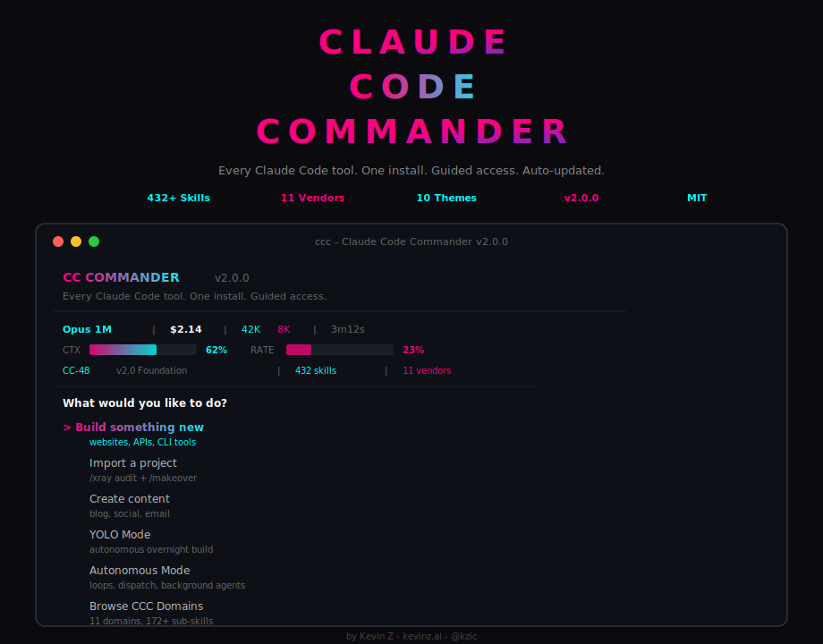
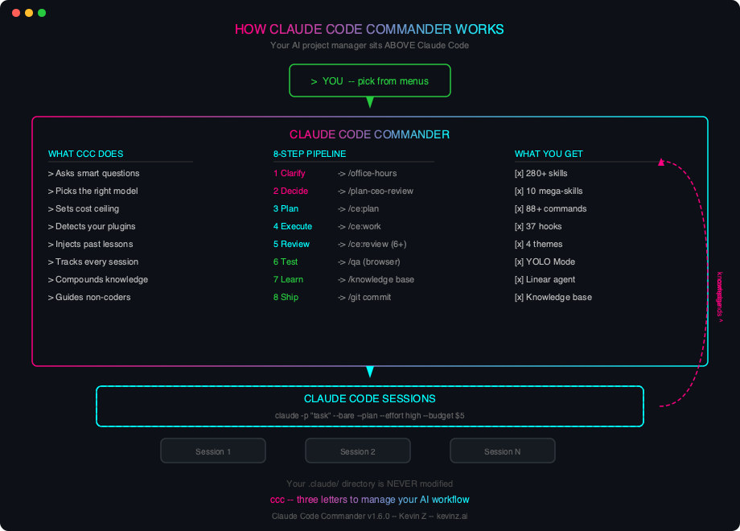
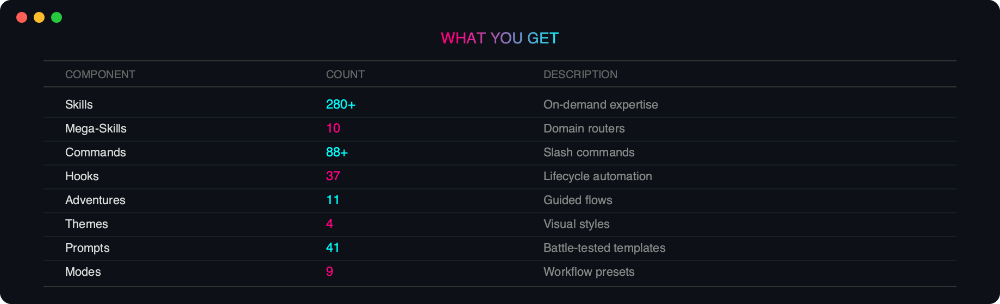
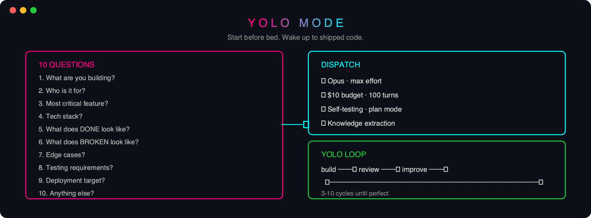
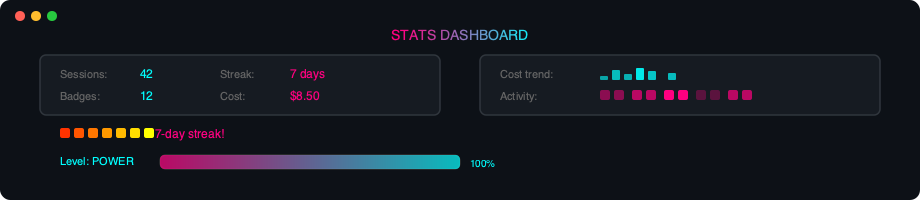
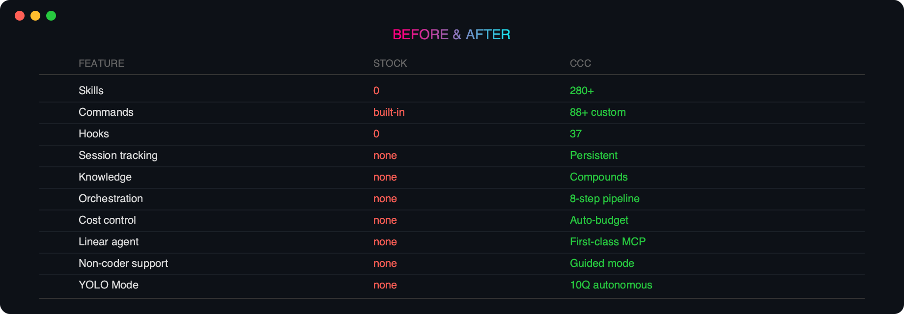
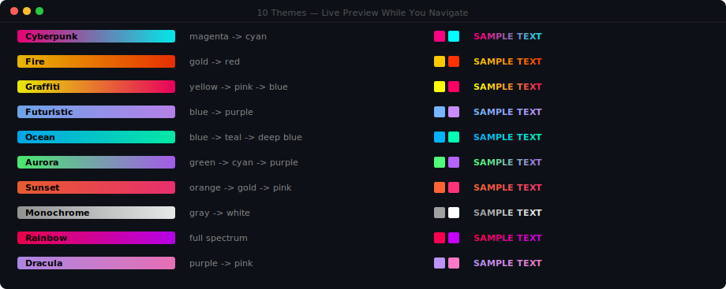

> **Every Claude Code tool. One install. Guided access. Auto-updated.**

**Not a skill pack. An AI cockpit.** The most comprehensive Claude Code aggregator ever built. Newbie-friendly.

[](https://opensource.org/licenses/MIT) [](./SKILLS-INDEX.md) [](./ACKNOWLEDGMENTS.md) [](./commander/tests/) [](./CHANGELOG.md)

**[Kevin Z](https://kevinz.ai)** · **[@kzic](https://x.com/kzic)** · Built from 200+ community sources · Aggregates 11 vendor packages

**[Install](#install)** · **[Browse Skills](SKILLS-INDEX.md)** · **[Ecosystem](docs/ECOSYSTEM.md)** · **[BIBLE](BIBLE.md)** · **[Changelog](CHANGELOG.md)**

---


Stock Claude Code is a blank terminal. No skills. No guidance. No memory.

**CC Commander wraps every major Claude Code tool** into one install — with a smart orchestrator that picks the best tool for each job, guided menus for beginners, and a cockpit dashboard for power users.

```
You type: ccc
You get:  A guided AI project manager with 432+ skills,
          11 vendor packages, and zero setup.
```



---


```bash
# npm (recommended — gives you the `ccc` command)
npm install -g cc-commander

# One-line script install
curl -fsSL https://raw.githubusercontent.com/KevinZai/cc-commander/main/install-remote.sh | bash

# Clone with vendor packages
git clone --recursive https://github.com/KevinZai/cc-commander.git && cd cc-commander && ./install.sh

# Claude Desktop / Cowork plugin
/plugin marketplace add KevinZai/cc-commander

# VS Code extension
cd extensions/vscode && code --install-extension .
```

After install: **`ccc`** — that's it. Three letters.

---


**You don't need to type anything. Multiple choice.** CCC guides you with menus.

### Step 1: Install (one command)

```bash
npm install -g cc-commander
```

### Step 2: Launch

```bash
ccc
```

### Step 3: Pick what you want to do

```
  What would you like to do?

  ❯ Build something new        ← websites, apps, tools
    Import a project            ← /xray audit + /makeover
    Create content              ← blogs, social, emails
    Research & analyze          ← competitors, markets
    YOLO Mode                   ← overnight autonomous build
    Autonomous Mode             ← loops, dispatch, background agents
    Browse CCC Domains          ← 11 domains, 172+ sub-skills
    Check my stats              ← cockpit dashboard
```

Use **arrow keys** to navigate. Press **Enter** to select.

### Step 4: Answer a few questions

CCC asks what you need (multiple choice — just pick one):

```
  What's the most important outcome?

  ❯ Something that works end-to-end
    A solid foundation to build on
    A quick prototype to test the idea
```

### Step 5: CCC does the rest

It dispatches to the best available tool (from 11 vendor packages), tracks the session, and learns from the results.

**No commands to memorize. No flags to type. No config files.** Just answer questions.

| Method | Command | For |
|--------|---------|-----|
| **Interactive** | `ccc` | Full guided experience |
| **Quick stats** | `ccc --stats` | Sessions, streaks, level |
| **Self-test** | `ccc --test` | Verify install |
| **Check updates** | `ccc --update` | Vendor package updates |
| **Fix issues** | `ccc --repair` | Reset corrupt state |

---




| Component | Count | What It Does |
|-----------|-------|-------------|
| Skills | 432+ | On-demand expertise |
| CCC Domains | 11 | Domain routers with sub-skills |
| Commands | 80+ | Slash commands (/ccc: prefix) |
| Hooks | 25 | Lifecycle automation |
| Adventures | 13 | Guided interactive flows |
| Vendor Packages | 11 | Best-in-class tools, auto-updated |
| Themes | 4 | Cyberpunk, Fire, Graffiti, Futuristic |
| Prompts | 36+ | Battle-tested templates |
| Modes | 9 | Workflow presets |

---


Each domain is a router that dispatches to specialized sub-skills on demand.

| Domain | Skills | What's Inside |
|--------|--------|---------------|
| **ccc-design** | 39 | landing pages, UI audit, animation, responsive layout, color systems, typography, canvas design, wireframes, component library, accessibility, dark mode, micro-interactions, illustration, icon sets, design tokens |
| **ccc-marketing** | 45 | CRO, email campaigns, ad copy, social media, SEO content, blog posts, landing page copy, A/B testing, funnel optimization, lead magnets, newsletter, brand voice, press releases, case studies, video scripts |
| **ccc-saas** | 20 | auth systems, billing/Stripe, API design, database schema, multi-tenancy, onboarding flows, admin dashboards, role-based access, webhooks, rate limiting, usage tracking, feature flags |
| **ccc-devops** | 20 | GitHub Actions, Docker, AWS deploy, Terraform, monitoring, logging, CI/CD pipelines, Kubernetes, Nginx, SSL certs, environment management, health checks, rollback strategies |
| **ccc-seo** | 19 | meta tags, JSON-LD schema, sitemap, robots.txt, Core Web Vitals, internal linking, keyword research, content optimization, image SEO, page speed, structured data, canonical URLs |
| **ccc-testing** | 15 | Vitest, Playwright E2E, TDD workflow, snapshot testing, API testing, load testing, coverage reports, test fixtures, mock strategies, visual regression, accessibility testing |
| **ccc-makeover** | 3 | /xray project audit (health score 0-100, maturity 1-5), /makeover agent swarm execution, before/after report card |
| **ccc-data** | 8 | SQL optimization, data pipelines, analytics setup, data visualization, machine learning, reporting, data quality, vector search |
| **ccc-security** | 8 | OWASP top 10, secrets scanning, dependency audit, container security, penetration testing, CSP headers, rate limiting, auth hardening |
| **ccc-research** | 8 | competitive analysis, market research, user research, technology evaluation, trend analysis, SWOT, stakeholder interviews, data synthesis |
| **ccc-mobile** | 8 | React Native, Expo, mobile UI, push notifications, deep linking, app store optimization, offline-first, gesture handling |

---


CC Commander aggregates the best Claude Code tools as git submodules. Auto-updated weekly.

| Package | Stars | What CCC Orchestrates |
|---------|-------|----------------------|
| [Everything Claude Code](https://github.com/affaan-m/everything-claude-code) | 120K+ | Lifecycle hooks, agents, security |
| [gstack](https://github.com/garrytan/gstack) | 58K+ | Decision layer, office hours, QA |
| [Superpowers](https://github.com/obra/superpowers) | 29K+ | TDD, code review, verification |
| [claude-code-best-practice](https://github.com/shanraisshan/claude-code-best-practice) | 26K+ | Reference architecture, patterns |
| [oh-my-claudecode](https://github.com/Yeachan-Heo/oh-my-claudecode) | 17K+ | Team orchestration, multi-agent |
| [Claude HUD](https://github.com/jarrodwatts/claude-hud) | 15K+ | Real-time status display |
| [RTK](https://github.com/rtk-ai/rtk) | 14.6K+ | Token optimization (60-90% savings) |
| [Compound Engineering](https://github.com/EveryInc/compound-engineering-plugin) | 11.5K+ | Knowledge compounding |
| [acpx](https://github.com/openclaw/acpx) | 1.8K+ | ACP protocol, structured agents |
| [claude-reflect](https://github.com/BayramAnnakov/claude-reflect) | 860+ | Self-improving skills |
| [Caliber](https://github.com/caliber-ai-org/ai-setup) | 300+ | Config scoring, drift detection |

The **smart orchestrator** scores each tool: capability match (50%) + popularity (15%) + recency (15%) + your preference (20%) — then picks the best one for each phase.

---


```
  PHASE          BEST TOOL              FALLBACK
  ──────────────────────────────────────────────
  ▸ Clarify      /office-hours          Spec flow
  ▸ Decide       /plan-ceo-review       Plan mode
  ▸ Plan         /ce:plan               Claude plan
  ▸ Execute      /ce:work               Dispatch
  ▸ Review       /ce:review (6+ agents) /simplify
  ▸ Test         /qa (real browser)     /verify
  ▸ Learn        Knowledge engine       Always on
  ▸ Ship         /ship                  git commit
```

CCC learns from every session. Knowledge compounds over time.

---


**Audit any project. Fix it automatically.**

```bash
/ccc:xray                    # Scan → health score 0-100
/ccc:makeover                # Agent swarm applies top fixes
```

| Dimension | Weight | What It Checks |
|-----------|--------|---------------|
| Security | 25% | CVEs, secrets, .env tracking |
| Testing | 20% | Config, coverage, frameworks |
| Maintainability | 20% | Complexity, linting, duplication |
| Dependencies | 15% | Outdated, vulnerable |
| DevOps | 10% | CI presence, quality gates |
| Documentation | 10% | README, CLAUDE.md, inline docs |

---


**Start before bed. Wake up to shipped code.**



10 questions → Opus with max effort → $10 budget → 100 turns → self-testing loop.

---


```
  ══════════════════════════════════════════────────
  CC COMMANDER  v2.0.0
  Every Claude Code tool. One install. Guided access.
  ─────────────────────────────────────────────
  🧠 Opus 1M  │  $2.14  │  ↑42K↓8K  │  3m12s
  CTX [████████████░░░░░░░░] 62%  RATE [████░░░░░░░░░░░░░░░░] 23%
  📋 CC-48 v2.0 Foundation  │  🎯 432 skills  │  📦 11 vendors
  ─────────────────────────────────────────
```

ASCII meters for context usage + rate limits. Emoji status indicators. Active Linear ticket. Skill and vendor counts. All in your terminal.

---

## Stats Dashboard



Sessions, streaks, badges, cost tracking, activity heatmap, level progression.

---

## Before & After



---

## The Kevin Z Method

> 7 rules from 200+ articles. 14 months of production.

1. Plan before coding
2. Context is milk — keep it fresh
3. Verify, don't trust
4. Subagents = fresh context
5. CLAUDE.md is an investment
6. Boring solutions win
7. Operationalize every fix

Full methodology: **[BIBLE.md](BIBLE.md)** — 2000+ lines, 7 chapters, appendices.

---



Live preview as you navigate. Switch anytime in Settings.

---

## Acknowledgments

CC Commander aggregates 11 open-source packages. Full credits: **[ACKNOWLEDGMENTS.md](ACKNOWLEDGMENTS.md)**

45+ ecosystem repos tracked: **[ECOSYSTEM.md](docs/ECOSYSTEM.md)**

---

## Contributing

```bash
skills/your-skill/SKILL.md        # Add a skill
commands/your-command.md           # Add a command
hooks/your-hook.js                 # Add a hook
commander/adventures/X.json        # Add a flow
```

MIT License.

---

<div align="center">

**CC Commander v2.0.0** · **[Kevin Z](https://kevinz.ai)** · **[@kzic](https://x.com/kzic)**

*Every Claude Code tool. One install. Guided access. Auto-updated.*

**[Install Now](#install)** · **[Read the BIBLE](BIBLE.md)** · **[Browse Skills](SKILLS-INDEX.md)** · **[Ecosystem](docs/ECOSYSTEM.md)**

</div>
