<!-- Keywords: Claude Code plugin, Claude Desktop, Cowork Desktop, AI PM, AI agents, MCP server, Anthropic, Claude SDK, prompt engineering, AI workflow, Claude Code Desktop, AI coding agent, Claude plugin, skill catalog -->
<p align="center">
  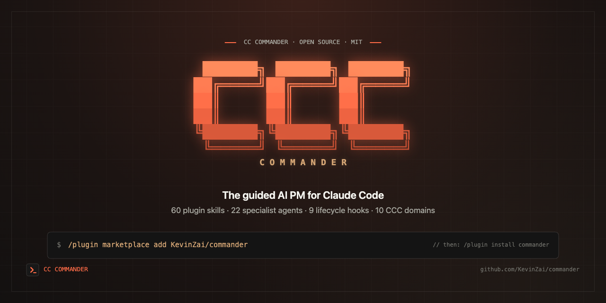
</p>

# CC Commander — AI PM for Claude Code · 74 Skills · 22 Agents · Core Free Forever

> **Ship faster with Claude Code and Cowork Desktop.** One plugin install activates 74 skills, 22 specialist AI agents, and 23 lifecycle hooks across Claude Code Desktop, Claude Code CLI, Cursor, Windsurf, and every MCP-capable IDE.

**Install in 30 seconds:**

```
Settings → Plugin Marketplace → Add from GitHub: KevinZai/commander → Install
```

**What you get:** 74 click-first `/ccc-*` plugin skills · 22 specialist sub-agents (architect, reviewer, debugger, designer, and more) · 23 lifecycle hooks · 2 bundled MCP servers · 466 ecosystem skills · Core free forever.


> **🖥️ Primary surface: Claude Code Desktop (aka Cowork Desktop).** Install once via Settings → Plugin Marketplace. All 74 plugin skills, 22 agents, 23 lifecycle hooks (39 handlers), and 2 credential-free bundled MCP servers (+16 opt-in via `/ccc-connect`) appear inside every session automatically — no terminal needed.
>
> Cowork Desktop and Claude Code Desktop are the same app, two UI modes. The plugin works identically in both. All screenshots in `docs/screenshots/` were taken in Desktop.

[](https://github.com/KevinZai/commander/stargazers) [](https://opensource.org/licenses/MIT) [](https://twitter.com/kzic) [](./SKILLS-INDEX.md) [](./commander/cowork-plugin/README.md) [](#️-who-its-for) [](./CHANGELOG.md)

<p>
  <strong>Powered by:</strong>
  <a href="https://anthropic.com/?utm_source=ccc&utm_medium=readme&utm_campaign=powered-by"></a>
  <a href="https://supabase.com/?utm_source=ccc&utm_medium=readme&utm_campaign=powered-by"></a>
  <a href="https://vercel.com/?utm_source=ccc&utm_medium=readme&utm_campaign=powered-by"></a>
  <a href="https://fly.io/?utm_source=ccc&utm_medium=readme&utm_campaign=powered-by"></a>
  <a href="https://upstash.com/?utm_source=ccc&utm_medium=readme&utm_campaign=powered-by"></a>
  <a href="https://cloudflare.com/?utm_source=ccc&utm_medium=readme&utm_campaign=powered-by"></a>
  <a href="https://posthog.com/?utm_source=ccc&utm_medium=readme&utm_campaign=powered-by"></a>
  <em>· <a href="https://docs.commanderplugin.com/affiliate-disclosure">affiliate disclosure</a></em>
</p>

**[Kevin Zicherman](https://kevinz.ai)** · **[@kzic](https://x.com/kzic)** · Built from 200+ community sources · Aggregates 19 vendor packages

**[Why CC Commander](#-why-cc-commander)** · **[The 70 skills](#the-70-plugin-skills)** · **[Browse Skills](SKILLS-INDEX.md)** · **[Agent Bible](docs/BIBLE-AGENT.md)** · **[Ecosystem](docs/ECOSYSTEM.md)** · **[BIBLE](BIBLE.md)** · **[Changelog](CHANGELOG.md)**

### 🎯 Who it's for

| If you are... | CC Commander is... |
|--------------|-------------------|
| 👋 **New to AI coding agents** → using **Claude Cowork Desktop** | Your onboarding buddy — `/ccc` pops up a native chip picker: **Build · Review · Ship · Design · Learn · More**. Click. No typing. 28 guided workflows, zero config. |
| 💻 **A developer** → using **Claude Code Desktop** or **Claude Code CLI** | Your project manager — routes complexity, compounds knowledge across sessions, Kevin Z Method built in. `/ccc-plan` → spec interview → plan file. |
| 🔧 **In Cursor / Windsurf / Cline / Continue / Codex** | One hosted MCP endpoint unlocks all 466+ skills in your IDE of choice |
| 📱 **On Claude mobile or iPad** | Same skills, same license, synced across devices (hosted MCP) |

---

## ⭐ 30-second install

> **For Cowork Desktop or Claude Code Desktop users (99% of people).** No terminal needed.

1. Open **Settings → Plugin Marketplace**
2. Click **Add from GitHub** → enter **`KevinZai/commander`** → **Add**
3. Find **`commander`** in the marketplace → click **Install**
4. Cmd+Q, reopen the app, type **`/ccc`** — you're live

✅ 74 plugin skills activate. ✅ Zero config. ✅ Zero API keys.

**Power-user CLI install:**
```bash
/plugin marketplace add KevinZai/commander
/plugin install commander
```

Or full dev environment + `ccc` binary:
```bash
curl -fsSL https://raw.githubusercontent.com/KevinZai/commander/main/install-remote.sh | bash
```

---

## 🌐 One plugin, every agent

> **Commander is a PM layer for whichever AI coding tool you use.** Same 74 skills, same 22 specialist agents, same lifecycle hooks — different install path per platform. The package name stays `commander` everywhere; the surrounding UI (Claude Code, Codex, Cursor, etc.) provides the platform context.

| Platform | Status | Install |
|---------|--------|---------|
| **Claude Code Desktop / Cowork Desktop** ⭐ | Shipping (primary) | Settings → Plugin Marketplace → Add from GitHub: `KevinZai/commander` |
| **Claude Code CLI** | Shipping | `/plugin marketplace add KevinZai/commander` then `/plugin install commander` |
| **Cursor / Windsurf / Cline / Continue / Codex** | Shipping (hosted MCP) | Point MCP client at `mcp.commanderplugin.com` |
| **Codex / Gemini native plugin runtimes** | Roadmap | Same repo, platform-specific adapter (planned v4.2+) |

One brand: **Commander**. One tagline: **The guided AI PM for every AI coding agent.** One repo: `KevinZai/commander`. Everywhere.

---

## 🎯 Why CC Commander

Stock Claude Code is a blank terminal with amnesia. Every other plugin solves one slice. CC Commander is the first **guided AI PM** — click-first UX, an intelligence layer that thinks before you do, and the whole ecosystem pre-wired. One install, everything active.

### 🥇 What no competitor has

| Moat | CC Commander | Cursor / Windsurf / Copilot | OSS (Cline / Continue / Aider) |
|------|--------------|----------------------------|-------------------------------|
| **Lifecycle hooks (23 × 39 handlers)** | ✅ SessionStart, PreToolUse, PostToolUse, Stop, PreCompact, Notification, etc. | ❌ None | ❌ None |
| **22 specialist agent personas** | ✅ Architect, Security-Auditor, TypeScript-Reviewer, Designer, Debugger, etc. | ❌ None ship pre-built | ❌ None ship pre-built |
| **18 MCP servers (2 bundled + 16 opt-in)** | ✅ Zero-config — Notion, Slack, Supabase, Figma, Linear, GitHub, Vercel, Fly… | ⚠️ Manual MCP setup required | ⚠️ Manual MCP setup required |
| **Spec-first planning** (/ccc-plan → interview → spec → multi-agent execution) | ✅ Native | ❌ No planning primitive | ❌ No planning primitive |
| **Cross-platform** (CLI + Desktop + VS Code path + hosted MCP) | ✅ Same brain everywhere | ❌ IDE-locked | ⚠️ IDE-locked |
| **Pricing transparency** | ✅ Core free forever — no signup, no card, no gates | ⚠️ Cursor $20+ confusing tiers; Windsurf credit confusion | ✅ BYOK free |

**The marketing angle:** *Set it once, the AI works smarter every session.* Lifecycle hooks fire automatically. Specialist agents already know your codebase conventions. The MCP ecosystem is pre-wired. No other tool ships any of this out of the box.

- 🖱️ **Click-first UX** — every menu is a native `AskUserQuestion` chip picker. No typing. No numbered menus. No ASCII prompts. Works identically in Cowork Desktop, Claude Code Desktop, and the CLI.
- 🧠 **`/ccc-suggest` intelligence layer** — Opus-class real-time recommendation. Scans your project state, recommends **one starred next step** with reasoning + named 3rd-party plugins. Kills info-paralysis.
- 🧩 **74 plugin skills including 13 `/ccc-*` specialist workflows** — plain slash commands (no `commander:` prefix), skill-based architecture: `ccc`, `ccc-start`, `ccc-browse`, `ccc-plan`, `ccc-build`, `ccc-review`, `ccc-ship`, `ccc-design`, `ccc-learn`, `ccc-xray`, `ccc-linear`, `ccc-fleet`, `ccc-connect` + `/ccc-e2e`, `/ccc-save-session`, `/ccc-resume-session`, `/ccc-changelog`, `/ccc-doctor`, `/ccc-tuneup`, `/ccc-upgrade`, `/ccc-yolo-setup`, `/ccc-ecc` and 11 domain routers.
- 🧭 **Orchestrator / Executor model** — `/ccc-orchestrate` has Fable/Opus write a Skill.md-style goal file, GPT-5.5 via `codex` or a Sonnet subagent execute it, and the orchestrator verify acceptance criteria. Pair it with `/ccc-handoff` for frequent fresh-chat resets and `/ccc-adopt` to bring the doctrine into any existing project. Pay for Fable on the thinking, not the typing.
- 🎭 **22 specialist agents with persona voices** — architect, security-auditor, performance-engineer, content-strategist, data-analyst, designer, product-manager, technical-writer, devops-engineer, qa-engineer, reviewer, builder, researcher, debugger, fleet-worker, typescript-reviewer, python-reviewer, go-reviewer, rust-reviewer, java-reviewer, kotlin-reviewer, csharp-reviewer. Each with a distinct voice layer in `commander/cowork-plugin/rules/personas/`.
- 🔌 **2 credential-free bundled MCP servers** — `context7` (library docs) + `sequential-thinking`. Opt-in via `/ccc-connect`: 16 more including Tavily, GitHub, Supabase, Figma, Playwright, Slack, Notion, claude-mem, Exa, Firecrawl, Zapier, Google Drive, Vercel, Neon, Fly.io, Upstash.
- 🪝 **23 lifecycle hooks × 39 handlers** — SessionStart, UserPromptSubmit, PreToolUse, PostToolUse, Stop, Notification, PreCompact, SubagentStop, PermissionRequest. Schema-compliant, 100% pass on `claude plugin validate`.
- 🗺️ **`/ccc-cheatsheet` live Mermaid map** — reads the filesystem as single source of truth, renders the whole plugin as a flow diagram. Never drifts.
- 🔄 **Weekly vendor auto-sync** — 19 vendor submodules auto-update via GitHub Actions. The ecosystem stays current without you touching a thing.
- 🌐 **Cross-client, one license** — Cowork Desktop, Code Desktop, Code CLI, Cursor, Windsurf, Cline, Continue, Codex, mobile (hosted MCP).
- 🚁 **Fleet orchestration** — `/ccc-fleet` runs multiple Sonnet agents in parallel **git worktrees**. Fan-out, pipeline, FOR/AGAINST, background modes.
- 🆓 **Core free forever** — no credit card, no signup. No feature gating, no paywalls.
- 🧬 **Shared brain: plugin + CLI** — same intelligence layer, same skill catalog, same personas. Install either, get both.
- 📖 **The Kevin Z Method** — `BIBLE.md` ships with the plugin. 7 rules, 200+ sources, 14 months of production methodology.
- 📄 **Printable cheat sheets** — [`docs/cheatsheets/`](docs/cheatsheets/) ships 3 print-ready PDFs: [CC Commander Essentials](docs/cheatsheets/ccc-essentials.pdf), [The Orchestrator/Executor Method](docs/cheatsheets/orchestrator-executor.pdf), and [Agents & Model Tiers](docs/cheatsheets/agents-model-tiers.pdf).
- 📚 **466+ skills across 11 CCC domains** — design, marketing, SaaS, DevOps, SEO, testing, security, data, research, mobile, makeover. Plus the vendor ecosystem.
- 🎯 **Plugins-name-plugins** — `/ccc-suggest` calls out specific 3rd-party plugins by name (`claude-mem`, `superpowers`, `caveman`, `impeccable`, `graphify`, and more) at the right moment. You learn the whole ecosystem through CC Commander.

### 🧠 The Fable Method

**The operating doctrine distilled from Anthropic's frontier Fable 5 model, encoded as 12 enforceable gates** — so ANY model running CC Commander produces Fable-shaped results, not just the flagship one. Arm it with `/ccc-fable on`, self-check with `/ccc-fable audit`. Full doctrine: [`commander/cowork-plugin/rules/fable-method.md`](commander/cowork-plugin/rules/fable-method.md).

- **Never trust a single pass** — the agent that does the work never grades it. Every finding gets adversarial verification from a fresh context.
- **Loops need verifiers, state, and stops** — repetition without a real verifier, a state file, and a deterministic stop condition is just an agent agreeing with itself on repeat.
- **Prove it before you alarm** — a scary number is a hypothesis until you run the exact check, open real samples, and hunt the disconfirming case.
- **Context is disposable, state is durable** — the durable record is handoff docs, memory, and the tracker, never the live chat.

**The method IS the moat.** A mid-tier model following all 12 gates reliably out-delivers an ungated frontier model on any task longer than one turn.

### 💡 How the intelligence works (the beginner headline)

**New to Claude Code? Start here:** `/ccc-suggest`.

Every time you run it, CC Commander reads your project state — detected stack, current branch, last 5 commits, open todos, recent errors — and returns **one starred recommendation** with plain-English reasoning. If another plugin would serve you better right now (e.g. `claude-mem` for persistent memory, `superpowers` for structured thinking, `caveman` for token-heavy iteration), it names it. Three reasoning tiers fire in order:

1. **Strong signals** — an open PR, a failing test, a dirty worktree, a mid-plan session
2. **Stack signals** — nextjs + Stripe detected → suggest `ccc-saas`; mobile repo → suggest `ccc-mobile`
3. **User intent** — pattern-match your recent prompts against the 502-skill catalog

One click → one next step. No info paralysis.

---

## Built on Claude Agent SDK primitives

CC Commander is built on Anthropic's 2026 Claude Agent SDK sub-agent architecture — the same primitives that power agentic workflows across Claude Code Desktop, Cowork Desktop, and the CLI. The **brain/hands** pattern separates orchestration (the PM layer: planning, routing, decision-making) from execution (22 specialist sub-agent personas that each embody a distinct role, model, and voice). 23 lifecycle hook events with 39 handlers fire automatically throughout every session — from `SessionStart` initialization through `SubagentStop` result aggregation — so the right agent is always running at the right moment without you lifting a finger.

---

## Using Cursor, Windsurf, Cline, Continue, or Codex?

[Hosted MCP setup](./mintlify-docs/features/browse-modes.mdx) — one URL + license key unlocks all 466+ skills in your editor.

---

## 🌟 What's new in v5.1.0

- 🧠 **Opus 4.8 session default** — `claude-opus-4-8`, $5/$25 per MTok, Fast mode 2.5× at $10/$50. New `ultra`/`xhigh` effort levels. `thinking: {type: "adaptive"}` replaces deprecated `budget_tokens`.
- ⚡ **Dynamic workflows** (research preview, requires Claude Code v2.1.154+) — 4 bundled JS workflow scripts spawn parallel subagents that cross-check findings: `ccc-audit` (backs `/ccc-xray`), `ccc-deep-review` (backs `/ccc-review`), `ccc-migrate`, `ccc-fleet`. Skills fall back to `Agent()` on older clients.
- 🚀 **`/ccc-ultracode`** — new skill for `xhigh` effort + automatic workflow orchestration. Or add `workflow:` to any prompt for a one-off run.
- 🪝 **Hooks 9 → 23 events** — 14 new lifecycle events: `SessionEnd`, `PostCompact`, `SubagentStart`, `TaskCreated`, `TaskCompleted`, and 9 more. Handlers: 24 → 38. Correctness fix: `session-save` moved `Stop` → `SessionEnd`.
- 🎯 **74 plugin skills** — recent channel/CI/ECC/setup skills (`/ccc-brainstorm`, `/ccc-qa`, `/ccc-loop`, `/ccc-hermes`, `/ccc-nightwatch`, `/ccc-ci`, `/ccc-yolo-setup`, `/ccc-ecc`) + 5 language reviewer agents (Go, Rust, Java, Kotlin, C#) + `/ccc-ultracode`.
- 🔐 **4 security mediums resolved** — telemetry scrubber hardened, error messages sanitized.
- 🤖 **22 specialist sub-agent personas** — 5 new language reviewers added (Go · Rust · Java · Kotlin · C#).
- 📦 **15 vendor pins refreshed** — ECC v1.7.0, oh-my-claudecode v4.14.4, repomix v1.14.1, and 12 more.
- 🧪 **284 tests passing** — +5 security regression tests added.
- 🖥️ **Desktop-first positioning throughout** — all docs now lead with "Claude Code Desktop is the primary surface."

## 🚀 What's new in v6.0.0

- 🧠 **Selective Fable 5 deep-mode** — Opus 4.8 stays session default (everyday), Fable 5 escalation-tier via `/model claude-fable-5` with once-per-day deep-reasoning nudge. Motto: *pay for Fable on the thinking, not the typing.*
- 🎛️ **Smart model routing** — selectModelForComplexity(score) auto-assigns: 0-29 Haiku, 30-65 Sonnet, 66-85 Opus, 86-100 Fable. Dispatch tiers: power=Fable/Opus, assisted=Opus/Sonnet, guided=Sonnet/Haiku.
- 💰 **Savings counter + `ccc --savings`** — every dispatch logs estimated cost vs baseline. Footer shows daily estimate (sv$X.XX); report command prints full breakdown to `~/.claude/commander/savings.json`.
- 🎭 **4 deep personas on Fable** — architect, debugger, security-auditor, product-manager run claude-fable-5 for complex reasoning.

## 🎉 What's new in v6.6.0

- 🎉 **Engagement Engine** — closes the P0 tier of the 2026-07-10 internal Fable audit: F1–F8, F10–F12, F17, F19, F23, and F25.
- 🪝 **Documented hook delivery** — new `hooks/lib/emit.mjs` contract layer uses `systemMessage` and `hookSpecificOutput.additionalContext`; all 13 status-field emitters converted.
- 💡 **Always-on skill suggestions** — `suggest-ticker` reads real CI, test, lint, and audit outcomes; at confidence ≥ 0.8 it emits an AskUserQuestion chip bridge: Run skill · Dismiss · `/ccc-browse`.
- 📝 **`/ccc-claudemd`** — new CLAUDE.md auto-audit with AUQ-gated fixes; plugin skills 71 → 72.
- 🎨 **Emoji voice injection** — a SessionStart handler injects the emoji-palette convention automatically; persona voice sections inlined across all 22 agents.
- ✅ **Independent verification** — verifier separation and mandatory git-worktree isolation now cover every write path in `ccc-migrate`, `ccc-orchestrate`, `ccc-plan-exec`, and `ccc-fleet`; a fresh agent verifies or refutes the work.
- 🧭 **Truthful onboarding** — `ccc-start` computes live counts instead of hardcoding stale totals.
- 🛠️ **Hook correctness fixes** — permission-gate rejections now surface; cost tracking and ceilings are session-keyed; context guards and warnings estimate real transcript context usage.

## ⚡ Dynamic Workflows + Ultracode

> **Research preview — requires Claude Code v2.1.154+.** Skills fall back to standard `Agent()` dispatch on older clients.

**Dynamic workflows** are JS scripts the runtime executes in the background, spawning many subagents that cross-check findings and merge results before returning. Four bundled workflows ship in `commander/cowork-plugin/workflows/`:

| Workflow | Backs | What it does |
|----------|-------|-------------|
| `ccc-audit` | `/ccc-xray` | Repo-wide audit — security, performance, architecture, test coverage in parallel |
| `ccc-deep-review` | `/ccc-review` | 4-dimension branch review (correctness · security · perf · maintainability) + reconciler |
| `ccc-migrate` | `/ccc-build` migrate | Discover → transform → verify pipeline for safe large migrations |
| `ccc-fleet` | `/ccc-fleet` | Fan-out / pipeline / judge orchestration patterns |

**Ultracode** combines `xhigh` effort + automatic workflow orchestration. Three ways to activate:

```
/ccc-ultracode               # guided path — recommended
/effort ultracode            # set for current session
workflow: <your task here>   # one-off without mode switch
```

The built-in `/deep-research` is also available for multi-source validated research.

## The 74 plugin skills

Each `/ccc-*` workflow works via native Desktop chip picker — no typing, just click:

| Command | What it does | First click |
|---|---|---|
| **`/ccc`** | Main hub — 6 intent tiles | Build · Review · Ship · Design · Learn · More |
| **`/ccc-suggest`** 🌟 | **Intelligence layer — recommends ONE starred next step** | Scans state → 1 move + reasoning + named plugins |
| **`/ccc-start`** | First-run onboarding + plan file | New project · Existing · Tour · Skip |
| **`/ccc-browse`** | Searchable catalog of every skill + agent | Domains · Workflows · Agents · All |
| **`/ccc-plan`** | Spec interview → implementation plan file | New feature · Bug fix · Refactor · From Linear |
| **`/ccc-build`** | Scaffold a project | Web app · API · CLI · Mobile · From spec |
| **`/ccc-review`** | Audit current branch | Diff · Security · Performance · Full x-ray |
| **`/ccc-ship`** | Pre-flight + deploy | Pre-flight · Release · Deploy · Rollback |
| **`/ccc-design`** | UI/UX workflow | Landing · Components · Polish · Figma→code |
| **`/ccc-learn`** | Skill discovery | Design · Marketing · SaaS · More domains |
| **`/ccc-xray`** | Project health scorecard | Quick · Full · Deps-focused · Security-focused |
| **`/ccc-linear`** | Linear board integration | View · Pick · Create · Overview |
| **`/ccc-fleet`** | Multi-agent orchestration (git worktrees) | Fan-out · Pipeline · FOR/AGAINST · Background |
| **`/ccc-connect`** | Opt-in MCP connector | Notion · Zapier · Supabase · Slack · GDrive |
| **`/ccc-cheatsheet`** | Live Mermaid map of the whole plugin | Filesystem is single source of truth |
| **`/ccc-e2e`** | E2E test scaffolding + Playwright automation | New suite · Existing project · Visual regression |
| **`/ccc-save-session`** | Save session state for later resume | Saves context, todos, plan to `~/.claude/commander/` |
| **`/ccc-resume-session`** | Resume a previously saved session | Lists recent sessions → pick one to restore |
| **`/ccc-orchestrate`** | Cross-runtime Orchestrator/Executor | Fable/Opus goal file → GPT-5.5 or Sonnet executor → verified acceptance criteria |
| **`/ccc-handoff`** | Proactive fresh-chat handoff | Dense session file + explicit restart before context quality decays |
| **`/ccc-adopt`** | Adopt CCC doctrine in another repo | Merge Orchestrator/Executor markers into `CLAUDE.md` without clobbering project rules |
| **`/ccc-fable`** | Arm the Fable Method — 12-gate session contract | on · status · audit · off — model-agnostic |
| **`/ccc-yolo-setup`** | Safe-YOLO permissions + Plan mode guardrails | Conservative · Balanced · Aggressive-safe |
| **`/ccc-ecc`** | Selective ECC component loader | Load skill · Load agent · Load hook · List |

Plus 11 domain routers (`ccc-design`, `ccc-marketing`, `ccc-saas`, `ccc-devops`, `ccc-seo`, `ccc-testing`, `ccc-security`, `ccc-data`, `ccc-research`, `ccc-mobile`, `ccc-makeover`) + 2 vendor-sourced skills (`/ccc-agent-writing`, `/ccc-systematic-debugging`). See [SKILLS-INDEX.md](SKILLS-INDEX.md) for the full catalog.

Click a cell → pick a sub-option → CC Commander handles it. No config files, no YAML editing, no syntax to memorize.

## 🤝 Works with these amazing OSS plugins

`/ccc-suggest` doesn't hoard — when another plugin is the right tool, it names it. Here's what CC Commander recommends at the right moment:

| Plugin | When `/ccc-suggest` calls it out |
|---|---|
| **claude-mem** | Persistent cross-session memory — you're 10+ sessions into a project and want recall |
| **superpowers** | Forces structured thinking — you're drifting on a multi-step task |
| **caveman** | Token-heavy iteration — cuts ~75% output tokens during rapid loops |
| **impeccable** | Final polish pass on UI — pixel-perfect micro-interactions |
| **graphify** | Any input (code, docs, papers) → clustered knowledge graph + HTML report |
| **claude-reflect** | Self-improving skills with reflection loops — you keep repeating a mistake |
| **Everything Claude Code (ECC)** | Full harness — 156 skills, 72 commands, 38 agents, lifecycle hooks |
| **gstack** | CEO/eng plan review, office hours, QA gates |
| **Compound Engineering** | Knowledge compounding + mandatory code review enforcement |
| **repomix** | Pack a codebase for AI (60% smaller via tree-sitter compression) |
| **claude-hud** | Real-time status display + offline cost tracking + git diffs |
| **RTK** | Token optimization (60–90% savings) + 25 AWS subcommands |
| **oh-my-claudecode** | HUD with worktree support, quota tracking, hyperlinks |
| **acpx** | ACP protocol, Flows system, structured agent-to-agent comms |
| **Caliber** | Config scoring, drift detection |

Install any of these separately — CC Commander detects what's available and routes to it. If you've got `claude-mem` installed, `/ccc-suggest` will reach for it when memory recall is the right move.

## 🧩 How Commander Extends ECC

**Everything Claude Code (ECC)** is the comprehensive *harness* — 156 skills, 72 commands, 38 agents, full lifecycle hooks. CC Commander is **not a replacement** for it — it's the **PM/orchestration UX layer** on top.

| Layer | Owns |
|-------|------|
| **ECC** (harness) | Raw breadth — skills, commands, agents, hook lifecycle |
| **CC Commander** (UX) | Curation + guidance + memory: click-first `/ccc-*` chips (AskUserQuestion), `/ccc-suggest` routing, the brain/hands pattern, The Kevin Z Method |

**What Commander adds on top of ECC:**
- **Click-first front door** — 70 curated `/ccc-*` workflows via native chip pickers, instead of memorizing 156+ commands.
- **`/ccc-suggest`** — Opus-class "next best move" routing across the whole ecosystem (names ECC when ECC is the right tool).
- **`/ccc-orchestrate` + `/ccc-handoff` + `/ccc-adopt`** — cross-runtime plan/execute split, proactive context reset, and one-command doctrine adoption for existing projects.
- **`/ccc-ecc`** — selective ECC loader for one skill, agent, or hook without installing the full harness.
- **Memory + compounding** — sessions learn; `/ccc-knowledge` + claude-mem integration.
- **Vendor aggregation** — ECC is one of 19 vendor packages; the Smart Orchestrator scores and routes across all of them.

**ECC-sourced parts are labeled** in the vendor tree (`vendor/everything-claude-code/`). Commander ports a minimal hook/agent set and otherwise defers to ECC upstream — run `/ccc-upgrade` to bump the pin. Install ECC separately for the full harness; Commander detects it and routes to it.

## 🆚 Compare to other Claude Code plugins

CC Commander is a **meta-layer** — it routes to other plugins, not away from them. Here's how it differs from the top alternatives:

| | CC Commander | ECC | Superpowers | gstack |
|---|---|---|---|---|
| **Primary surface** | Claude Code Desktop plugin + CLI | CLI harness | Claude Code CLI | Claude Code CLI |
| **Click-first UX** | ✅ Native chip pickers, no typing | ❌ Text menus | ❌ Slash commands | ❌ Slash commands |
| **Sub-agent personas** | 22 (architect, reviewer, debugger…) | 38 agents | 0 | 3 |
| **Skill count** | 541 (75 plugin + 466 ecosystem) | 156 | ~20 | ~15 |
| **Hosted MCP server** | ✅ (100 calls/mo free) | ❌ | ❌ | ❌ |
| **Cross-IDE** | ✅ (Cursor, Windsurf, Cline, Codex) | ❌ Claude only | ❌ Claude only | ❌ Claude only |
| **Free** | ✅ Forever | ✅ | ✅ | ✅ |
| **Recommends rivals** | ✅ `/ccc-suggest` names other plugins | ❌ | ❌ | ❌ |

**Bottom line:** if you want the full Claude Code harness (156 skills, 72 commands), install ECC. If you want the click-first PM layer that works across Cowork Desktop, CLI, and Cursor, install CC Commander. Many users run both.

## 2-Minute First Win

```
# 1. Open the command center
/ccc

# 2. Say: "build me a REST API with TypeScript"
# → Commander asks 3 clarifying questions
# → Selects the right model + skills automatically
# → Ships working code with tests

# 3. Say: "review my last PR"
# → reviewer agent runs severity-rated code review
# → Flags Critical/High/Medium/Low findings with file:line citations

# 4. Say: "night mode — build a landing page while I sleep"
# → 8-hour autonomous build with checkpoints every 10 edits
# → Wakes you up to shipped code
```

## Works In 8 IDEs

Claude Code · Cursor · Windsurf · Cline · Continue · Codex · Claude mobile · Claude Desktop

## Core Free Forever

All 74 plugin skills, 22 specialist agents, 23 lifecycle hooks, 2 bundled MCP servers, and 16 opt-in connectors — free forever, no credit card, no feature gating. Sustained by transparent affiliate links, Kevin's consulting practice, an optional Pro community, and GitHub Sponsors. A hosted-infrastructure Pro tier is planned later — all content stays free forever.

---

---


## Why CCC

Stock Claude Code is a blank terminal with amnesia. No skills. No guidance. No memory. Every session starts from zero. And it wastes 98% of your context window on tool output you'll never re-read.

**CCC remembers everything, learns from every session, and gets smarter the more you use it.** It wraps every major Claude Code tool into one install — with a smart orchestrator, guided menus, and an Intelligence Layer that auto-adjusts every dispatch based on your project.

```
You type: ccc
You get:  A guided AI project manager with 531 skills,
          74 plugin skills, 22 agents, 19 vendor packages,
          real learning, and zero setup.
```

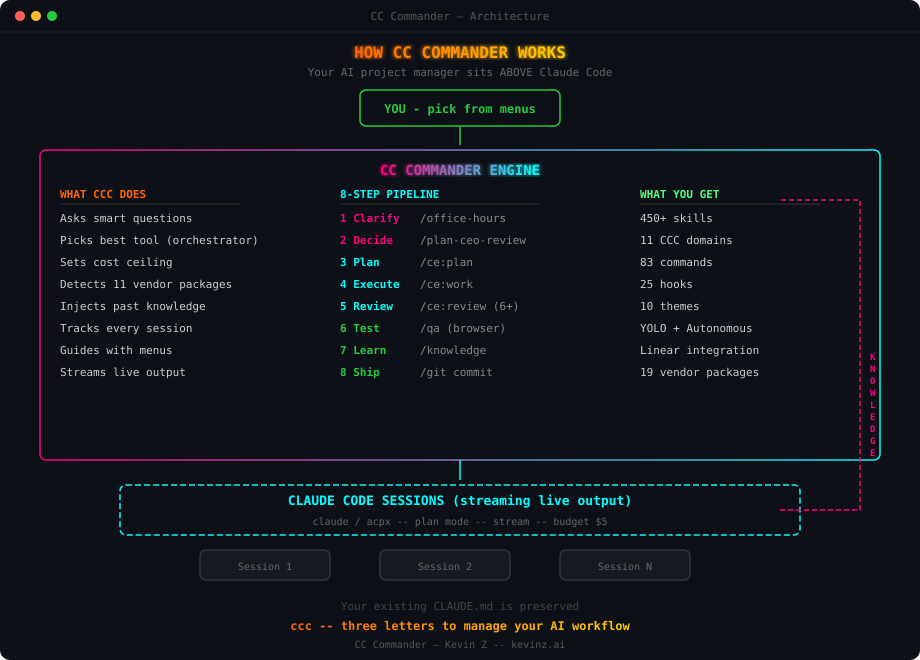

---

## See It In Action

### Main Menu — Arrow Keys, No Commands to Memorize

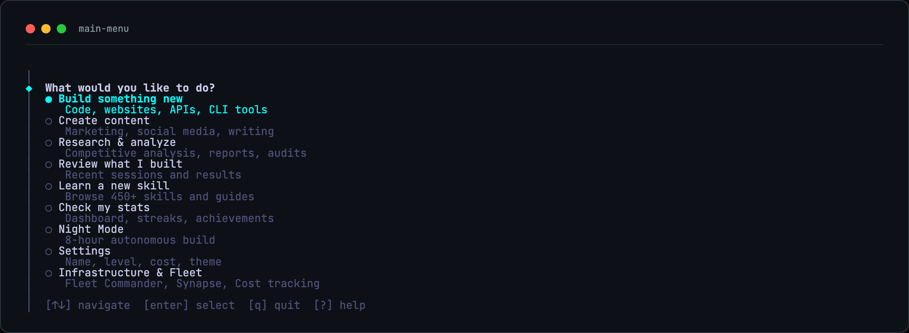

### Cockpit Dashboard — Live Session Status

Context, rate limits, and budget meters in your terminal. Color-codes green → yellow → red as limits approach.

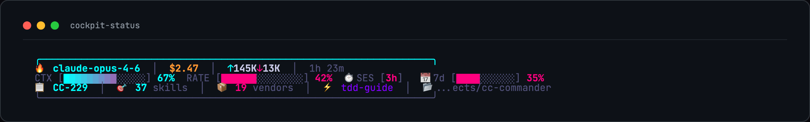

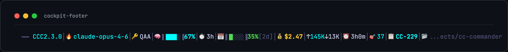

**Rich footer bar** — rainbow status line with live session meters:

```
━━ CCC5.1│🔥Opus4.8-1M│🔑gAA│🧠▐██45%░░▌│⏱️▐██░░▌6%│📅▐██░░▌34%│💰$2.34│⬆️640K⬇️694K│⏰8h0m│🎯502│📋CC-150│📂~/project
```

### Stats Dashboard

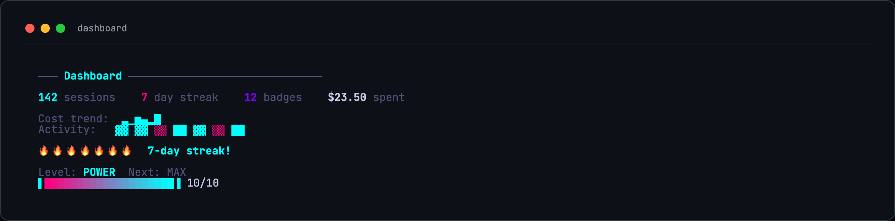

Sessions, streaks, badges, cost tracking, activity heatmap, level progression.

### 11 CCC Domains — One Skill Loads an Entire Specialty

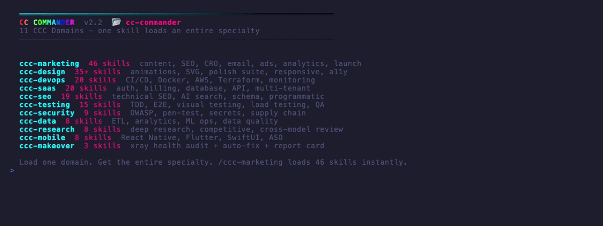

### 500+ Skills — Install Only What You Need


> All recordings are real terminal output captured with [vhs](https://github.com/charmbracelet/vhs). No mockups.

---

## 📸 Screenshots

Desktop screenshots arriving with the v5.1.0 stable tag — see [`docs/screenshots/PLACEHOLDERS.md`](docs/screenshots/PLACEHOLDERS.md) for in-progress capture briefs.

---

## Intelligence Layer

> Stock Claude Code is a blank terminal with amnesia. CCC remembers everything, learns from every session, and gets smarter the more you use it.

**An AI project manager that thinks before it acts.** Before dispatching a single token, CCC scores your task, reads your stack, pulls relevant lessons from past sessions, and selects the right model and budget automatically. No configuration. No flags. It just works.

### How It Works

**Four modules. Always running.**

#### 1. Weighted Complexity Scoring (`dispatcher.js`)

Every task scored 0–100 using 47 keyword signals, word count, and fuzzy regex matching:

```
"fix typo"             → score  0  → 10 turns, $1 budget, Haiku
"add dark mode"        → score 25  → 20 turns, $3 budget, Sonnet
"refactor auth module" → score 60  → 35 turns, $6 budget, Sonnet
"build SaaS platform"  → score 100 → 50 turns, $10 budget, Opus
```

File scope estimation adds 0–20 bonus points by scanning how many project files the task is likely to touch. Budget and turns auto-adjust — no manual flags needed.

#### 2. Stack Detection (`project-importer.js`)

CCC reads your project before every dispatch: `package.json`, `Dockerfile`, `go.mod`, `requirements.txt`. Detects nextjs, react, vue, docker, python, rust, go, github-actions, orm, billing, testing. Reads current git branch + last 5 commit themes. Adds monorepo detection (workspaces, lerna, turbo, nx).

#### 3. Skill Recommendations (`skill-browser.js`)

`recommendSkills(task, techStack)` combines three signals:

| Signal | Weight | What It Does |
|--------|--------|-------------|
| Stack match | 10 pts | Next.js project → nextjs-app-router ranks first |
| Keyword match | 2 pts/hit | "auth" task → auth, jwt, better-auth bubble up |
| Usage history | boost | Skills that worked for you rank higher over time |

Trending skills (7-day window) surface automatically. Skills that led to successful sessions compound their ranking advantage.

#### 4. Knowledge Compounding (`knowledge.js`)

Every completed session extracts a lesson (keywords, category, stack, error patterns, success patterns) stored in `~/.claude/commander/`. Searched before the next dispatch with time-decay relevance: < 7 days = 2x, < 30 days = 1.5x, older = 1x. Fuzzy keyword matching and cross-domain boosts (web↔react, api↔backend, testing↔bugfix) catch related concepts.

**Smart retry** handles failures automatically: rate limit → wait 60s + retry; context overflow → reduce turns to 60% + retry; budget exceeded → clear error with next steps.

### Intelligence Analysis — Smart Dispatch in Action

Before dispatching a single token, CCC scores your task, reads your stack, and auto-configures the session.

```
  Task: "Add authentication with JWT and OAuth"

  Intelligence Analysis:
  ├─ Complexity Score: 72/100 (complex)
  ├─ Keyword signals:  +15 (auth) +15 (implement) +20 (production)
  ├─ Word count:       +10 (detailed description)
  ├─ Stack detected:   nextjs, react, tailwind
  └─ Related lessons:  2 found (JWT auth succeeded, OAuth2 pattern)

  Auto-configured dispatch:
     Model: opus  |  Turns: 35  |  Budget: $6
     Skills: nextjs-app-router, ccc-saas, auth-patterns
     Knowledge: 2 past lessons injected

  Dispatching... ████████████████████░░░░ 78%
```

### Skill Recommendations — Ranked by Relevance

CCC ranks skills using your stack + task keywords + past usage. The right tools surface automatically.

```
  Recommended skills for your project:

  SCORE  SKILL                 WHY
  ─────────────────────────────────────────────
   20    nextjs-app-router     Stack match + keyword
   16    frontend-design       Stack match
   16    shadcn-ui             Stack match
   14    saas-scaffolder       Keyword: auth, billing
   12    tailwind-v4           Stack match
    8    ccc-testing           Always recommended

  ❯ Use top recommendation
    Browse all 466+ skills
    Search by keyword
    Back to main menu
```

### Knowledge Compounding — Learning After Every Session

Every completed session extracts patterns and errors. The next dispatch is informed by everything that worked before.

```
  Session Complete — Knowledge Extracted

  Task:     "Add JWT authentication"
  Outcome:  Success
  Cost:     $4.12  |  Duration: 12m
  Category: api

  Patterns learned:
  ├─ bcrypt + JWT combo works well with Next.js
  ├─ httpOnly cookies for token storage
  ├─ middleware.ts matcher needs exact paths
  └─ next-auth conflicts with custom Prisma adapter

  Knowledge base: 47 lessons  |  12 categories
  Next dispatch will be 23% more informed.
```

### Project Import — Stack Auto-Detection

CCC reads your project before every dispatch. No setup needed.

```
  Importing: ~/ccc-projects/my-saas-app

  Detected:
  ├─ CLAUDE.md           142 lines
  ├─ Tech stack:         nextjs, react, tailwind, prisma, stripe
  ├─ Monorepo:           No
  ├─ Git branch:         feature/checkout
  └─ Recent commits:     "add cart", "fix price calc", "stripe webhook"

  6 skills pre-selected for this stack
  3 relevant lessons from knowledge base

  ❯ Start building in this project
    Run /xray health audit first
    Back to main menu
```

### The Net Effect

| Session | What Changed |
|---------|-------------|
| 1 | Dispatches based on complexity score alone |
| 5 | Knows your stack, recommends proven skills |
| 20 | Has learned your patterns — feels like a PM who knows your codebase |

### Token Optimization Stack — 5 Layers of Savings

| Layer | Tool | Savings |
|-------|------|---------|
| Tool output sandboxing | context-mode | **98%** — SQLite + FTS5, BM25 snippets only |
| CLI output filtering | RTK | 99.5% — strips verbose shell output |
| Skill tiering | `_tiers.json` | ~10k tokens — 30 essential vs 466 full |
| Rate limit rotation | ClaudeSwap | 2 MAX accounts, drain-first strategy |
| Prompt caching | Extended TTL | 90% discount, 1hr cache window |

---

## Features


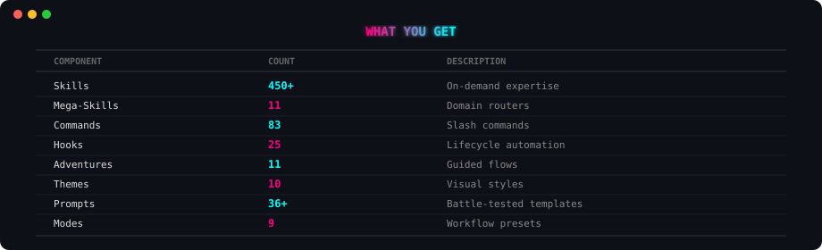

| Component | Count | What It Does |
|-----------|-------|-------------|
| Skills | 466 | On-demand expertise (deduplicated) |
| Plugin Skills | 74 | Desktop-first skills (13 /ccc-* workflows + 11 domain routers + 7 new channel/ECC/setup skills + Orchestrator/Executor + meta + vendor-sourced + session management) |
| Agents | 22 | Specialist sub-agent personas with distinct voice layers |
| Lifecycle Hooks | 23 × 39 handlers | SessionStart, UserPromptSubmit, PreToolUse, PostToolUse, Stop, Notification, PreCompact, SubagentStop, PermissionRequest |
| MCP Servers | 2 + 16 opt-in | Context7 + Sequential-Thinking bundled; 16 more opt-in via /ccc-connect (GitHub, Supabase, Figma, Playwright, Slack, Notion…) |
| CCC Domains | 11 | Domain routers with sub-skills |
| Commands | 83 | Slash commands (/ccc- prefix) |
| Hooks (JS) | 25 | Lifecycle automation (kit-native) |
| Adventures | 13 | Guided interactive flows |
| Vendor Packages | 19 | Best-in-class tools, auto-updated |
| Themes | 10 | Cyberpunk, Fire, Ocean, Aurora, Sunset, Monochrome, Rainbow, Dracula + more |
| Prompts | 36+ | Battle-tested templates |
| Modes | 9 | Workflow presets |
| Split Mode | tmux | Tabbed sessions — each task gets a window |
| Agent API | CLI | Headless dispatch for AI orchestrators |
| Infrastructure | 6 | Fleet, Synapse, Cost, AO, CloudCLI, Paperclip commands |
| Service Detector | auto | Probes 8 services + 4 CLIs on startup |

### Every Path, Visualized

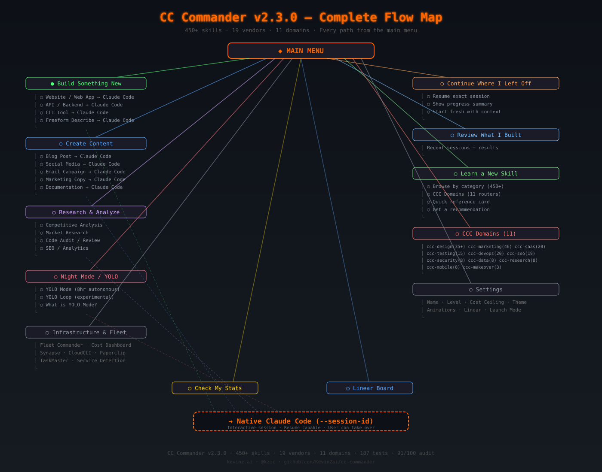

> Every menu option, every sub-flow, every path to Claude Code — one diagram. [View full size](docs/assets/ccc-flowchart.svg)

### Night Mode / YOLO — Autonomous Overnight Build


**Start before bed. Wake up to shipped code.**

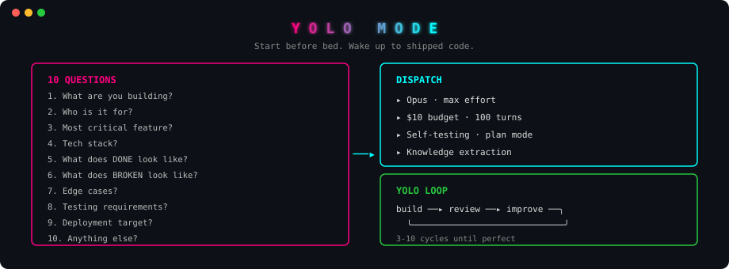

10 questions → Opus with max effort → $10 budget → 100 turns → self-testing loop.

```
  YOLO Mode — Autonomous Overnight Build

  What are we building tonight?
  > "Full e-commerce checkout with Stripe integration"

  Configuration:
  ├─ Model:       Opus (max reasoning)
  ├─ Budget:      $10 (hard cap)
  ├─ Max turns:   100
  ├─ Self-test:   Enabled (tests after each phase)
  ├─ Checkpoint:  Every 10 edits
  └─ Stop file:   ~/.claude/commander/yolo-stop

  Ready to run for up to 8 hours unattended.

  ❯ Start YOLO build
    Adjust settings
    Cancel
```

---

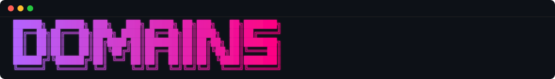

## 11 CCC Domains

Each domain is a router that dispatches to specialized sub-skills on demand.

| Domain | Skills | What's Inside |
|--------|--------|---------------|
| **ccc-design** | 41 | landing pages, UI audit, animation, responsive layout, color systems, typography, canvas design, wireframes, component library, accessibility, dark mode, micro-interactions, illustration, icon sets, design tokens, named-look design systems, video/HTML design capture |
| **ccc-marketing** | 45 | CRO, email campaigns, ad copy, social media, SEO content, blog posts, landing page copy, A/B testing, funnel optimization, lead magnets, newsletter, brand voice, press releases, case studies, video scripts |
| **ccc-saas** | 20 | auth systems, billing/Stripe, API design, database schema, multi-tenancy, onboarding flows, admin dashboards, role-based access, webhooks, rate limiting, usage tracking, feature flags |
| **ccc-devops** | 20 | GitHub Actions, Docker, AWS deploy, Terraform, monitoring, logging, CI/CD pipelines, Kubernetes, Nginx, SSL certs, environment management, health checks, rollback strategies |
| **ccc-seo** | 19 | meta tags, JSON-LD schema, sitemap, robots.txt, Core Web Vitals, internal linking, keyword research, content optimization, image SEO, page speed, structured data, canonical URLs |
| **ccc-testing** | 15 | Vitest, Playwright E2E, TDD workflow, snapshot testing, API testing, load testing, coverage reports, test fixtures, mock strategies, visual regression, accessibility testing |
| **ccc-makeover** | 3 | /xray project audit (health score 0-100, maturity 1-5), /makeover agent swarm execution, before/after report card |
| **ccc-data** | 8 | SQL optimization, data pipelines, analytics setup, data visualization, machine learning, reporting, data quality, vector search |
| **ccc-security** | 8 | OWASP top 10, secrets scanning, dependency audit, container security, penetration testing, CSP headers, rate limiting, auth hardening |
| **ccc-research** | 8 | competitive analysis, market research, user research, technology evaluation, trend analysis, SWOT, stakeholder interviews, data synthesis |
| **ccc-mobile** | 8 | React Native, Expo, mobile UI, push notifications, deep linking, app store optimization, offline-first, gesture handling |

---


## 19 Vendor Packages

CCC aggregates the best Claude Code tools as git submodules. Auto-updated weekly. 19 packages, 1,500+ vendor skills.

| Package | Stars | What You Get |
|---------|-------|-------------|
| [Everything Claude Code](https://github.com/affaan-m/everything-claude-code) | 120K+ | 156 skills, 72 commands, 38 agents, lifecycle hooks |
| [gstack](https://github.com/garrytan/gstack) | 58K+ | CEO/eng plan review, office hours, QA — OpenClaw integration v2 |
| [Superpowers](https://github.com/obra/superpowers) | 29K+ | Forces structured thinking — /ccc-plan, /ccc-tdd, /ccc-verify |
| [claude-code-best-practice](https://github.com/shanraisshan/claude-code-best-practice) | 26K+ | Reference architecture, Channels, Auto Mode |
| [repomix](https://github.com/yamadashy/repomix) | 22.8K+ | Pack codebases for AI (tree-sitter compression = 60% smaller) |
| [oh-my-claudecode](https://github.com/Yeachan-Heo/oh-my-claudecode) | 17K+ | HUD with worktree support, quota tracking, hyperlinks |
| [Claude HUD](https://github.com/jarrodwatts/claude-hud) | 15K+ | Real-time status display, offline cost tracking, git diffs |
| [RTK](https://github.com/rtk-ai/rtk) | 14.6K+ | Token optimization (60-90% savings), 25 AWS subcommands |
| [Compound Engineering](https://github.com/EveryInc/compound-engineering-plugin) | 11.5K+ | Knowledge compounding, mandatory code review enforcement |
| [claude-skills](https://github.com/alirezarezvani/claude-skills) | 8.6K+ | 223+ skills, 23 agents, prompt A/B testing |
| [claude-mem](https://github.com/thedotmack/claude-mem) | 46.7K+ | Knowledge Agents, persistent cross-session memory |
| [claude-code-ultimate-guide](https://github.com/FlorianBruniaux/claude-code-ultimate-guide) | 2.7K+ | 219 templates, 271 quizzes, threat database |
| [acpx](https://github.com/openclaw/acpx) | 1.8K+ | ACP protocol, Flows system, structured agent communication |
| [claude-reflect](https://github.com/BayramAnnakov/claude-reflect) | 860+ | Self-improving skills with reflection loops |
| [Caliber](https://github.com/caliber-ai-org/ai-setup) | 300+ | Config scoring, drift detection |
| [graphify](https://github.com/safishamsi/graphify) | 17.5K+ | Any input → knowledge graph, clustered communities, HTML + JSON |
| [UI/UX Pro Max](https://github.com/nextlevelbuilder/ui-ux-pro-max-skill) | 62K+ | Design intelligence for professional UI/UX across platforms |
| [claude-code-prompts](https://github.com/repowise-dev/claude-code-prompts) | 142+ | Defensive prompt patterns, verification specialist |
| [MengTo/Skills](https://github.com/MengTo/Skills) | 100+ | Web design + prompting — named-look design systems, video/HTML → prompt capture |

---

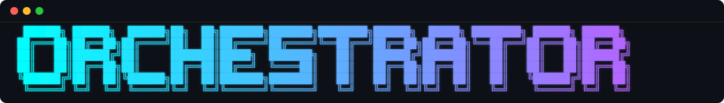

## Smart Orchestrator

The **smart orchestrator** scores each tool: capability match (50%) + popularity (15%) + recency (15%) + your preference (20%) — then picks the best one for each phase.

```
  PHASE          BEST TOOL              FALLBACK
  ──────────────────────────────────────────────
  ▸ Clarify      /ccc-office-hours          Spec flow
  ▸ Decide       /plan-ceo-review       Plan mode
  ▸ Plan         /ce:plan               Claude plan
  ▸ Execute      /ce:work               Dispatch
  ▸ Review       /ce:review (6+ agents) /simplify
  ▸ Test         /ccc-qa (real browser)     /ccc-verify
  ▸ Learn        Knowledge engine       Always on
  ▸ Ship         /ship                  git commit
```

CCC learns from every session. Knowledge compounds over time.

---


## XRay + Makeover

**Audit any project. Fix it automatically.**

```bash
/ccc-xray                    # Scan → health score 0-100
/ccc-makeover                # Agent swarm applies top fixes
```

| Dimension | Weight | What It Checks |
|-----------|--------|---------------|
| Security | 25% | CVEs, secrets, .env tracking |
| Testing | 20% | Config, coverage, frameworks |
| Maintainability | 20% | Complexity, linting, duplication |
| Dependencies | 15% | Outdated, vulnerable |
| DevOps | 10% | CI presence, quality gates |
| Documentation | 10% | README, CLAUDE.md, inline docs |

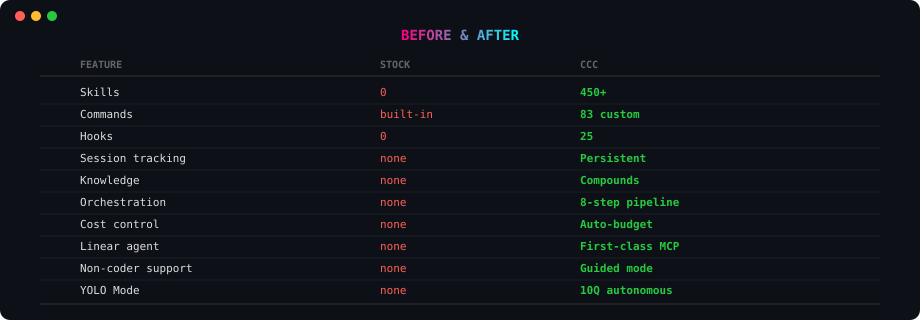

---


## Quick Start — Pick Your Path

One question: **How are you using Claude?**

### Path A: Desktop Plugin (Recommended)

> The primary way to use CCC. Works in Claude Desktop and any Claude Code session.

```
/plugin marketplace add KevinZai/commander
/plugin install commander
```

CCC appears as a plugin you can invoke immediately. Say "start ccc" or "what should I build" to begin.

**What you get:** 74 plugin skills, 22 specialist agents, 23 lifecycle hooks (39 handlers), 2 credential-free bundled MCP servers + 16 opt-in via `/ccc-connect`. Core free forever.

**Marketplace:** `commander-hub` at [KevinZai/commander](https://github.com/KevinZai/commander)

---

### Path B: Claude Code (Slash Commands)

> You want skills + commands inside Claude Code sessions.

```bash
curl -fsSL https://raw.githubusercontent.com/KevinZai/commander/main/install-remote.sh | bash
```

Then in any Claude Code session:

```
/ccc
```

Full interactive menu appears. Same features, no separate CLI needed.

**What you get:** All 466+ skills and commands, no extra CLI binary required.

---

### Your First 60 Seconds

```
1. ccc → Main menu (14 options)
2. Pick "Build something new" → Choose project type
3. Answer 3 multiple-choice questions → CCC generates a plan
4. CCC dispatches Claude with the right model, budget, and skills
5. Session ends → CCC extracts lessons → gets smarter next time
```

No configuration. No YAML. No API keys. The Intelligence Layer handles everything.

---

### CLI Installation (Legacy)

> You use `claude` in your terminal and prefer a standalone CLI.

**Option 1 — One-liner install:**
```bash
curl -fsSL https://raw.githubusercontent.com/KevinZai/commander/main/install-remote.sh | bash
```

**Option 2 — npm:**
```bash
npm install -g cc-commander
```

Then:
```bash
ccc
```

Arrow keys to navigate. Enter to select. That's it.

**Update anytime:**
```bash
ccc --update
```

**Where files live:**
- Source: `~/.cc-commander/` (auto-created by installer)
- Config: `~/.claude/` (skills, commands, hooks, CLAUDE.md)
- Binary: `ccc` → symlinked to source

> Don't delete `~/.cc-commander/` — the `ccc` command needs it.

**What you get:** Full CLI with tmux split mode, daemon, theme switching, and the cockpit dashboard.

---

## CLI Reference

| Command | What It Does |
|---------|-------------|
| `ccc` | Interactive mode (default — tmux tabbed) |
| `ccc --stats` | Sessions, streaks, level, cost |
| `ccc --test` | 22-point self-test (verify install) |
| `ccc --update` | Pull latest + reinstall |
| `ccc --repair` | Reset corrupt state |
| `ccc --simple` | Menu-only, no tmux |
| `ccc --dispatch "task"` | Headless dispatch (for AI agents) |
| `ccc --skills` | Manage skill tiers (list, install, remove, tier) |

### Split Mode

**The default mode.** Tabbed tmux sessions. Each task gets its own window.

CCC menu runs in tab 0. Each dispatched task opens a new tmux window where Claude works with full output visible.

| Key | Action |
|-----|--------|
| `Ctrl+A n` | Next tab |
| `Ctrl+A p` | Previous tab |
| `Ctrl+A 0` | Back to CCC menu |
| `Ctrl+A q` | Quit session |
| Mouse click | Switch tabs |

### Cancel Running Tasks

- **During any build:** Press `Escape` or `q` to kill the Claude process and return to menu
- **During YOLO loop:** `touch ~/.claude/commander/yolo-stop` to halt between cycles
- **In split mode:** Switch to the Claude tab and `Ctrl+C`

### Daemon Mode

**KAIROS-inspired persistent background agent.** Monitors your project, processes queued tasks, and consolidates knowledge — all hands-free.

```bash
ccc --daemon                    # Start (runs in background)
ccc --queue "fix login bug"     # Add task to queue
ccc --queue-list                # Show pending tasks
ccc --daemon-stop               # Stop daemon
```

| Feature | What It Does |
|---------|-------------|
| Tick loop (5 min) | Checks queue, git status, dispatches work |
| Dream mode (1 hr) | Consolidates knowledge, detects error patterns |
| Task queue | Priority-based, file-backed, auto-dispatch |
| Budget cap | 15-second limit per tick action |

Customize: `--interval 120` (2 min ticks) · `--tick-budget 30` · `--dream 30` (30 min dreams)

---

## Use Inside Claude Code

No CLI needed. Type `/ccc` in any Claude Code session — it opens a click-first visual picker (no typing, no menus). The six intents are **build · review · ship · design · learn · more**:

```
/ccc build     → scaffold a project (web / API / CLI / mobile)
/ccc review    → audit the current branch (diff / security / perf / x-ray)
/ccc ship      → pre-flight checks + release + deploy
/ccc design    → UI/UX workflow
/ccc learn     → skill discovery across the 11 CCC domains
/ccc more      → everything else (full catalog + specialists)
```

Prefer to jump straight to a specialist? Each capability is its own `/ccc-*` command:

| Capability | Command |
|------------|---------|
| Project health scorecard | `/ccc-xray` |
| Auto-apply the top fixes | `/ccc-makeover` |
| Audit & optimize your project's CLAUDE.md | `/ccc-claudemd` |
| Browse the 11 CCC domains | `/ccc-domains` |
| Browse the 466 skills | `/ccc-browse` |
| Spec-first planning interview | `/ccc-plan` |
| Infrastructure sub-menu (Fleet, Cost, Paperclip, …) | `/ccc-infra` |
| Diagnose services & CLIs | `/ccc-doctor` |

Works in **Claude Code**, **Claude Desktop Cowork**, and **VS Code / Cursor**.

---

## Agent-Friendly API

CCC is built to be controlled by AI agents — OpenClaw, Claude Code, or any orchestrator.

| Command | Output | Purpose |
|---------|--------|---------|
| `ccc --dispatch "task" --json` | JSON | Run task headlessly |
| `ccc --list-skills --json` | JSON | All 466+ skills |
| `ccc --list-sessions --json` | JSON | Session history |
| `ccc --status` | JSON | Health check |
| `ccc --template` | text | Latest CLAUDE.md template |

**Override flags:** `--model opus` · `--max-turns 50` · `--budget 5` · `--cwd /path`

```bash
# OpenClaw agent dispatches a build
result=$(ccc --dispatch "Build auth with JWT" --json --model opus --budget 5)

# Claude Code agent checks available skills
ccc --list-skills --json | jq '.[] | select(.name | contains("auth"))'
```

---

## Security

- **No command injection** — all shell calls use `execFileSync` with array arguments
- **Auto-mode by default** — dispatches use `--permission-mode auto`, not `--dangerously-skip-permissions`
- **YOLO only skips** — only YOLO/night mode uses skip-permissions (intentional, documented)
- **Zero npm vulnerabilities** — verified on every CI run
- **PII scanning** — CI blocks commits containing personal data patterns
- **Error containment** — every error returns to menu with error ID, never raw stack traces
- **Pre-publish checks** — `npm run prepublishOnly` runs all tests + lint before publish

---

## Agent Bible

**[BIBLE-AGENT.md](docs/BIBLE-AGENT.md)** — 268-line machine-readable reference. Any AI agent reads this and can manage CCC immediately.

```bash
# Tell any agent:
"Read docs/BIBLE-AGENT.md from the cc-commander repo, then use the CLI API to manage this project."
```

Covers: CLI API, dispatch patterns, JSON schemas, skill catalog, level/model defaults, integration points.

---

## The Kevin Z Method

> 7 rules from 200+ articles. 14 months of production.

1. Plan before coding
2. Context is milk — keep it fresh
3. Verify, don't trust
4. Subagents = fresh context
5. CLAUDE.md is an investment
6. Boring solutions win
7. Operationalize every fix

Full methodology: **[BIBLE.md](BIBLE.md)** — 2000+ lines, 7 chapters, appendices.

For AI agents: **[BIBLE-AGENT.md](docs/BIBLE-AGENT.md)** — 268-line machine-readable version.

---

## 10 Themes

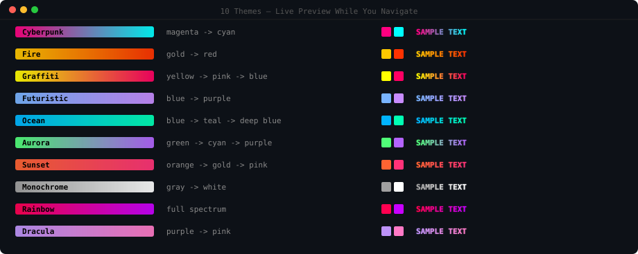

**Cyberpunk, Fire, Ocean, Aurora, Sunset, Monochrome, Rainbow, Dracula, Graffiti, Futuristic.** Live preview as you navigate. Switch anytime in Settings or type `/ccc theme`.

---

## vs aider.chat — positioning

Both tools make you faster. They solve different problems.

| Dimension | aider | CC Commander |
|-----------|-------|-------------|
| **Surface** | Terminal / Git | Claude Code Desktop + CLI + IDE |
| **LLM** | Any (OpenAI, Anthropic, local) | Claude-native (Sonnet / Opus / Haiku) |
| **Core pattern** | Pair programmer — you drive, aider edits | Guided PM — CCC plans, routes, dispatches |
| **Primitives** | Diff-based file editing + Git | Claude Agent SDK: skills, agents, hooks, MCP |
| **Agent model** | Single model, single context | 22 specialist sub-agent personas (brain/hands) |
| **Git** | Deep — commit messages, repo mapping | Lifecycle hooks + `/ccc-ship` pre-flight |
| **Context** | Repo map (tree-sitter, 15k tokens) | Session compounding + knowledge base |
| **Cost** | API pay-per-token | Core free forever (affiliate + consulting model) |
| **Install** | `pip install aider-chat` | Desktop plugin marketplace or `curl \| bash` |
| **Best at** | Solo rapid edits, refactors, small files | Multi-phase features, reviews, fleet orchestration |

Aider is your pair programmer. CC Commander is your PM. They're complementary — use aider for solo rapid edits, CCC for multi-phase features that need structure.

---

## Who Built This

CCC is built by [Kevin Z](https://kevinz.ai) ([@kzic](https://x.com/kzic)) — a non-technical entrepreneur and CEO of [MyWiFi Networks](https://mywifinetworks.com) (20+ years in tech, never wrote production code). He wanted to leverage Claude Code to its max capabilities without chasing plugins, reading changelogs, or memorizing commands. So he scanned every Claude Code article, plugin, and skill on the internet — 200+ sources — and distilled it into one self-learning AI project manager. Every feature was built with Claude Code itself. If a non-coder can build a 450+ skill toolkit with AI, imagine what you can build.

---

## Acknowledgments

CCC aggregates 19 open-source packages. Full credits: **[ACKNOWLEDGMENTS.md](docs/ACKNOWLEDGMENTS.md)**

45+ ecosystem repos tracked: **[ECOSYSTEM.md](docs/ECOSYSTEM.md)**

---

## Share

If CC Commander helped you ship faster, share it:

[](https://twitter.com/intent/tweet?text=CC%20Commander%20%E2%80%94%2061%20skills%2C%2022%20agents%2C%2023%20hooks.%20The%20guided%20AI%20PM%20for%20Claude%20Code.%20Free%20for%20now.&url=https%3A%2F%2Fgithub.com%2FKevinZai%2Fcommander&via=commanderplugin)

## License

MIT License for the full project. The Intelligence Layer (4 files) has an additional [Commons Clause](docs/LICENSE-INTELLIGENCE.md) — free to use, not to sell.

All 19 vendor packages are permissive open-source (MIT, Apache-2.0, and CC-BY-SA-4.0).

> **Note:** GitHub may show "Unknown" in the sidebar because some vendor submodules don't ship a LICENSE file in their repo root. Each vendor retains its upstream license — check the linked vendor repositories for specifics.

---

## Contributing

```bash
skills/your-skill/SKILL.md        # Add a skill
commands/your-command.md           # Add a command
hooks/your-hook.js                 # Add a hook
commander/adventures/X.json        # Add a flow
```

---

<div align="center">

**CC Commander v6.7.0** · **[Kevin Zicherman](https://kevinz.ai)** · **[@kzic](https://x.com/kzic)**

*Every Claude Code tool. One install. An AI brain that learns.*

**[Install Now](#quick-start--pick-your-path)** · **[Read the BIBLE](BIBLE.md)** · **[Agent Bible](docs/BIBLE-AGENT.md)** · **[Browse Skills](SKILLS-INDEX.md)** · **[Ecosystem](docs/ECOSYSTEM.md)**

</div>
