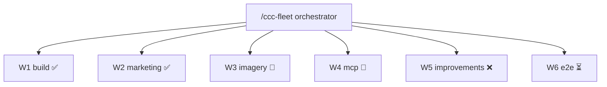

# /ccc-fleet-viz — Live Fleet Tree

Triggered by user typing `/ccc-fleet-viz` or automatically at the end of any `/ccc-fleet` run.

## Inputs

Read:
- `/tmp/ccc-fleet/*-status.json`
- `/tmp/ccc-fleet/*-complete.json`
- `/tmp/ccc-fleet/worker-progress.jsonl` when present
- `git worktree list --porcelain`
- `commander/tests/*` when present

Malformed state markers must be skipped without aborting the visualization.

## Render

Run the helper from the repo root:

```bash
node commander/cowork-plugin/skills/ccc-fleet-viz/lib/render-fleet-tree.js --watch
```

The helper prints:
1. A live ASCII tree to stdout.
2. A fenced Mermaid `graph TD` block immediately after it, so Desktop can render the fleet inline.

While any worker is `running`, `waiting`, or `unknown`, the helper refreshes every 2 seconds. When all workers are `done` or `failed`, it prints the final snapshot and exits.

## Expected Shape

```text
/ccc-fleet (orchestrator) — 6 workers, 3 done, 2 running, 1 failed
├── ✅ W1 build        → claude/codex-w1-build @ 0019f10
├── ✅ W2 marketing    → claude/codex-w2-marketing @ a0a3cb8
├── 🔄 W3 imagery      → 3/6 images generated, ETA ~4min
├── 🔄 W4 mcp          → 18 tools registered, tests in flight
├── ❌ W5 improvements → blocked: merge conflict
└── ⏳ W6 e2e          → waiting on W1
```



## Final Step From /ccc-fleet

When `/ccc-fleet` synthesis is complete, invoke this skill once to render the final fleet tree. Do not reimplement the renderer in `/ccc-fleet`; keep the rendering path centralized here.
