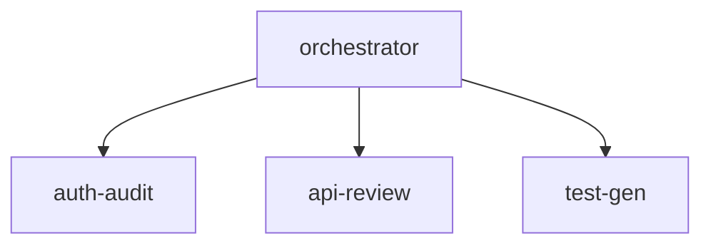

`/ccc-fleet-viz` renders the current CC Commander agent fleet as an ASCII spawn tree and a Mermaid diagram — showing which agents are running, their cost, completion percentage, and parent/child relationships.

## Trigger

```
/ccc-fleet-viz
```

Also activates on: "fleet status", "show agent tree", "what agents are running", "fleet progress", after any `/ccc-fleet` run finishes

## What it does

Reads `~/.claude/commander/fleet/notifications.jsonl` and the active session state to produce:

**ASCII spawn tree**
```
┌─ orchestrator (main)          $0.34  ██████████ 100%
├─ Wave-A: auth-audit           $0.12  ████████░░  80%  running
├─ Wave-A: api-review           $0.08  ██████░░░░  60%  running
└─ Wave-B: test-gen             $0.02  ██░░░░░░░░  20%  queued
```

**Mermaid diagram** (rendered in Claude's artifact panel if available)


## Data sources

| Source | What it reads |
|--------|-------------|
| `~/.claude/commander/fleet/notifications.jsonl` | Agent spawn/stop events with timestamps and cost |
| `~/.claude/commander/sessions/active-session.json` | Current session cost and context usage |

## Refresh

Run `/ccc-fleet-viz` again at any time to get an updated snapshot. The skill reads live state on each invocation — no background process required.

## Agent

No sub-agent dispatch — runs inline (Sonnet, medium effort, read-only tools).
